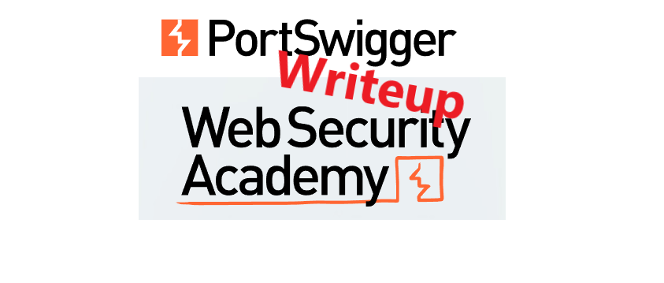

# Write-up: <LAB_NAME> @ PortSwigger Academy

This write-up for the lab *<LAB_NAME>* is part of my walk-through series for [PortSwigger's Web Security Academy](https://portswigger.net/web-security).

**Learning path**: Server/Client-side/Advanced topics → XZY

Lab-Link: <<LAB_LINK>>  
Difficulty: <LAB_LEVEL>  
Python script: [script.py](script.py)  

## Lab description

lab_description

## Steps

### Analysis

As usual, the first step is to analyze the functionality of the lab application. In this lab, it is XXX

---

### The theory

---

### The malicious payload

success

