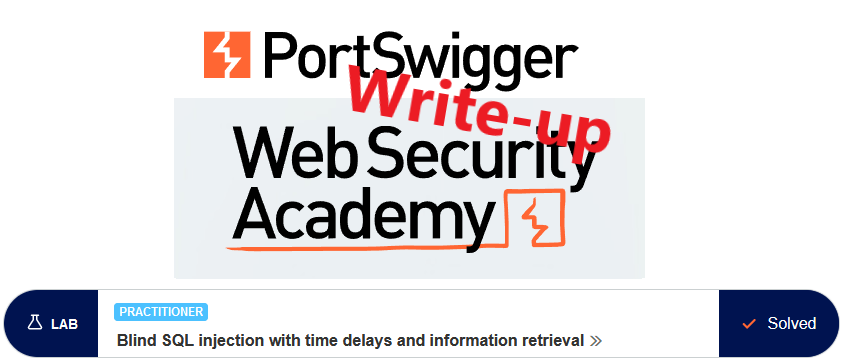
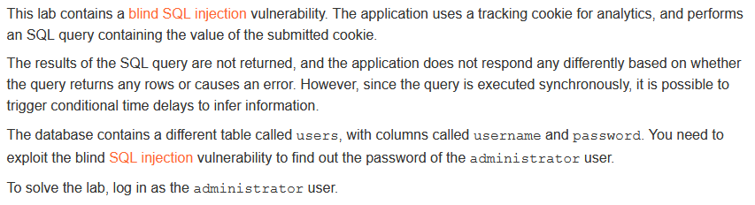
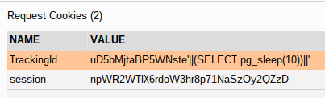
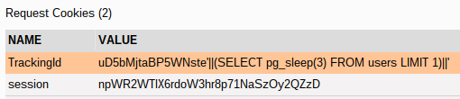
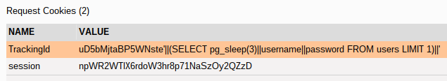
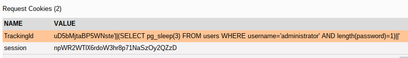
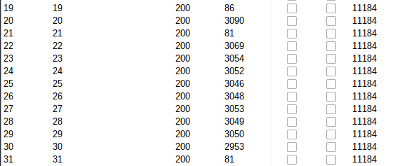
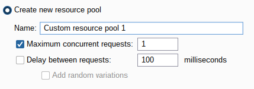
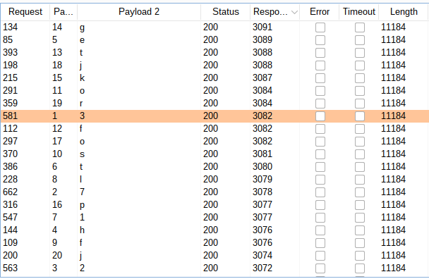
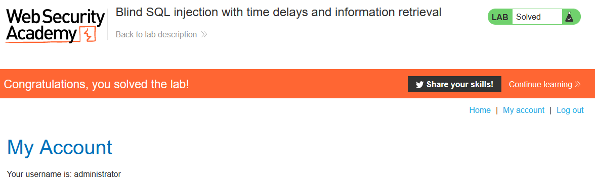

# Write-up: Blind SQL injection with time delays and information retrieval @ PortSwigger Academy



This write-up for the lab *Blind SQL injection with time delays and information retrieval @ PortSwigger Academy* is part of my walkthrough series for [PortSwigger's Web Security Academy](https://portswigger.net/web-security).

Lab-Link: <https://portswigger.net/web-security/sql-injection/blind/lab-time-delays-info-retrieval>  
Difficulty: PRACTITIONER  
Python script: [script.py](script.py)  

## Lab description



## Query

The query used in the lab will look something like

```sql
SELECT trackingId FROM someTable WHERE trackingId = '<COOKIE-VALUE>'
```

In my case, the cookie contains this content
`Cookie: TrackingId=uD5bMjtaBP5WNste; session=npWR2WTlX6rdoW3hr8p71NaSzOy2QZzD`

I will omit the complete cookie content from now on and only provide the string appended to the TrackingId value.

## Steps

### Find database engine

Due to the type of vulnerability, on the page itself, we can not distinguish whether the injection caused any reaction. This also makes finding an injection point more difficult, as simply injecting a single quote does not cause any reaction.

On the [cheat [sheet](https://portswigger.net/web-security/sql-injection/cheat-sheet), time-delay examples are given for multiple database engines. As we don't know which one to choose, simply attempt them one by one.

```text
Oracle: dbms_pipe.receive_message(('a'),10)
Microsoft: WAITFOR DELAY '0:0:10'
PostgreSQL: SELECT pg_sleep(10)
MySQL: SELECT sleep(10) 
```

The important thing is that the query must remain valid, as if it errors out we will not get any indication of it and may assume that the injection failed and move to the next database engine, when in fact the query was never executed.

I try to form the following query (ABC being the value of the tracking cookie).

```sql
SELECT trackingId FROM someTable WHERE trackingId = 'ABC' || (<CODE HERE>) || ''
```

The first character injected is the single quote after the ABC, then I concatenate the output of my code, followed by another concatenation with a single quote. For Oracle and PostgreSQL, the `||`s are used for concatenation, for Microsoft a `+` and for MySQL a single space.

Reaching the PostgreSQL syntax and injecting `'||(SELECT pg_sleep(10))||'`, the query takes a long time to finish: 10.090s. Usually, the query takes about 100ms for me, so these additional 10 seconds come from the injection.



### Confirm table and column names as well as username

Now that we know the database type, the next steps are:

- confirm that the `user` table exists and
- contains the columns `username` and `password` and
- contains an entry for username `administrator`

I also cut down the delay to 3 seconds to make it more convenient.

`'||(SELECT pg_sleep(3) FROM users LIMIT 1)||'`



`'||(SELECT pg_sleep(3)||username||password FROM users LIMIT 1)||'`



`'||(SELECT pg_sleep(3)||username||password FROM users WHERE username='administrator')||'`


All queries take slightly more than 3 seconds, whereas using different names for table or column names or using a different username, the response comes immediately.

--> Table exists with username and password columns, containing an entry for `administrator` as username.

### Get the length of the password

Enumerating the password is now easy by extending the `WHERE` clause:

`'||(SELECT pg_sleep(3) FROM users WHERE username='administrator' AND LENGTH(password)=1)||'`



However, when attempting this in Burp Intruder, the following picture was shown, hinting that the password has every length between 20 and 30, with the exception of 21. Not very likely.



By default, Burp Intruder creates 10 concurrent requests. This might cause an issue, so try again after creating a new resource pool with only a single concurrent request:




Now the result looks like expected, and the password is 20 characters long.

### Enumerate password

To enumerate the password is basically the same, just by checking each character of the password instead of the length of the password. I use the same resource pool as above to avoid any issues with concurrent requests.

`'||(SELECT pg_sleep(3) FROM users WHERE username='administrator' AND SUBSTR(password,1,1)='a')||'`


Using Burp Intruder again, with attack type: *Cluster bomb*

- *Payload 1*: numeric sequential, 1...20
- *Payload 2*: Brute force - for real-life, add special characters



Password is `372het1lfsoftgkpojrj`

### Log in

All that is left is to log in with these credentials. The lab updates to



