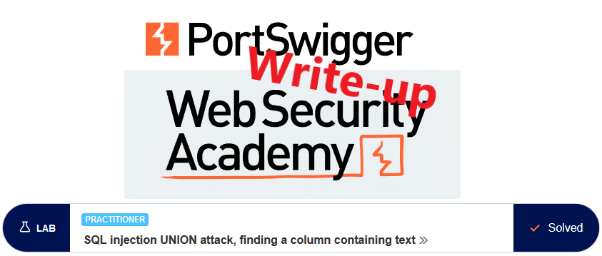

# Write-up: SQL injection UNION attack, finding a column containing text



This write-up for the lab *SQL injection UNION attack, finding a column containing text* is part of my walk-through series for [PortSwigger's Web Security Academy](https://portswigger.net/web-security).

Lab-Link: <https://portswigger.net/web-security/sql-injection/union-attacks/lab-find-column-containing-text>  
Difficulty: PRACTITIONER  
Python script: [script.py](script.py)  
Python script (manual payload): [script_manual.py](script_manual.py)

## Lab description

- vulnerable to SQL injection in the product category filter
- UNION based vulnerability

###  Goal

Find columns containing string data with a UNION attack by returning a provided random string

## Query

The query might be something like

```sql
SELECT * FROM someTable WHERE category = '<CATEGORY>'
```

## Steps

### Confirm injectable argument

The first steps are identical to the lab [SQL injection UNION attack, determining the number of columns returned by the query](../SQL_injection_UNION_attack,_determining_the_number_of_columns_returned_by_the_query/README.md) and are not repeated here.

The number of columns in the result is 3 as well.

### Finding text columns

In a UNION, both queries must match the number of columns as well as the data types of each column.

The `null` fields match any data types. By successively exchanging a single null with a string, e.g. 'x', we can find out which columns contain string data.

By adding a `' UNION (SELECT null, 'x', null)--` to the query, the SQL statement looks like this and results in an 'x' added in the table.

```sql
SELECT * FROM someTable WHERE category = 'Accessories' UNION (select null, 'x', null)--'
```


Injecting the requested string will solve the exercise:


### Bonus

By playing around a bit, we find out that the first argument is a number and represents the product ID that is placed in the 'View details' link and the thirst argument is the price by injecting `'` UNION (SELECT 1, 'aP6tWl', 33.33)--`


