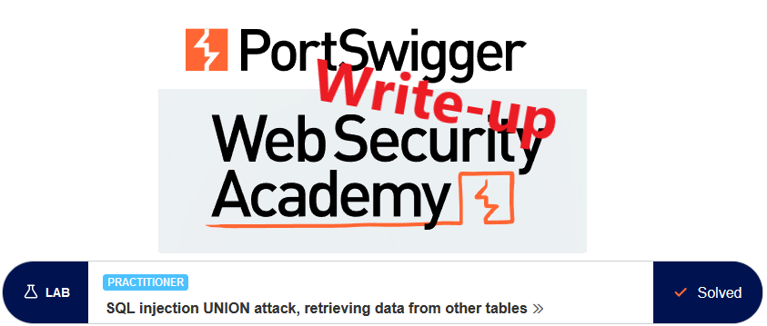
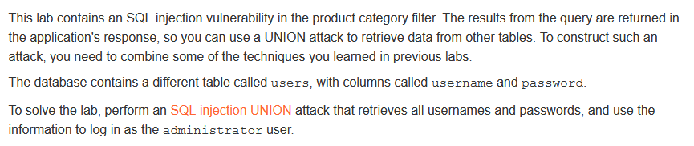
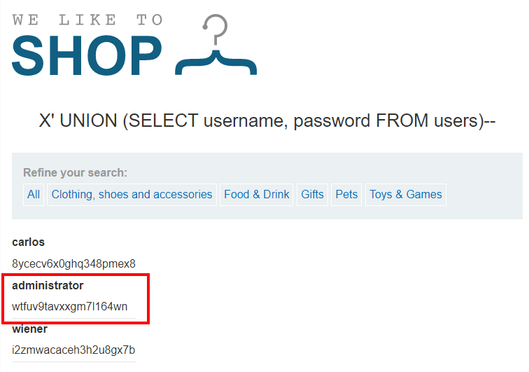

# Write-up: SQL injection UNION attack, retrieving data from other tables @ PortSwigger Academy



This write-up for the lab *SQL injection UNION attack, retrieving data from other tables* is part of my walkthrough series for [PortSwigger's Web Security Academy](https://portswigger.net/web-security).

Lab-Link: <https://portswigger.net/web-security/sql-injection/union-attacks/lab-retrieve-data-from-other-tables>  
Difficulty: PRACTITIONER  
Python script: [script.py](script.py)  

## Lab description



## Query

The query used in the lab will look something like

```sql
SELECT * FROM someTable WHERE category = '<CATEGORY>'
```

## Steps

### Confirm injectable argument

The first steps are identical to the labs [SQL injection UNION attack, determining the number of columns returned by the query](../SQL_injection_UNION_attack,_determining_the_number_of_columns_returned_by_the_query/README.md) and [SQL injection UNION attack, finding a column containing text](../SQL_injection_UNION_attack,_finding_a_column_containing_text/README.md) and are not repeated here.

As a result of these steps, I find out that the number of columns is 2, with both being string columns.

### Extracting usernames and passwords

I know which table (`users`) contains the credentials (columns `username` and `password`). And conveniently we have two string columns, so we can simply dump the contents with a UNION.

I use an invalid category so that no articles are found and only my output appears. The injection string is `X' UNION (SELECT username, password FROM users)--` to form the following query:

```sql
SELECT * FROM someTable WHERE category = 'X' UNION (SELECT username, password FROM users)--
```

This results in a dump of three user credentials:



The last step is to log in as the administrator and the lab updates to


