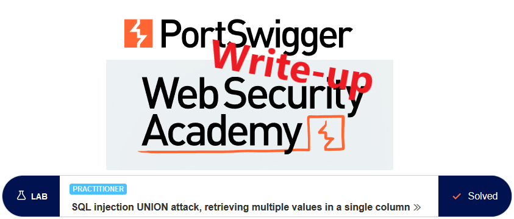
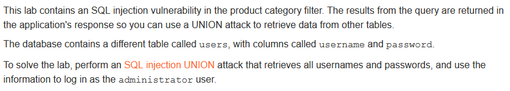
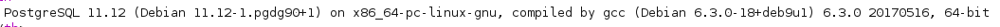
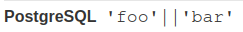
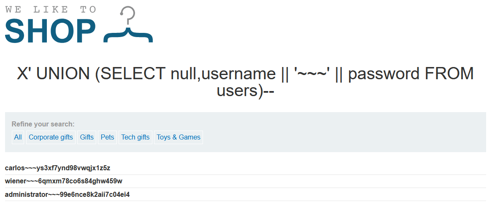
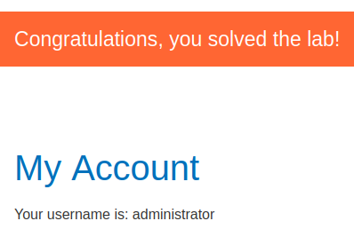

# Write-up: SQL injection UNION attack, retrieving multiple values in a single column @ PortSwigger Academy



This write-up for the lab *SQL injection UNION attack, retrieving multiple values in a single column* is part of my walkthrough series for [PortSwigger's Web Security Academy](https://portswigger.net/web-security).

Lab-Link: <https://portswigger.net/web-security/sql-injection/union-attacks/lab-retrieve-multiple-values-in-single-column>  
Difficulty: PRACTITIONER  
Python script: [script.py](script.py)  

## Lab description



## Query

The query used in the lab will look something like

```sql
SELECT * FROM someTable WHERE category = '<CATEGORY>'
```

## Steps

### Confirm injectable argument

The first steps are identical to the labs [SQL injection UNION attack, determining the number of columns returned by the query](../SQL_injection_UNION_attack,_determining_the_number_of_columns_returned_by_the_query/README.md) and [SQL injection UNION attack, finding a column containing text](../SQL_injection_UNION_attack,_finding_a_column_containing_text/README.md) and are not repeated here.

As a result of these steps, I find out that the number of columns is 2, with just the second being a text column.

### Find database used

I want to extract both usernames and passwords, while only having a single string column. For this, I can concatenate multiple values into single fields. The syntax depends on the database engine, so find out which database is used to drive the page.

Portswigger has a nice [cheat sheet](https://portswigger.net/web-security/sql-injection/cheat-sheet) that contains database version queries.

Luckily, the second attempt is successful and results in the database details.




### Extracting usernames and passwords

I know which table (`users`) contains the credentials (columns `username` and `password`). As I have just a single string column, I can either issue two queries and manually combine the data (for this to work I need to ensure the order is identical), or concatenate these values into a single string to be able to extract them in one go.

The latter version is much more convenient. Fortunately, the [cheat sheet](https://portswigger.net/web-security/sql-injection/cheat-sheet) mentioned above also contains the information required:



To be able to distinguish username from password, I also need to concatenate some unique-ish string in between. I use an invalid category so that no articles are found and only my output appears.

I inject `X' UNION (SELECT null,username || '~~~' || password FROM users)--` to create a SQL query like this:

```sql
SELECT * FROM someTable WHERE category = 'X' UNION (SELECT null,username || '~~~' || password FROM users)--
```

Resulting in three user credentials:



The only step left is to log in as the administrator and the lab updates to


