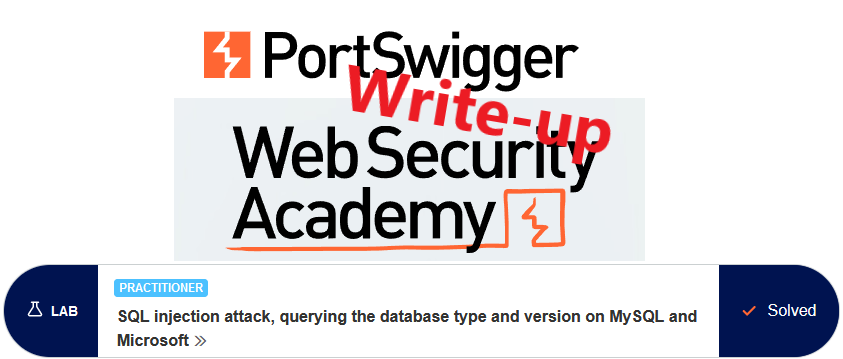
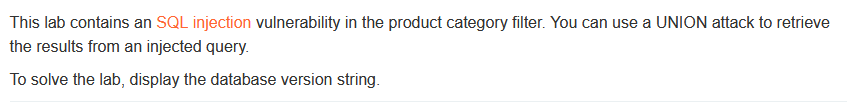
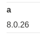
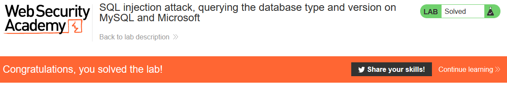

# Write-up: SQL injection attack, querying the database type and version on MySQL and Microsoft @ PortSwigger Academy



This write-up for the lab *SQL injection attack, querying the database type and version on MySQL and Microsoft* is part of my walkthrough series for [PortSwigger's Web Security Academy](https://portswigger.net/web-security).

Lab-Link: <https://portswigger.net/web-security/sql-injection/examining-the-database/lab-querying-database-version-mysql-microsoft>  
Difficulty: PRACTITIONER  
Python script: [script.py](script.py)  

## Lab description



## Query

The query used in the lab will look something like

```sql
SELECT * FROM someTable WHERE category=<CATEGORY>
```

## Steps

### Confirm vulnerability

The first steps are **mostly** identical to the labs [SQL injection UNION attack, determining the number of columns returned by the query](../SQL_injection_UNION_attack,_determining_the_number_of_columns_returned_by_the_query/README.md) and [SQL injection UNION attack, finding a column containing text](../SQL_injection_UNION_attack,_finding_a_column_containing_text/README.md) and are not repeated here 

The difference is that on MySQL (which appears to be used here), a `#` character is best used for beginning a comment instead of the `--`.

As a result of these steps, I find out that the number of columns is 2, with both being string columns.

### Query the version

The [SQL injection](https://portswigger.net/web-security/sql-injection/cheat-sheet) cheat sheet](https://portswigger.net/web-security/sql-injection/cheat-sheet) shows the query required on MySQL and MSSQL.

Therefore I need to inject `' UNION SELECT 'a',@@version#` to obtain the version information with the following query:

```sql
SELECT * FROM someTable WHERE category='Pets' UNION SELECT 'a',@@version#'
```

This result in this output on the page:


and a friendly success message


