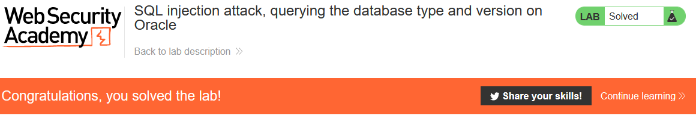

# Lab: SQL injection attack, querying the database type and version on Oracle

Lab-Link: <https://portswigger.net/web-security/sql-injection/examining-the-database/lab-querying-database-version-oracle>  
Difficulty: PRACTITIONER  
Python script: [script.py](script.py)  

## Known information

- SQL injection vulnerability in the product category filter
- UNION based attack
- Goals:
  - Display the database version

## Query

The query might be something like

```sql
SELECT * FROM someTable WHERE category=<CATEGORY>
```

## Steps

### Confirm vulnerability

The first steps are identical with the labs [SQL injection UNION attack, determining the number of columns returned by the query](../SQL_injection_UNION_attack,_determining_the_number_of_columns_returned_by_the_query/README.md) and [SQL injection UNION attack, finding a column containing text](../SQL_injection_UNION_attack,_finding_a_column_containing_text/README.md) and are not repeated here.

The number of colums in this case is 2, with both being string columns.

### Query version

On the [SQL injection cheat sheet](https://portswigger.net/web-security/sql-injection/cheat-sheet) are two different methods of querying the database version on Oracle.

The `SELECT version FROM v$instance` only returns the version number, the `SELECT banner FROM v$version` returns the full version string that is requested.

Therefore we need to inject `' UNION SELECT 'a',banner FROM v$version--` to obtain the version information with the following query:

```sql
SELECT * FROM someTable WHERE category='Pets' UNION SELECT 'a',banner FROM v$version--'
```

This result in this outpu on the page:


and a friendly success message


