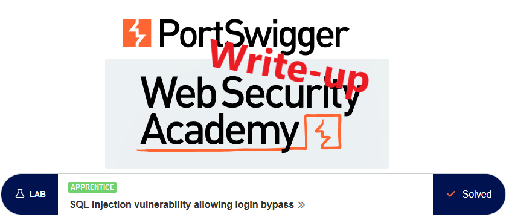
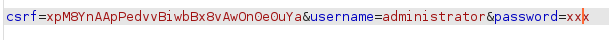
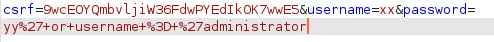
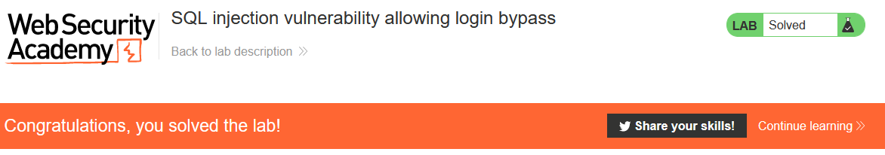

# Write-up: SQL injection vulnerability allowing login bypass



This write-up for the lab "SQL injection vulnerability allowing login bypass" is part of my walk-through series for [PortSwigger's Web Security Academy](https://portswigger.net/web-security).

Lab-Link: <https://portswigger.net/web-security/sql-injection/lab-login-bypass>  
Difficulty: APPRENTICE  
Python script: [script.py](script.py)

## Lab description

- vulnerability to SQL injection in the login function.

### Goal

- login as `administrator` user

## Query

The query might be something like

```sql
SELECT * FROM users WHERE username = '<USERNAME>' AND password = '<PASSWORD>'
```

## Steps

### Evaluate request

When using `administrator` as username and `xxx` as password, the data content of the request looks like this:



At least one of the parameters is vulnerable to SQL injection.

### Inject in username

Start with trying to inject in the username. To make the WHERE part of the query return the information of the administrator, the password check needs to be avoided. This can be done by injecting a comment after the username, making the server ignore the remainder of the query.

```sql
WHERE username = 'administrator' --
```

This will result in a query like

```sql
SELECT * FROM users WHERE username = 'administrator' -- ' AND password = '<PASSWORD>'
```

Note that the single quote that the application likely inserts after the username will be commented away too.


The request data sent are url-encoded. When entering the injection in the browser, this will be done by the browser automatically. In, for example, Burp Suite, this needs to be done manually (`CTRL-u`)


And we are in


### Inject in password

We can also try injecting in the password. The WHERE clause here will fail, as we don't know the password. But if we assume (or know) that the column name of the username is actually `username`, than we can simply add a second condition that will succeed:

```sql
WHERE username = 'xx' AND password = 'yy' or username = 'administrator'
```

The part injected in the password field is

```sql
' or username = 'administrator
```

The single quote finishes the password argument, and the `administrator` argument is finished by the single quote the application inserts after the password. The 'comment everything that follows' approach from above works just as fine too.

Of course, this will only work if the password is stored as plain text. Otherwise, the inserted SQL will simply be hashed and never reaches the database.

As the password field does not show the input, entering it directly in Burp Suite Repeater is more convenient. The content of the `username` field will be ignored.



This, too, results in access to the `administrator` account.


At the same time, the lab updates to

