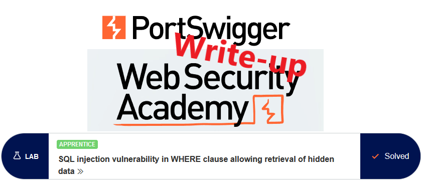
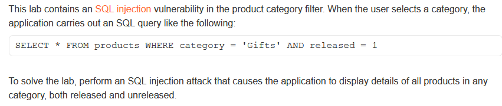
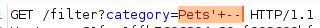

# Write-up: SQL injection vulnerability in WHERE clause allowing retrieval of hidden data



This write-up for the lab "SQL injection vulnerability in WHERE clause allowing retrieval of hidden data" is part of my walk-through series for [PortSwigger's Web Security Academy](https://portswigger.net/web-security).

Lab-Link: <https://portswigger.net/web-security/sql-injection/lab-retrieve-hidden-data>  
Difficulty: APPRENTICE  
Python script: [script.py](script.py)

## Lab description



## Query

The query used by the application is provided in the lab description. I assume that the category string is taken directly from the URL argument

```sql
SELECT * FROM products WHERE category = '<PARAM>' AND released = 1
```

## Steps

### Find a baseline

To know a baseline for for released products, I filter for `Pets` which shows 3 entries. 

### Ignore the released part of the query

Now I need to inject something that causes the 'AND released = 1' part to be ignored, for example by injecting a comment that ignores all the remaining parts of the query.

For example, injecting `Pets'--` results in this query:

```sql
SELECT * FROM products WHERE category = 'Pets'--' AND released = 1
```

Note the single quote after the `--`, which is added by the application. This would be a syntax error, but due to the comment it is ignored and we don't have to deal with it.

#### URL encode

The URL needs to be properly encoded. When using a browser, this will be done automatically by the browser but is not shown in the URL bar. When using Burp Repeater the URL encoding needs to be done manually with `Ctrl+U`.



==> 4 entries are shown, so the released part is commented out successfully.

### Show all products regardless of category

To show all products, regardless of category or released status, I need to inject a string that evaluates to `TRUE` for each entry in the table. For example the expression `1=1`.

```sql
Pets' OR 1=1--
```
This results in the query

```sql
SELECT * FROM products WHERE category = 'Pets' or 1=1 -- ' AND released = 1
```

which displays all entries as for each entry the condition 1=1 stays true. The lab updates to


