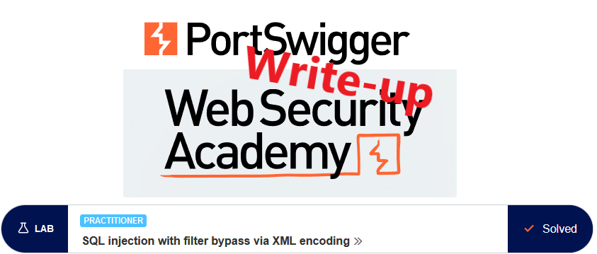
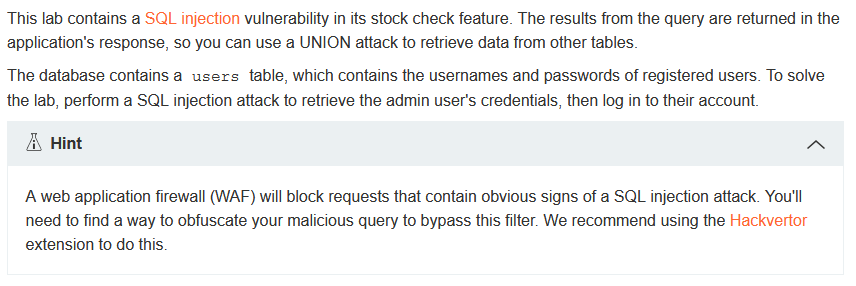
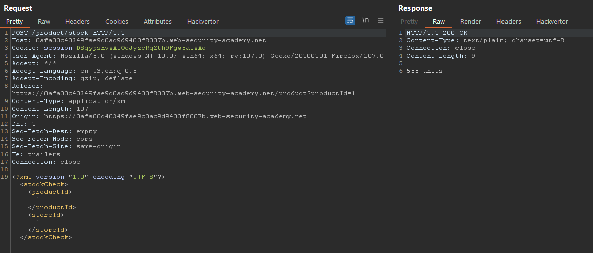
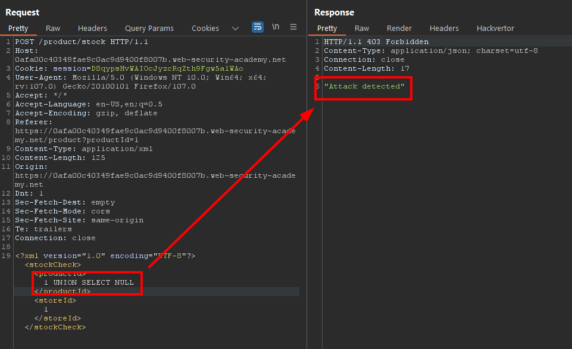
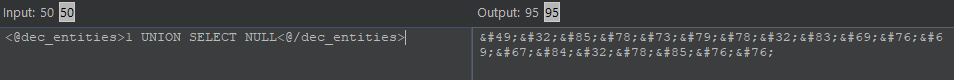
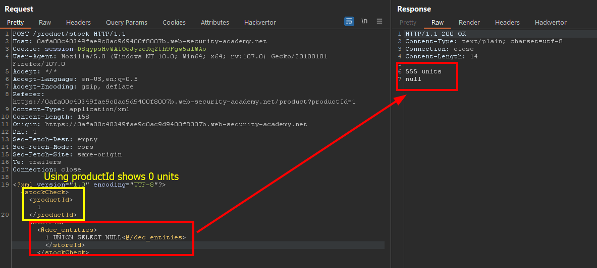
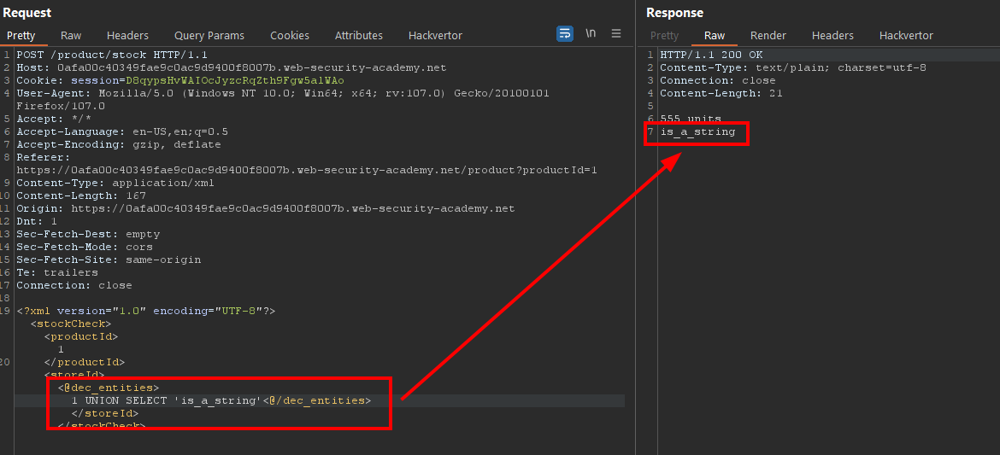
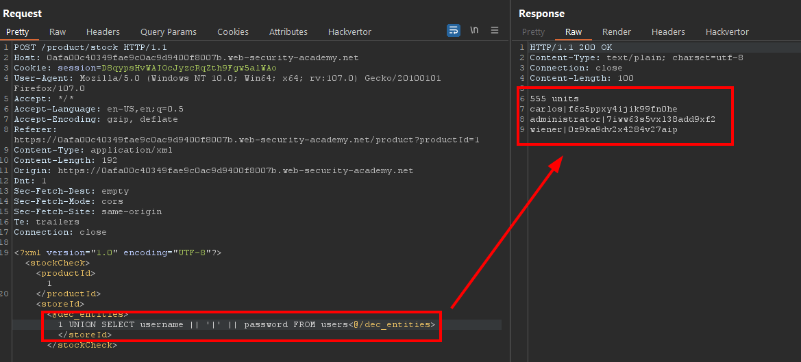

# Write-up: SQL injection with filter bypass via XML encoding @ PortSwigger Academy

This write-up for the lab *SQL injection with filter bypass via XML encoding* is part of my walk-through series for [PortSwigger's Web Security Academy](https://portswigger.net/web-security).

**Learning path**: Server-side topics → SQL injection

Lab-Link: <https://portswigger.net/web-security/sql-injection/lab-sql-injection-with-filter-bypass-via-xml-encoding>  
Difficulty: PRACTITIONER  
Python script: [script.py](script.py)  

## Lab description

## Steps

As usual, the first step is to analyze the functionality of the lab application. In this lab, it is a shop website. As recommended in the lab description I use the Burp extension [Hackvertor](https://github.com/portswigger/hackvertor) for this lab.

I can check the stock in several locations for each of the products so I do this and check the result in Burp Proxy:

Now I want to see what happens if I try to inject a basic SQL command. The next steps I perform for both arguments `productId` and `storeId` separately as I do not know the SQL statement that is used and whether both arguments are injectable. 

The results are the same, at least for now, so I show it for `productId` only:

There is protection of some kind against this as I receive a `403 Forbidden` response. 

---

## The theory

According to the description, a web application firewall (WAF) is in place. Such an application monitors the requests and tries to find malicious traffic. The rules can be as simple as a blacklist with forbidden characters or requests. It can also be a whitelist that only allows certain known good constructions through. Or any combination thereof.

My first attempt would be to use HTML encoding to find out whether the decoding happens before or after the WAF (in this lab, HTML encoding is enough to bypass the WAF). But as the request contains the arguments in XML I try injecting XML entities instead.

There are a number of websites that explain XML entities, for example [tutorialspoint.com](https://www.tutorialspoint.com/xml/xml_character_entities.htm) or [within the xaml documentation of Microsoft](https://learn.microsoft.com/en-us/dotnet/desktop/xaml-services/xml-character-entities).

I can encode characters with their decimal or hexadecimal values with `&#NN;` and `&#xNN;` respectively. Fortunately, the [Hackvertor](https://github.com/portswigger/hackvertor) extension comes with both. I start with decimal entities. 

Heckvertor shows the actual output in its interface and I could directly use the encoded values in Repeater. However, using `<@dec_entities>1 UNION SELECT NULL<@/dec_entities>` is easier to read and much better to use than `&#49;&#32;&#85;&#78;&#73;&#79;&#78;&#32;&#83;&#69;&#76;&#69;&#67;&#84;&#32;&#78;&#85;&#76;&#76;`.

At this point, the usage of `productid` and `storeId` differ in their output. Using the SQL string in `productId`  shows `0 units`, indicating that I bypassed the WAF but failed to product a valid result with the injected statement.

This is different with `storeId` where I receive an additional line in the output containing the injected `null` result. 

At the same time, it confirms that I have a single output column, otherwise the UNION would have been invalid. 

---

### Check for string column

The next question is whether I can use this column to transport a string value. 

In a decent application, the stock would be stored in a numeric field with the application adding the ` units` string just for display purposes. Here, the front end does not do it as I receive the full string from the server. It may be added by the backend, or it is stored as the full string in the database. In the latter case, I could use the column easily. 

I change my statement to output a string value:

As evidenced by the output, the column is indeed a string column.

---

### Table and column name

The next step would be to enumerate table and column names to find out where user data is stored. 

For this lab, the lab description contains table as well as column names so I do not have to enumerate them. In this write-up, I will skip this part. If you are interested in details, there are labs showing how to do this for both [Oracle](https://github.com/frank-leitner/portswigger-websecurity-academy/tree/main/01-sqli/SQL_injection_attack%2C_listing_the_database_contents_on_Oracle) and [non-Oracle](https://github.com/frank-leitner/portswigger-websecurity-academy/tree/main/01-sqli/SQL_injection_attack%2C_listing_the_database_contents_on_non-Oracle_databases) databases. 

---

### The malicious payload

I have a single output column in which I need to transport both usernames and passwords. There is a dedicated lab on [how to retrieve multiple values in a single column](https://github.com/frank-leitner/portswigger-websecurity-academy/tree/main/01-sqli/SQL_injection_UNION_attack%2C_retrieving_multiple_values_in_a_single_column).

I concatenate the username and passwords together with a single `|` as separator: `<@dec_entities>1 UNION SELECT username || '|' || password FROM users<@/dec_entities>`. If usernames or passwords contain my separator, I may need to change it, especially if I automate it in a script later on.

Fortunately, all usernames and passwords are alphanumeric. 

I use the credentials of `administrator` to log in and the lab updates to

---

## Closing thoughts about Hackvertor

This was my first attempt at using the Hackvertor extension. Until today, whenever I needed encoded characters I copied the encoded string into Burp Repeater. Of course, it was somewhere between difficult and impossible to quickly adjust the string in the Repeater, most of the time I edited the string elsewhere and again copied the encoded version into Repeater. This also meant that Burp Intruder was not an option if any variable content was within the encoded string.

Now I saw how easy it is to have a possibility that is a very readable and easily modifiable string in Burp that is useable in both Repeater and Intruder. Hackvertor definitely earned its place on my must-have extensions.