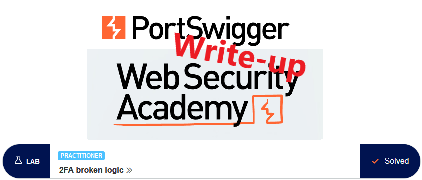

# Write-up: 2FA broken logic @ PortSwigger Academy

This write-up for the lab *2FA broken logic* is part of my walkthrough series for [PortSwigger's Web Security Academy](https://portswigger.net/web-security).

Learning path: Server-side topics → Authentication

Lab-Link: <https://portswigger.net/web-security/authentication/multi-factor/lab-2fa-broken-logic>  
Difficulty: PRACTITIONER  
Python script: [script.py](script.py)  

## Lab description

## Steps

### Analyze successful login process

I have access to a valid user account on that system, so my first step is to log in as `wiener` to see what the normal authentication flow looks like.

On the website, everything looks as expected. My next step is to analyze the requests and responses in more detail:

The first interesting thing is that the username provided in the POST request is reflected back as a cookie. In the request of the security code (`login2`), this cookie is included:

I wonder what happens if the cookie value gets replaced in the second step? In theory, it should not matter because everything should be combined into a session on the server-side, never involving any client-side storage of information for anything but the session ID.

### Modify cookies

I try to repeat every request sent so far by just changing the `verify=wiener` to `verify=carlos` in the cookie. When I send the request to `/login2`, something interesting happens:

It appears that this has triggered the setup of a 2FA code for `carlos`, even though no correct password for that user was provided.

### Brute force the 2FA code

If `/login2` only verifies the 2FA code without checking that it was preceded by a credential check, then I can completely bypass the credentials check for the victim account. The only thing required is an own set of credentials to obtain the workflow information and a valid username for the victim.

- Attack type: **Sniper**
- Payload: Numbers, 0-9999, Number format 4 digits

Now simply select `Request in browser` from the context menu to:

