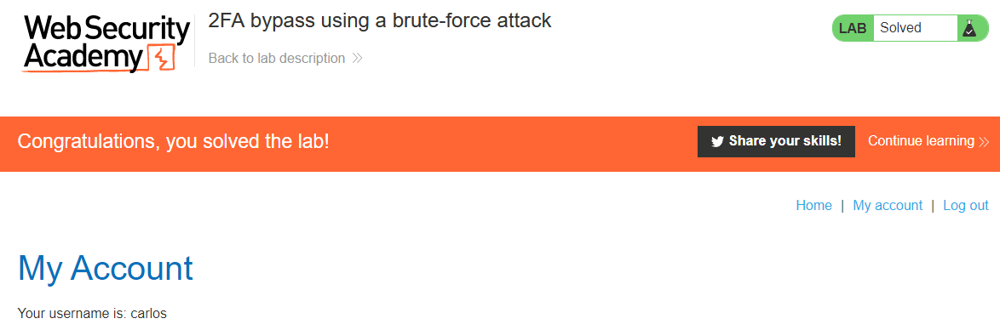

# Write-up: 2FA bypass using a brute-force attack @ PortSwigger Academy

This write-up for the lab *2FA bypass using a brute-force attack* is part of my walkthrough series for [PortSwigger's Web Security Academy](https://portswigger.net/web-security).

Learning path: Server-side topics → Authentication

Lab-Link: <https://portswigger.net/web-security/authentication/multi-factor/lab-2fa-bypass-using-a-brute-force-attack>  
Difficulty: EXPERT  
Python script: Currently no reliable script available

## Lab description

## Steps

The hint for this lab indicates that Burp macros or extensions like Turbo Intruder are required. As I never used Burp macros before, I decided to go that way and follow the provided solution to learn.

### Analyze process flow

As usual, the first step is to analyze the functionality of the lab, in this case, the login workflow.

In this lab, I have no access to an account, therefore I try to log in with both a random username/password combination as well as the provided good credentials for `carlos`.

Using random credentials, I get a generic `Invalid username or password.` message, while using the credentials for `carlos` I get a response redirecting me to `/login2`, which asks for a multi-factor security code.

Brute-forcing the code directly does not work in this case. If I enter it wrong two times, the session appears to be terminated and the CSRF token is invalidated.

The application does not, however, lock the account out as I can attempt it again immediately. If the application does it correctly and generates a new 2FA-code for each login attempt, this does not help me. But if a 2FA code remains valid until it is used, I can brute force it.

The login process involves multiple requests that need to be performed in order, so the basic Burp Intruder does not help here. 

So I turn my attention to macros and try to combine these requests into a single macro:

I verify that the last response asks for the MFA-code when running the macro:

Next, I need to set up the session handling rules and make sure that the lab page is within the defined scope in the session handling rule editor.

Now it is time to start the brute force attack. I select the POST request with the MFA-code from the history, send it to Burp Intruder and select the MFA-code as payload.

- Attack type: **Sniper**
- Payload: Numbers, 0-9999, 4 digits

Also, ensure that only a single concurrent request is used:

I start the attack. As only a single request is sent at a time, and it is basically not one but four requests each time, this is painfully slow. But, after a time a response comes back that is a redirect:

Show results in Browser gives a:

