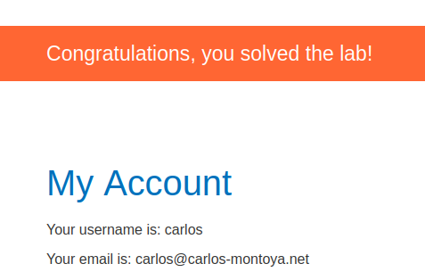

# Lab: 2FA simple bypass

Lab-Link: <https://portswigger.net/web-security/authentication/multi-factor/lab-2fa-simple-bypass>  
Difficulty: APPRENTICE  
Python script: [script.py](script.py)  

## Known information

- Vulnerable login, 2FA can be bypassed
- Known good valid credentials for both own (`wiener:peter`) and victim (`carlos:montoya`) account
- 2FA is email based, access to 2FA emails for account `wiener` is provided
- No access to victims 2FA
- Goals:
  - Access user account page of `carlos`

## Steps

## Login as wiener

As usual, open the page and login with the own account `wiener`. Notice the button `Email client` on top of the page. When asked for the 4-digit security code, enter the provided email client to retrieve it:

![login_as_wiener(img/login_as_wiener.png)

## Login as carlos

Trying to login as `carlos`, we do not have access to his email client so can not retrieve the 2FA code. What happens if I manually request the `my-account` page after the first step of authentication?

Obviously, the login operation is already performed after the first step of the 2FA authentication. Entering a wrong code obviously triggers a logout. Manually bypassing it instead and directly accessing the known account page URL after the first step is enough to use this valid session.

