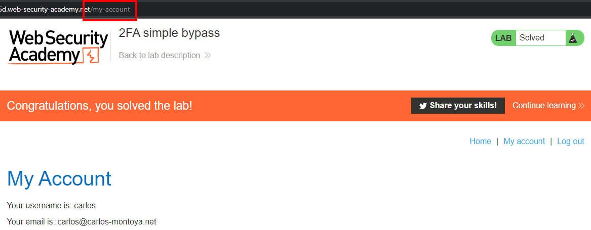

# Write-up: 2FA simple bypass @ PortSwigger Academy

This write-up for the lab *2FA simple bypass* is part of my walkthrough series for [PortSwigger's Web Security Academy](https://portswigger.net/web-security).

Learning path: Server-side topics → Authentication

Lab-Link: <https://portswigger.net/web-security/authentication/multi-factor/lab-2fa-simple-bypass>  
Difficulty: APPRENTICE  
Python script: [script.py](script.py)  

## Lab description

Clickable links for [Candidate usernames](https://portswigger.net/web-security/authentication/auth-lab-usernames) and [Candidate passwords](https://portswigger.net/web-security/authentication/auth-lab-passwords)

## Steps

### Login as wiener

As usual, I open the application and log in with the account `wiener`. On the top of the screen is a button `Email client`. When asked for the 4-digit security code, use the provided email client to retrieve it:

### Login as carlos

Now I try to log in as `carlos`. As I do not have access to his email client, I can not retrieve the 2FA code. What happens if I, instead of trying to find the 2FA code, manually change the URL and request the `my-account` page after the first step of authentication?

Obviously, the login operation is already performed after the first step of the 2FA authentication. Entering a wrong code triggers a logout. Manually bypassing it instead and directly accessing the known account page URL after the first step is enough to use this valid session.

