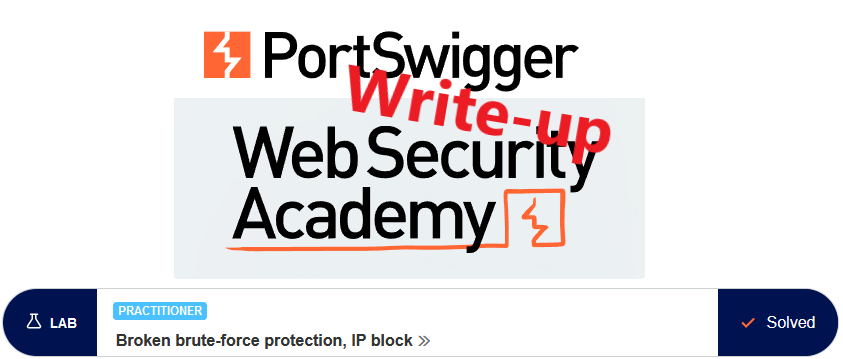
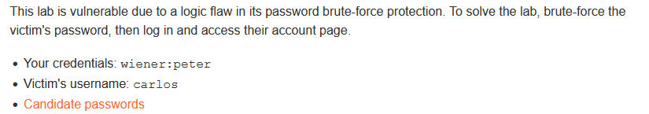
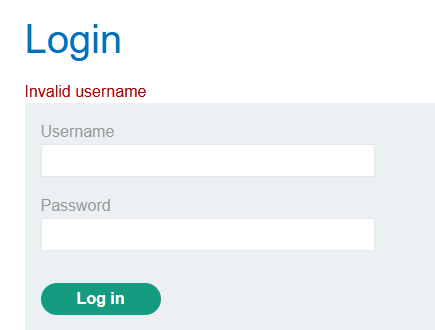
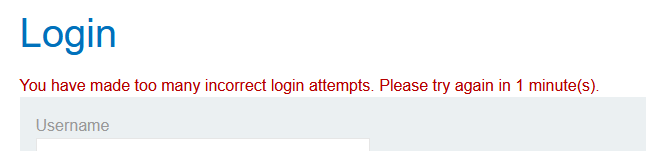
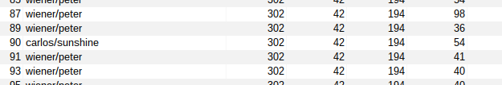
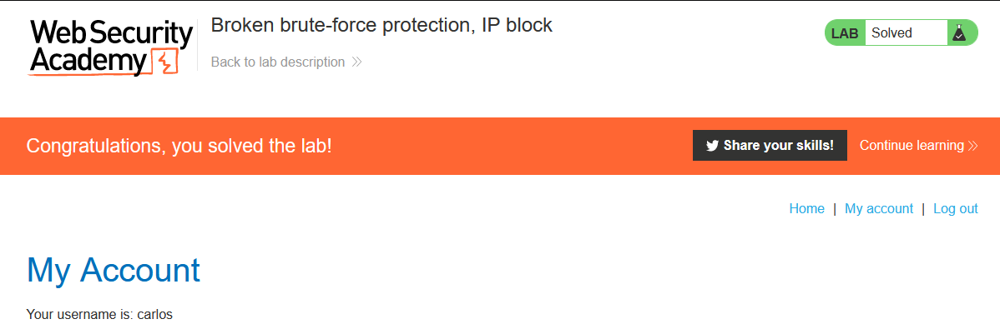

# Write-up: Broken brute-force protection, IP block @ PortSwigger Academy



This write-up for the lab *Broken brute-force protection, IP block* is part of my walkthrough series for [PortSwigger's Web Security Academy](https://portswigger.net/web-security).

Learning path: Server-side topics → Authentication

Lab-Link: <https://portswigger.net/web-security/authentication/password-based/lab-broken-bruteforce-protection-ip-block>
Difficulty: PRACTITIONER  
Python script: [script.py](script.py)  

## Lab description



Clickable links for [Candidate usernames](https://portswigger.net/web-security/authentication/auth-lab-usernames) and [Candidate passwords](https://portswigger.net/web-security/authentication/auth-lab-passwords)

## Steps

As usual, the first step is to analyze the functionality of the lab, in this case, the login functionality, and try to log in with some random username and password. This time, the error message is very specific:



The lab uses some form of brute-force protection, after a few unsuccessful login attempts, I get a different message and a coffee break:



After three unsuccessful attempts, the login gets locked out for a minute. I notice, however, that this counter appears to reset on a successful login. If I fail two login attempts and, with the third attempt, log in as `wiener`. After logout, I have again three attempts until it locks.

One way to solve the lab would be to inject the credentials of `wiener` on every third line and then use the Pitchfork attack on the Burp Intruder.

In the hint section of the Lab, the tool `Turbo Intruder` was mentioned, so I thought this is a good time to learn about it.

From the look of it, it is extremely configurable. After a quick look at the examples on [github](https://github.com/PortSwigger/turbo-intruder/tree/master/resources/examples), the basic usage with python scripts looks not too difficult.

I capture a login attempt and send it to `Turbo Intruder` (in the context menu: `Extensions->Turbo Intruder->Send to turbo intruder`).

I want both username and password fields to be configurable. For every entry in the `candidate_passwords.txt` file, I want to queue an additional request with the known good credentials `wiener:peter`. And as I'm unsure how concurrency and the brute force protection interact, I opt for a purely serial approach:


Script version:

```python
# Find more example scripts at https://github.com/PortSwigger/turbo-intruder/blob/master/resources/examples/default.py
def queueRequests(target, wordlists):
    engine = RequestEngine(endpoint=target.endpoint,
                           concurrentConnections=1,
                           requestsPerConnection=1,
                           pipeline=False
                           )

    for word in open('/home/frank/src/ctf-writeups/portswigger-websecurity-academy/authentication/candidate_passwords.txt'):
        engine.queue(target.req, ['carlos', word.rstrip()])
        engine.queue(target.req, ['wiener', 'peter'])


def handleResponse(req, interesting):
    if interesting:
        table.add(req)
```

And sure enough, when I order the result list by status, the single `carlos` line is easily visible in the myriad of `wiener/peter` lines:



Enumerated password: **sunshine**

Now I simply log in and the lab updates to


