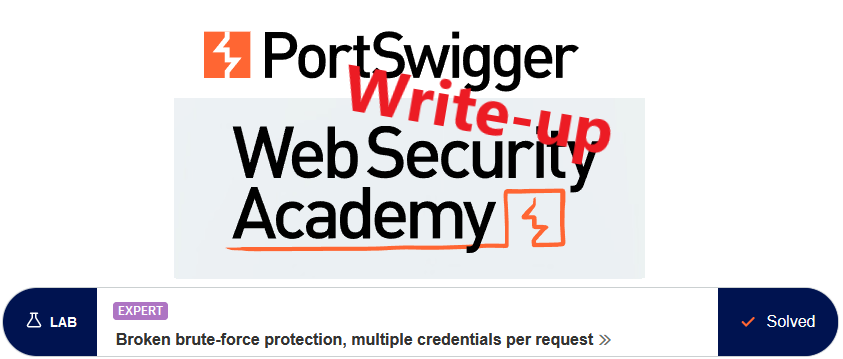
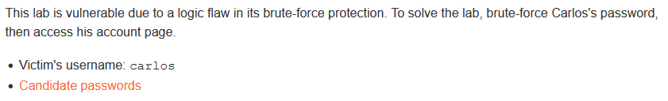
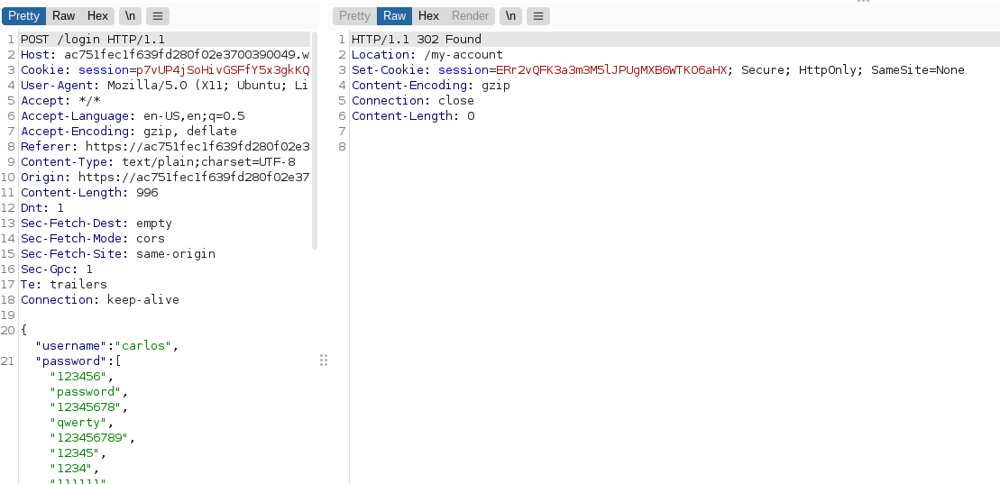
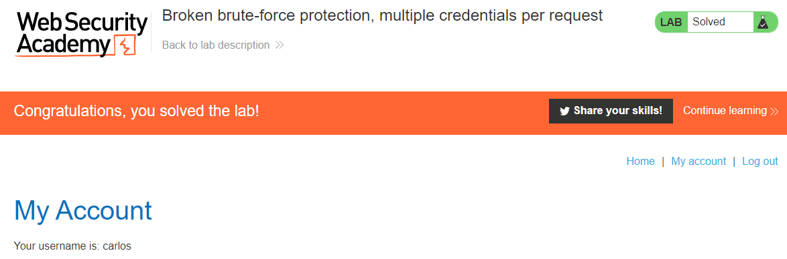

# Write-up: Broken brute-force protection, multiple credentials per request @ PortSwigger Academy

This write-up for the lab *Broken brute-force protection, multiple credentials per request* is part of my walkthrough series for [PortSwigger's Web Security Academy](https://portswigger.net/web-security).

Learning path: Server-side topics → Authentication

Lab-Link: <https://portswigger.net/web-security/authentication/password-based/lab-broken-brute-force-protection-multiple-credentials-per-request>  
Difficulty: EXPERT  
Python script: [script.py](script.py)  

## Lab description

Clickable link [Candidate passwords](https://portswigger.net/web-security/authentication/auth-lab-passwords)

## Steps

### Hunt for information

As usual, the first step is to analyze the functionality of the lab, in this case, the login feature. I start by finding some general information about the behavior of the brute-force protection, whether it is based on account names, source IPs or whatnot (ignoring the hint in the lab name for a bit)

So I try to login with invalid credentials and simply try to repeat the request a couple of times with Burp Intruder Null payloads.

As can be seen, after three attempts I am locked out for one minute. (Error message in the first three responses is `'Invalid username or password.`, whereas after that it changes to `You have made too many incorrect login attempts. Please try again in 1 minute(s).`) Therefore it is not based on usernames but on something that identifies me as the same client, be it IP or another characteristic.

To try whether the lockout is based on something in the HTTP headers I followed up with another Intruder run, this time modifying the User-Agent per request, using the `X-Forwarded-For` header and removing or modifying the cookie value. But to no avail, after three attempts the lockout occurs.

In theory, the correct way forward is to check for other issues that were covered in previous labs, e.g. subtle differences in errors or timing. But as each lab is dedicated to a single issue this will not be the correct way here and I skip these.

### Having a closer look at the request

One thing that was new here, compared to the previous labs, is that the request data was not the normal POST data but a JSON structure.

What happens if I set a hundred password parameters? I send the request to Turbo Intruder and try it out:

The response shows two things:

1. It is a case not handled properly by the application, resulting in an error.
2. As anything not handled by the application is a potential attack vector, the general approach might be correct, just not this exact syntax.

### Modifying the request

Sending 100 different password parameters results in a server error. So what happens if I supply a single password parameter that contains all the passwords in a list?

Here, the result is not one of the usual error messages, but it results in a 302-response.

Now just repeat the request in the browser to solve the lab. Strictly speaking, however, we have not found the password of `carlos`, we just logged in as `carlos`.

