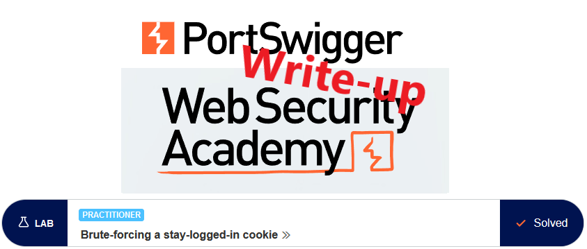
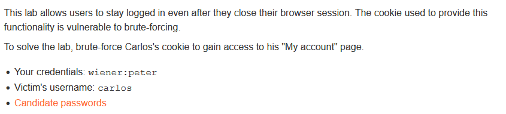
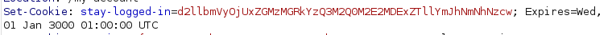
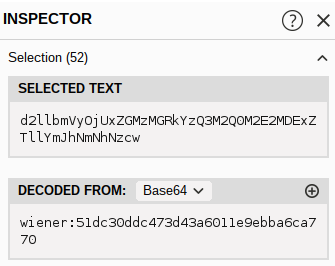
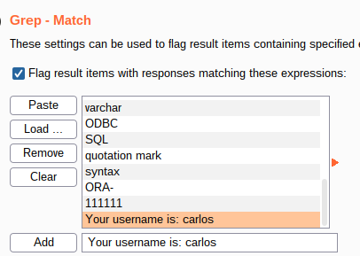
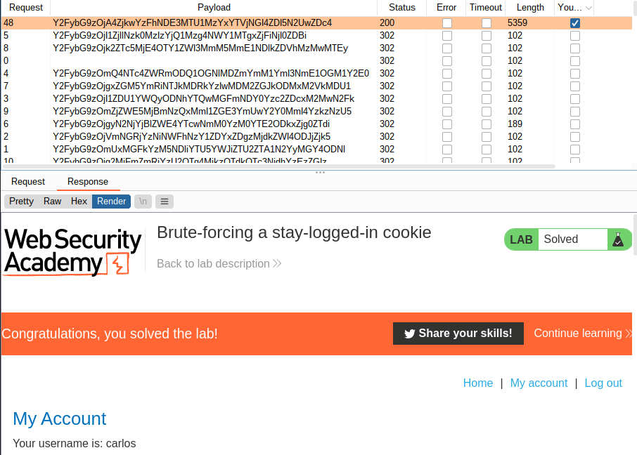
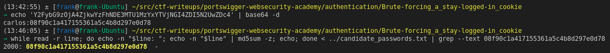
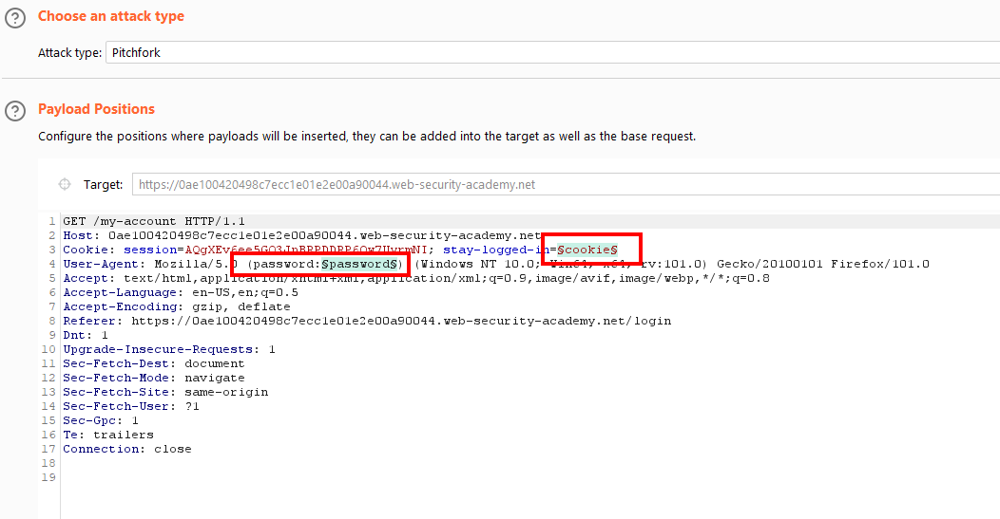
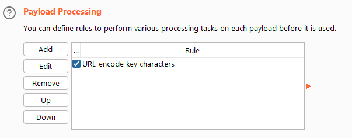
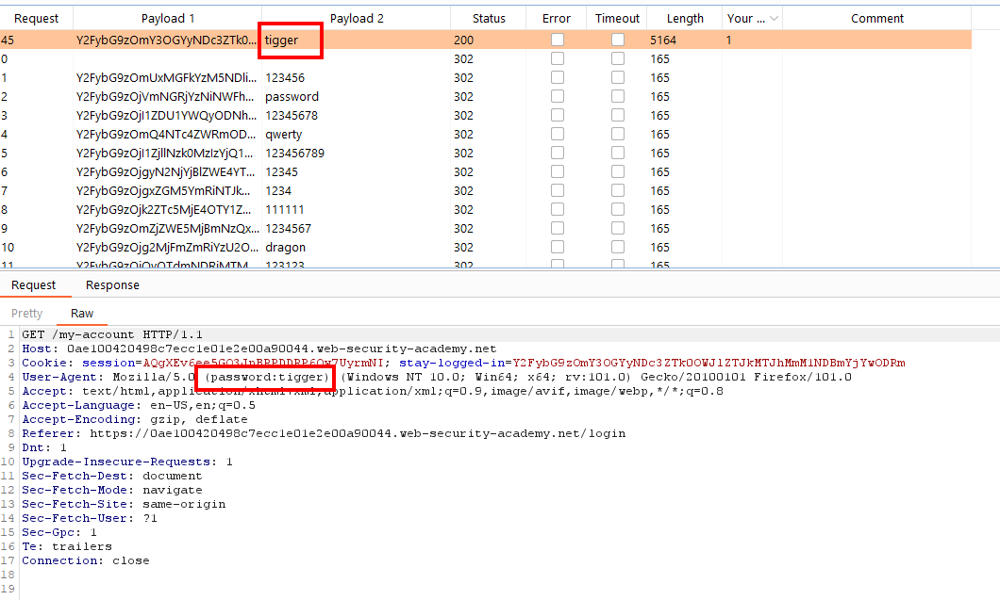

# Write-up: Brute-forcing a stay-logged-in cookie @ PortSwigger Academy

This write-up for the lab *Brute-forcing a stay-logged-in cookie* is part of my walkthrough series for [PortSwigger's Web Security Academy](https://portswigger.net/web-security).

Learning path: Server-side topics → Authentication

Lab-Link: <https://portswigger.net/web-security/authentication/other-mechanisms/lab-brute-forcing-a-stay-logged-in-cookie>  
Difficulty: PRACTITIONER  
Python script: [script.py](script.py)  

## Lab description

Clickable link for [Candidate passwords](https://portswigger.net/web-security/authentication/auth-lab-passwords)

## Steps

### Analyze cookie

As usual, the initial step is to analyze the login and 'stay-login' process. As such, I log in with the known credentials of the user `wiener`. In the response, a cookie is set that catches the eye:

Using Burp Suite, it immediately shows the decoded value in the Inspector:

It can be seen that the username is part of the cookie. If I can guess the second part correctly for a user it becomes possible to create valid cookies for that user.

The second part looks like a hash and is 32 characters long, which lets me think md5. Let's see if it is a simple md5 of the username (which would be a really fatal flaw as no password would be required) or the password (which would be not much better):

And indeed, the second part is an md5 hash of the password

### Brute force the cookie

I send the request for the account page to Burp Intruder, setting the `stay-logged-in` cookie as the payload

- Attack type: **Sniper**
- Payload: 

For each of the passwords, I hash it, add the username in front and base64-encode everything. I also set on the options page a matching rule to quickly see if I am logged in as user `carlos`:

And sure enough, ordering after this rule just has a single hit and the lab updates:

### Brute force the password from the known hash

Being able to log into a session of the victim is well and good, but I also want to know the actual password. In the Burp Intruder run above I could not find a way to display the raw payload value that was used, just the final payload after all the payload processing was performed.

To obtain the password, I send the cookie value to Decoder and decode it with base64:

As the hash is not salted (it does not contain any random unique part) it becomes easy to get the password with the help of [rainbow tables](https://en.wikipedia.org/wiki/Rainbow_table). 

But here, the candidate password file is rather short. This makes a password brute force very quick without them:

Here, I read the candidate_passwords.txt file line by line, calculate the md5sum of its content and check if it matches the now known hash.

And yes, I know that this approach is very bad in real life as it calculates every single hash before it does the grep, but it was the fastest to type that came into mind :)

### Improvement: Know the actual password straight away

As an improvement, I added a second payload to Intruder. The first one, the actual cookie, I set up identical as above. 

For the second one, I use the same list but don't perform any hashing. I add this inside the `User-Agent` header. To ensure that it does not break if a password candidate contains any characters that are illegal in the header I use a payload processing rule to URL-encode it:

Running the attack yields a much nicer result:

I see the password directly in the Intruder result list (it was a different session so the password differs from the one above). Even if the password would have contained characters that got URL-encoded it would be trivial to decode it.
