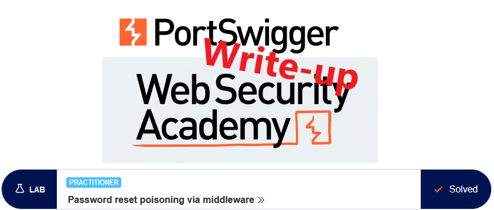
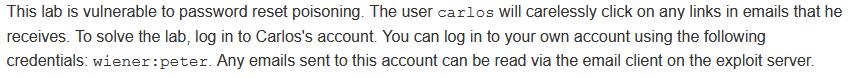
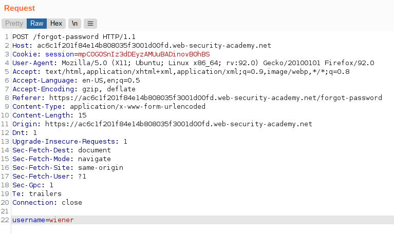
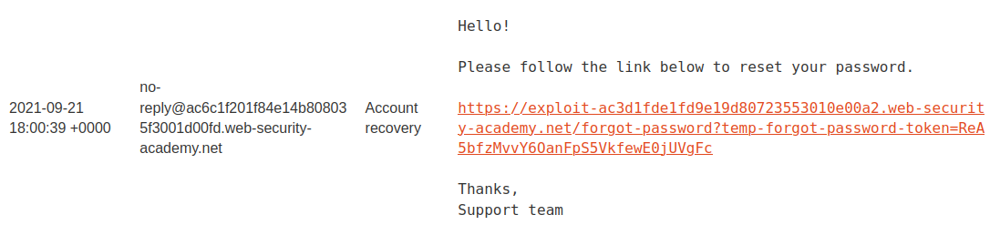
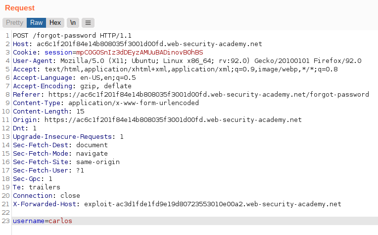
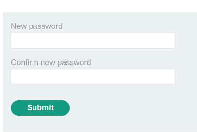
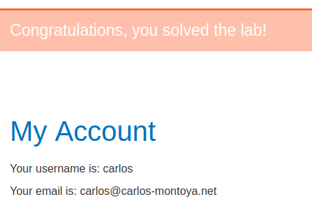

# Write-up: Password reset poisoning via middleware @ PortSwigger Academy

This write-up for the lab *Password reset poisoning via middleware* is part of my walkthrough series for [PortSwigger's Web Security Academy](https://portswigger.net/web-security).

Learning path: Server-side topics → Authentication

Lab-Link: <https://portswigger.net/web-security/authentication/other-mechanisms/lab-password-reset-poisoning-via-middleware>  
Difficulty: PRACTITIONER  
Python script: Currently no script

## Lab description

## Steps

### Analyze password reset process

As usual, the first step is to analyze the functionality of the lab, in this case, the password reset feature. Clicking on the "Forgot password?"-link and entering the username `wiener`, we receive a password reset email on our email account:

Clicking on the link allows setting a new password as one would expect. The request triggering this looks unremarkable, as does the one for actually setting the new password.

On the exploit server, I can create a web page, see the access logs of the exploit server and read the emails of `wiener`.

I can't fake the second request directly as it requires the `temp-forgot-password-token`, which the server generates as a response to the first request. The token is dynamic and changes on every request regardless of whether the previous one was used or not. 

But it is contained in the URL, so if the request can be manipulated to point to the exploit server, it will be written to the server log.

### Manipulate the request

The request contains multiple headers referring to the host. If I can manage to include the exploit server, we might be able to obtain useful information in the access logs.

As I have an own account and access to its emails, I can try this out. Attempting to manipulate the `Origin` and `Referer` values did not change the URL within the 'reset password' email.

Checking for possible headers on [mozilla.org](https://developer.mozilla.org/en-US/docs/Web/HTTP), one stands out quickly: [X-Forwarded-Host](https://developer.mozilla.org/en-US/docs/Web/HTTP/Headers/X-Forwarded-Host).

It is used to identify the original host header sent by the client in scenarios where reverse proxies are in place that might replace the other headers. So I start to play reverse proxy.

I get the original request for the password reset, send it to Burp Repeater and add an `X-Forwarded-Host` header pointing to the exploit server.

Sure enough, the email now contains a link to my exploit server, clicking it shows our token in the access log:

Now it becomes easy, I just change the username to `carlos` and send the request again:

And sure enough, true to his words `carlos` clicks on any link he receives:

### Changing the password

The remaining step is trivial, I send the password change request of `wiener` to Repeater and change the token to the one obtained from `carlos`. I can not access his reset password page and set the password to a known value:

Logging in with the now known credentials results in:

