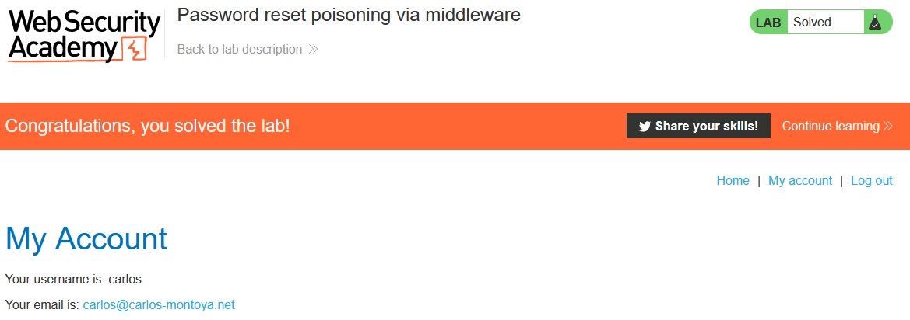

# Lab: Password reset poisoning via middleware

Lab-Link: <https://portswigger.net/web-security/authentication/other-mechanisms/lab-password-reset-poisoning-via-middleware>  
Difficulty: PRACTITIONER  
Python script: Currently no script

## Known information

- Website vulnerable to password reset poisoning
- Known good credentials for user `wiener:peter`
- User `carlos` is a good phishing target and clicks on anything
- Goals:
  - Log into account of `carlos`

## Steps

### Analyse password reset process

As usual, starting the lab with analyzing the process of the password request. Clicking on the "Forgot password?"-link and entering the username `wiener`, we receive a password reset email on our email account:

Clicking on the link allows to set a new passwords as would be expected. The request triggering this looks unremarkable, as does the one for actually setting the new password.

On the exploit server, we can create a web page, see the access logs of the exploit server and read the emails of wiener.

We can't fake the second request directly as it requires the `temp-forgot-password-token`, which the server generates as response of the first request. The token is dynamic and changes on every request regardless whether the previous one was actually used or not. But it is contained in the URL, so if the request can be manipulated to point to the exploit server, it will be written to the server log.

### Manipulate the request

The request contains multiple headers referring to the host. If we can manage to include the exploit server, we're golden.

As we have an own account and access to its emails, we can try it out. Attempting to manipulate the `Origin` and `Referer` values did not change the URL within the 'reset password' email.

Checking for possible headers on [mozilla.org](https://developer.mozilla.org/en-US/docs/Web/HTTP), one stands out quickly: [X-Forwarded-Host](https://developer.mozilla.org/en-US/docs/Web/HTTP/Headers/X-Forwarded-Host).

It identifies the original host header sent by the client in scenarios where reverse proxies are in place that might replace it. So let's play reverse proxy.

Getting the original request of the password reset, sending it to repeater and adding a `X-Forwarded-Host` header pointing to the exploit server.

Sure enough, the email now contains a link to our exploit server, clicking it shows our token in the access log:

Now it becomes easy, just changing the username to carlos and send the request again:

And sure enough, true to his words `carlos` clicks on any link he receives:

### Changing the password

The remaining step is trivial, using the real URL of the server, access the reset password page of carlos to set the password to a known value:

Logging in with the now known credentials results in:

