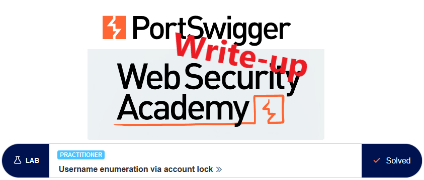
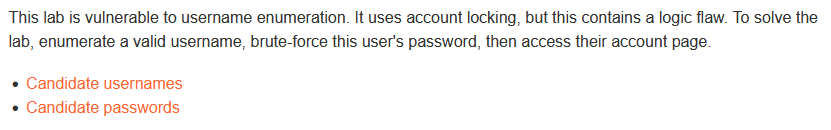
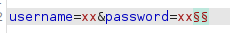
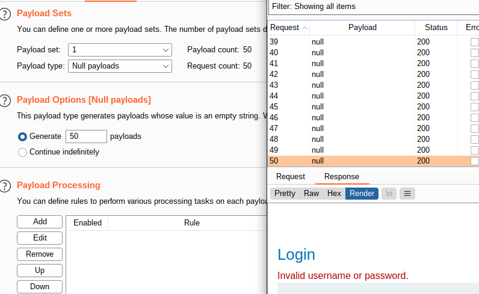
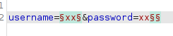
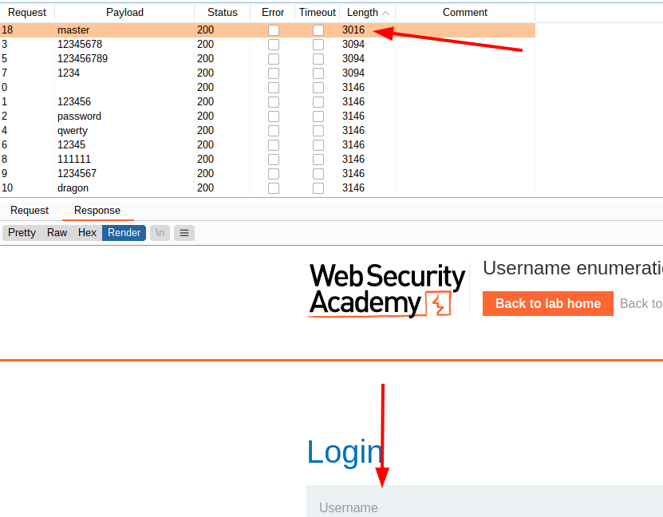
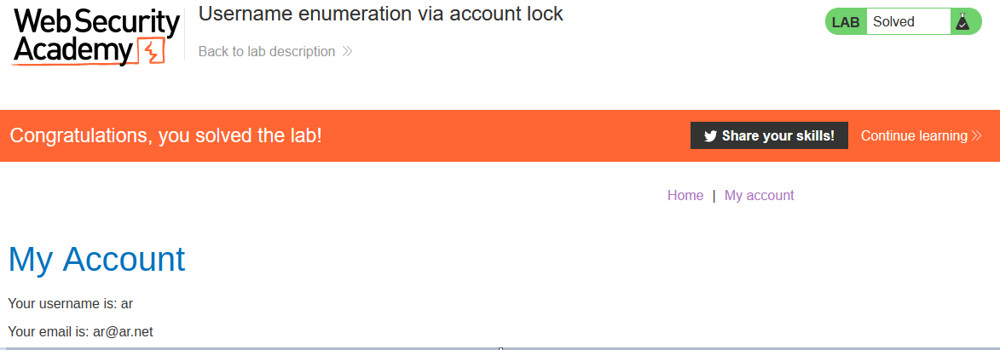

# Write-up: Username enumeration via account lock @ PortSwigger Academy

This write-up for the lab *Username enumeration via account lock* is part of my walkthrough series for [PortSwigger's Web Security Academy](https://portswigger.net/web-security).

Learning path: Server-side topics → Authentication

Lab-Link: <https://portswigger.net/web-security/authentication/password-based/lab-username-enumeration-via-account-lock>  
Difficulty: PRACTITIONER  
Python script: [script.py](script.py)  

## Lab description

Clickable links for [Candidate usernames](https://portswigger.net/web-security/authentication/auth-lab-usernames) and [Candidate passwords](https://portswigger.net/web-security/authentication/auth-lab-passwords)

## Steps

### Enumerate username

As a first step, I want to find out some basics about the account lockout. It states account lockout, so I guess it is based on actual usernames, but to verify I try to login with an (allegedly) invalid username and see if it locks me out based on my IP.

For this, I use the null payload option to generate 50 login attempts. But even after the 50th request, it still states 'Invalid username or password' and does not mention any lockout.

- Attack type: **Sniper**
- Payload: Null payloads, 50 times

That means it does not trigger based on login attempts from one source, but on existing accounts only. So I repeat the last step, this time making multiple requests for each possible username and see whether there is a different behavior or message.

- Attack type: **Cluster Bomb**
- Payload 1: the provided candidate usernames
- Payload 2: Null payloads, 10 times

After this finishes, most responses have a length of 3094. For one username there are a couple of responses with a different length though:

It can also be seen that I have 3 attempts before the lockout occurs.

Enumerated username: **ar**

### Find the password

As the lockout is just one minute, and the potential password list is small it would be possible to just brute-force our way in by waiting for one minute after each third attempt. However, I suspect that is not the correct solution here.

So now that a username is known let's see what happens if I try to brute-force it

- Attack type: **Sniper**
- Payload 1: the provided candidate passwords

The result is somewhat unexpected. There are the expected 3 attempts with the 'Invalid username or password' response, there are the remaining attempts with the 'You have made too many incorrect login attempts'-message, and there is a single response without any error message.

Found password: **master**

So I wait one minute and test whether this is the correct password. The lab updates to

