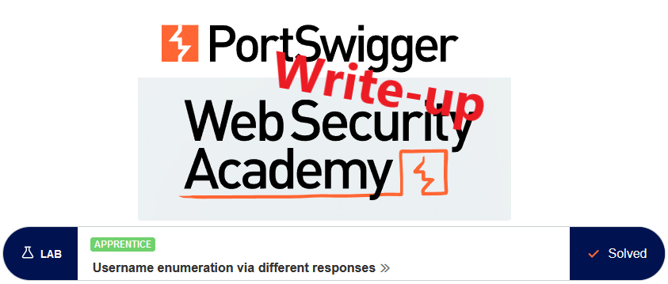
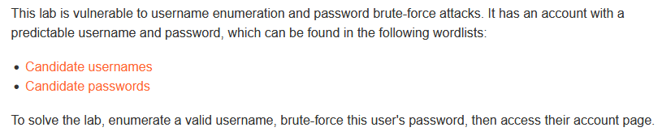

# Write-up: Username enumeration via different responses @ PortSwigger Academy

This write-up for the lab *Username enumeration via different responses* is part of my walkthrough series for [PortSwigger's Web Security Academy](https://portswigger.net/web-security).

Lab-Link: <https://portswigger.net/web-security/authentication/password-based/lab-username-enumeration-via-different-responses>  
Difficulty: APPRENTICE  
Python script: [script.py](script.py)  

## Lab description

Clickable links for [Candidate usernames](https://portswigger.net/web-security/authentication/auth-lab-usernames) and [Candidate passwords](https://portswigger.net/web-security/authentication/auth-lab-passwords)

## Enumerate username

As a first step, I go to the page and try to log in with some random username and password. The response I receive is quite chatty about the error reason:

Such behavior is rather rare nowadays but shows nicely the reason behind the generic 'login failed' messages of today.

I load the page in Burp Intruder, with the username as the only payload

- Attack type: *Sniper*
- Payload: *provided username list*

After running the enumeration, I need to find the valid usernames. The page shows `invalid username` if the user is not found, so I use a negative filter to find for which username the message does **not** appear:

Username found: **announcements**

### Brute force password

In the screenshot above, another very verbose error message is visible, so I repeat the same step, using the username found as the value for the username argument and brute-forcing the password argument with the provided password list.

- Attack type: *Sniper*
- Payload: *provided password list*

The filter settings now use the `Incorrect password` message to show just the correct password. The page is a redirect to the `/my-account` page which is the goal of the lab.

### Login

All that is left is to log in with the username and password combination, or simply use Burps 'Request in browser' feature to avoid typing and the lab updates to

