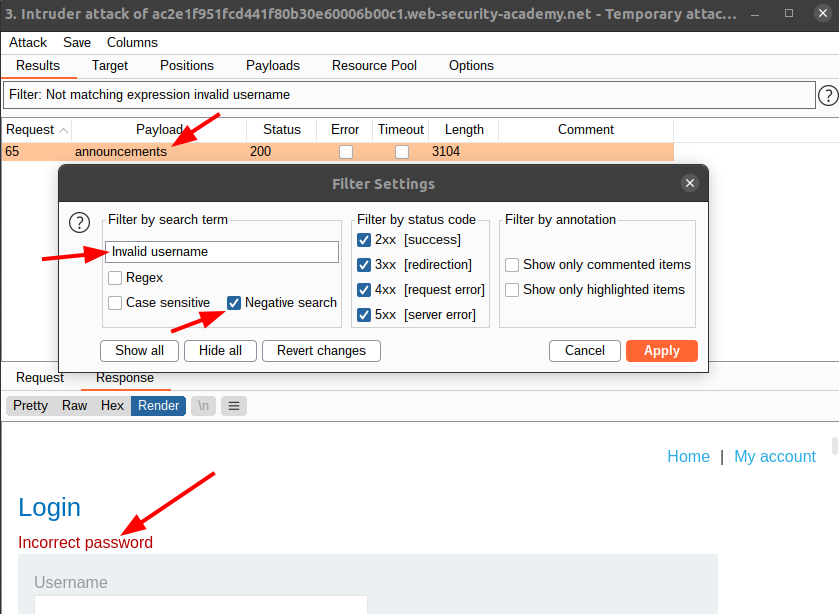
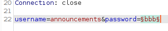
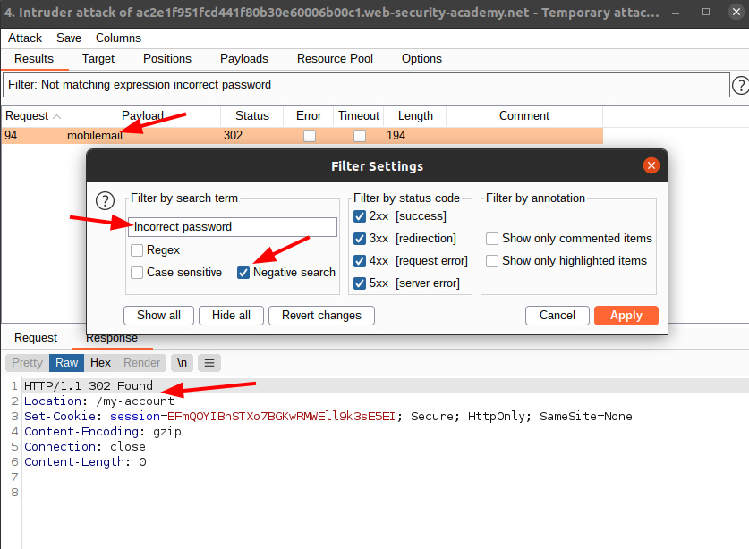
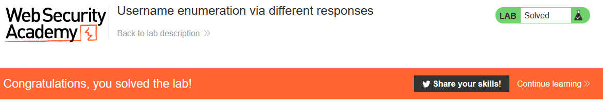

# Lab: Username enumeration via different responses

Lab-Link: <https://portswigger.net/web-security/authentication/password-based/lab-username-enumeration-via-different-responses>  
Difficulty: APPRENTICE  
Python script: [script.py](script.py)  

## Known information

- Login mechanism vulnerable to brute force
- Detailed responses about cause of error
- Lists of possible usernames and passwords are provided
- Goals:
  - enumerate a valid user
  - brute force the corresponding password
  - login and access account page

## Enumerate username

As a first step, go to the page and try to login with some random username and password. Notice that the response is rather telling about the error reason:

Such behaviour is rather rare nowadays but shows nicely the reason behind the generic 'login failed' messages of today.

Load the page in Burp Intruder, with the username as only payload

- Attack type: *Sniper*
- Payload: *provided username list*

After running the enumeration, we need to find the valid usernames. The page shows `invalid username` if the user is not found, so use a negative filter for this:

Username found: **announcements**

### Brute force password

In the screenshot above we clearly see another very verbose error message, so we basically repeat the step, using the username found as username and brute forcing the password argument with the provided password list.

- Attack type: *Sniper*
- Payload: *provided password list*

The result filter now uses the `Incorrect password` message to show just the correct password. The page is a redirect to the `/my-account` page that is goal of the lab.

### Login

Login with the username and password combination, or simply use Burps 'Request in browser' feature to avoid typing results in:

