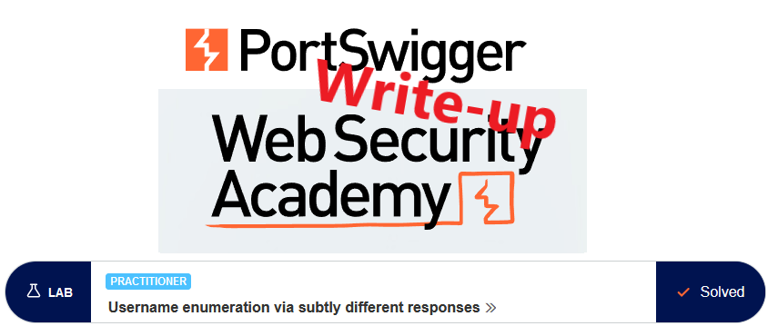
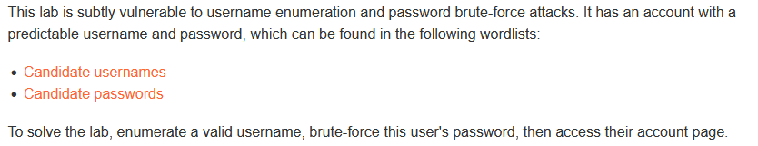
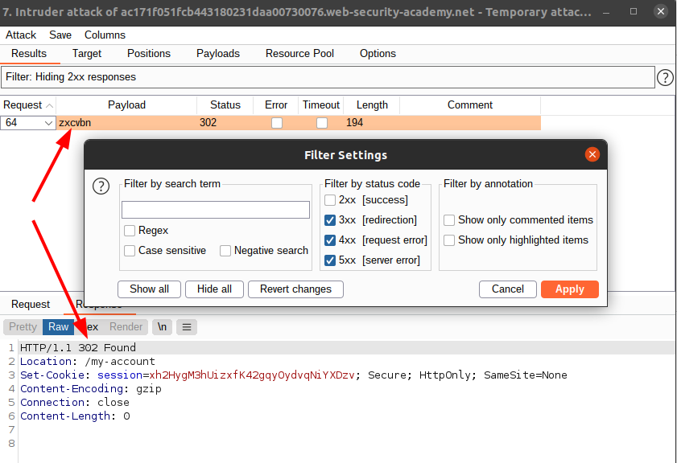

# Write-up: Username enumeration via subtly different responses @ PortSwigger Academy

This write-up for the lab *Username enumeration via subtly different responses* is part of my walkthrough series for [PortSwigger's Web Security Academy](https://portswigger.net/web-security).

Learning path: Server-side topics → Authentication

Lab-Link: <https://portswigger.net/web-security/authentication/password-based/lab-username-enumeration-via-subtly-different-responses>  
Difficulty: PRACTITIONER  
Python script: [script.py](script.py)  

## Lab description

Clickable links for [Candidate usernames](https://portswigger.net/web-security/authentication/auth-lab-usernames) and [Candidate passwords](https://portswigger.net/web-security/authentication/auth-lab-passwords)

## Steps

### Enumerate username

As usual, the first step is to analyze the functionality of the lab, in this case, the login functionality, and try to log in with some random username and password. This time, the error message is rather generic:

In general, this is good practice for any type of login functionality. But it relies on the fact that the error message is 100% identical in all cases. If it is hardcoded in multiple places, then there is the risk that there are minor differences. Might be a simple typo, some punctuation, or even just extra spaces.

 I load the page in Burp Intruder, with the username as the only payload.

- Attack type: *Sniper*
- Payload: *provided username list*

After running the enumeration, I need to find if there are any deviations in the responses. When I logged in with a random username, the page showed `Invalid username or password.`. I use a negative search filter to see if any responses do not match this:

And indeed, in one case the error message misses the full stop at the end.

Username found: **apps**

### Brute force password

Now I repeat the step, this time for the password argument until the correct password is found.

- Attack type: *Sniper*
- Payload: *provided password list*

On successful login, the page redirects, so I remove all responses with 2xx status codes (alternative, filter for responses not containing 'Invalid username or password'

### Login

Lastly, I log in with the username and password combination, or simply use Burps 'Request in browser' feature to avoid typing results in and the lab updates to:

