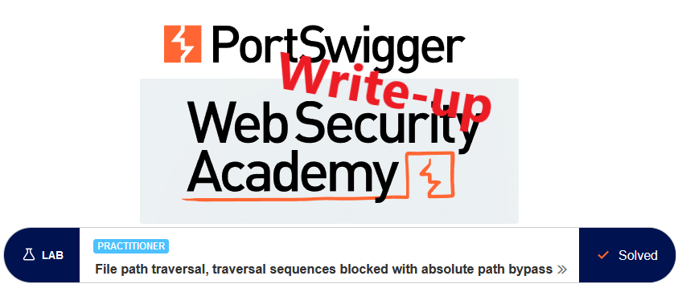
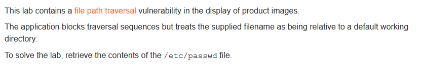
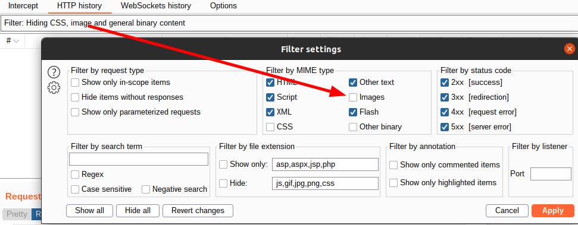
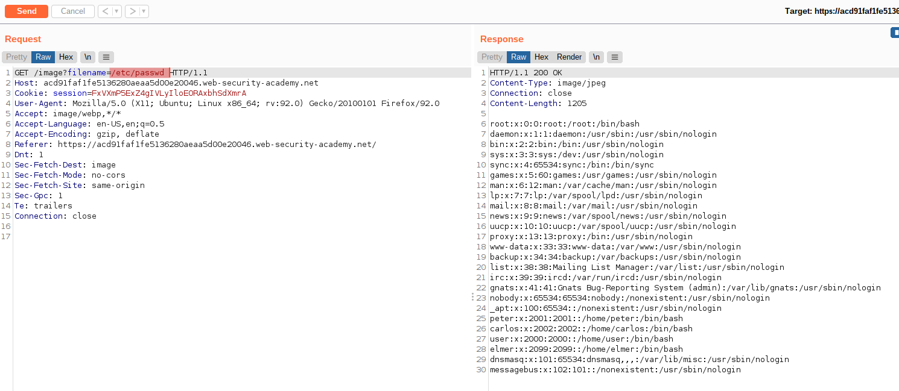
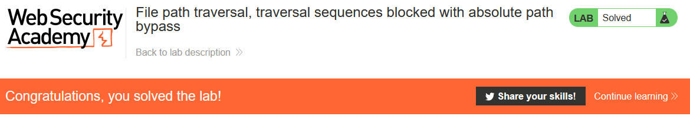

# Write-up: File path traversal, traversal sequences blocked with absolute path bypass @ PortSwigger Academy

This write-up for the lab *File path traversal, traversal sequences blocked with absolute path bypass* is part of my walkthrough series for [PortSwigger's Web Security Academy](https://portswigger.net/web-security).

**Learning path**: Server-side topics → Directory traversal

Lab-Link: <https://portswigger.net/web-security/file-path-traversal/lab-absolute-path-bypass>  
Difficulty: PRACTITIONER  
Python script: [script.py](script.py)  

## Lab description

## Steps

### Analysis

The first step is as usual the analysis of the website. It is a shop website with a few rather interesting products. I recommend reading the product descriptions. It does not help at all with the lab, but PortSwigger put in the effort to write interesting texts so the least we can do is read them. 

Like in the [previous lab](../File_path_traversal,_simple_case/README.md), the page references the product images as file names, indicating a possible path traversal vulnerability

As described in the lab description, simply requesting `../../../etc/passwd` does not lead to any file. The hint in the lab description, 'filenames are treated as relative to a default working directory', could be interpreted in different ways:

1. Default as defined within the application:

    The application prepends this default working directory to the requested filename before trying to access the file (e.g. something like `'/var/html/www/' + $_REQUEST["filename"]`, the hardcoded first part could be interpreted as 'default working directory')

2. Default as defined by the webserver:

    Alternatively, the application could rely on the fact that the execution of file system activities will always happen in the 'default working directory' of the webserver if no path is given. So when requesting `64.jpg`, which by itself is no path, it will assume the path of `/image` to look for the file.

    But when provided with an absolute path, then this path is used.

I rule out the first one as this would allow simple path traversals which are not possible. Thus assuming it is the second interpretation then providing an absolute path may be the solution.

### The malicious payload

So I load the page and send one of the image requests to Burp Repeater.  If you don't see it in the HTTP history, check if images are filtered out in the filter bar (by default it is hidden):

Now I request the `/etc/passwd` with its absolute path:

At the same moment, the lab page updates to

