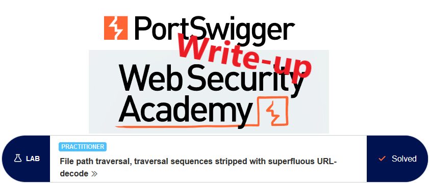
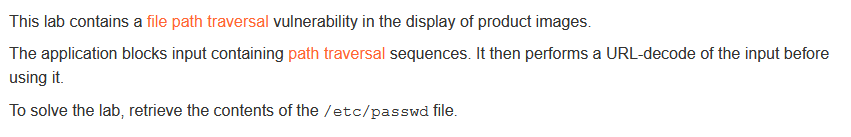
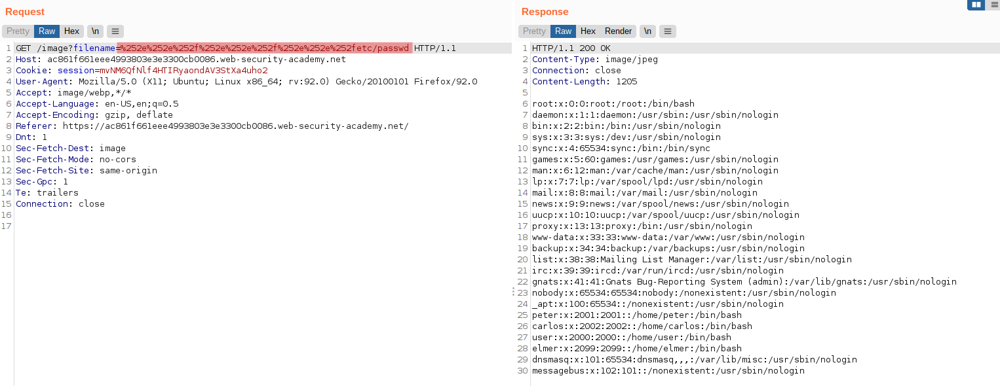
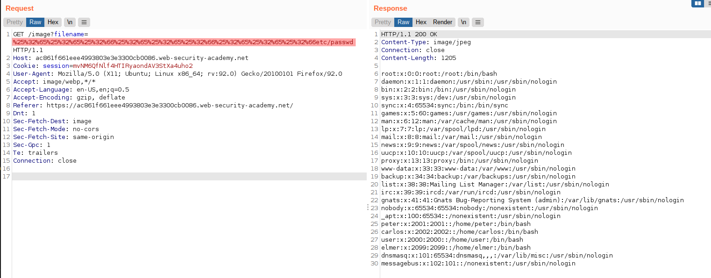
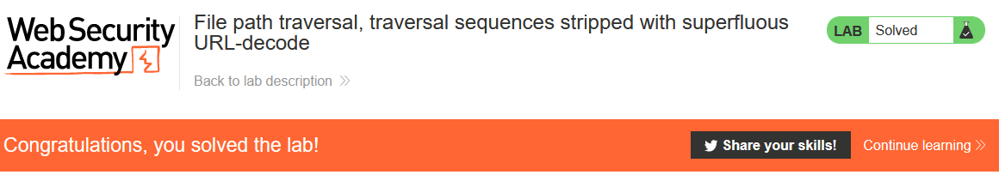

# Write-up: File path traversal, traversal sequences stripped with superfluous URL-decode @ PortSwigger Academy



This write-up for the lab *File path traversal, traversal sequences stripped with superfluous URL-decode* is part of my walkthrough series for [PortSwigger's Web Security Academy](https://portswigger.net/web-security).

**Learning path**: Server-side topics → Directory traversal

Lab-Link: <https://portswigger.net/web-security/file-path-traversal/lab-superfluous-url-decode>  
Difficulty: PRACTITIONER  
Python script: [script.py](script.py)  

## Lab description



## Steps

### Analysis

The first step is as usual the analysis of the website. Like in the earlier labs on path traversal, it is a shop website. The page references the product images as file names again, indicating a possible path traversal vulnerability.

The solutions of the previous labs will not be successful here. But the description mentions that the application removes path traversal sequences first, then URLdecodes the remaining.

URL encoding is a means to ensure data is within the character range that is allowed in URLs, regardless of the actual value of the data. It is usually used for data that either contains characters that have a special meaning within URLs (e.g. `&`) or is non-printable data. But of course, it can be used for any printable ASCII characters.

In the case of characters within the normal ASCII range, the character is represented by a `%`, followed by its ASCII value in hex. The characters required for a path traversal and their encodings are:

```urlencode
. --> %2e 
/ --> %2f
```

### Accessing /etc/passwd

One level of URLdecoding is usually done by the server itself upon receiving the request. Therefore just encoding `../` as `%2e%2e%2f` will not be enough. The server performs the URLdecoding and passes `../` to the application, which filters it out. But nothing stops us from URLencode the encoded string again before sending.

For this, we need to encode also encode the `%` character itself:

```urlencode
. --> %2e 
/ --> %2f
% --> %25
```

One possible string would be `%252e%252e%252f`. The server decodes each `%25` to `%`, the strings `2e` and `2f` by themselves have no special meaning and will be treated as literal characters. The application, therefore, receives the sequence `%2e%2e%2f`, strips path traversal components (which are not there at this point), then URLdecodes it to `../`

### The malicious payload

A valid filename for the path traversal is therefore `%252e%252e%252f%252e%252e%252f%252e%252e%252fetc/passwd`



### An alternative payload

Of course, when using Burp Repeater it is much easier to just type the `../../../` part in, than select it and `right-click -> Convert Selection -> URL -> URL encode all characters` twice. 

This also encodes the `2 5 e f` characters from the first conversion, leading to a filename of `%25%32%65%25%32%65%25%32%66%25%32%65%25%32%65%25%32%66%25%32%65%25%32%65%25%32%66etc/passwd`, which is also perfectly fine here:



While issuing either of the requests above, the page updates to


