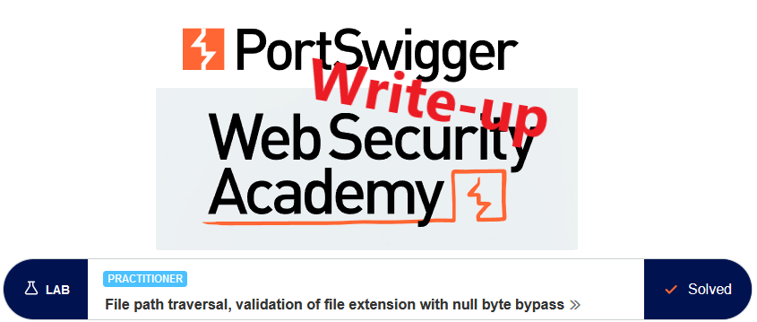
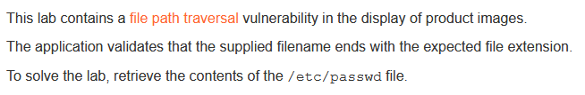
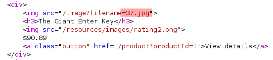
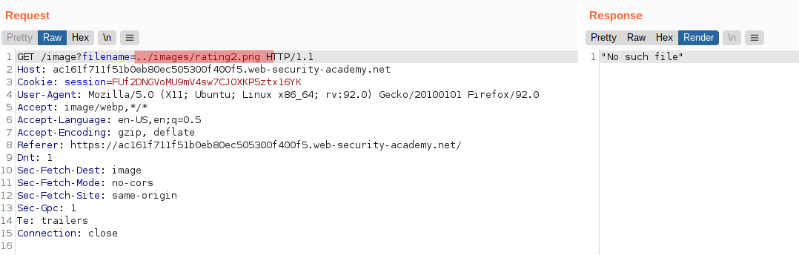
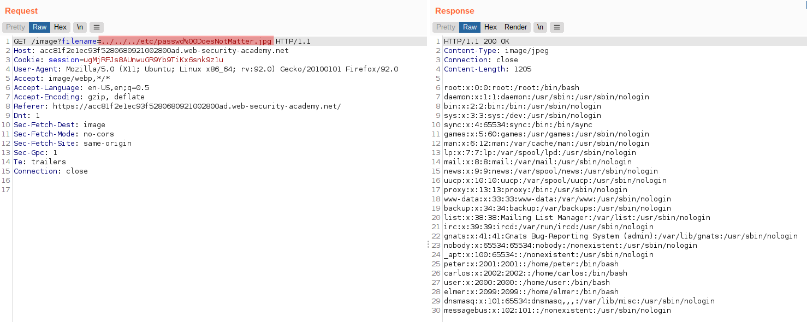
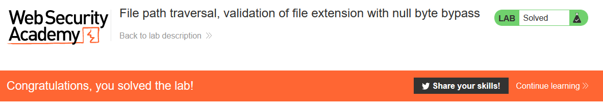

# Write-up: File path traversal, validation of file extension with null byte bypass @ PortSwigger Academy

This write-up for the lab *File path traversal, validation of file extension with null byte bypass* is part of my walkthrough series for [PortSwigger's Web Security Academy](https://portswigger.net/web-security).

**Learning path**: Server-side topics → Directory traversal

Lab-Link: <https://portswigger.net/web-security/file-path-traversal/lab-validate-file-extension-null-byte-bypass>  
Difficulty: PRACTITIONER  
Python script: [script.py](script.py)  

## Lab description

## Steps

### Analysis

The first step is as usual the analysis of the website. Like in the earlier labs on path traversal, it is a shop website. The page references the product images as file names again, indicating a possible path traversal vulnerability. Here, the filenames are provided as basic filenames:

The rating image just below uses the `images` directory. Guessing that the product images might be in the same directory, try whether path traversal sequences are possible:

And indeed, I can back out and return to the images directory. Now try the same with the `rating2.png` file:

This request does not provide the image. While I have of course no way of knowing that the two `images` directories are actually the same, it gives the indication that the file extension is checked (ignoring the fact that I know it due to the lab name).

This check may be done by simply comparing the last 4 characters of the filename with the string literal `.jpg`. Any type of such string comparison may be vulnerable to an ancient issue: null termination of strings.

### Some background

A lot of low-level software like operating systems are written in C. In that language, strings are defined as sequences of characters that are followed by a null byte (a full byte of all zeros in binary, or %00 in URLencoding). There was no way of checking the length of a string but iterating over it until a null byte was found.

As long as the null byte was found within the reserved memory area, the length of the string was found. For example, if within a 10-character range the content is `ABCD%00`, then the string is `ABCD` with a length of 4. The amount of memory used is always one byte more than the usable length to account for the null byte.

This leads to a wonderful amount of bugs and vulnerabilities. If the developer does not account for this additional byte it can result in reading or writing over the reserved space, leading to all kinds of undesired consequences, like application crashes (best case) or arbitrary code execution (best case for attackers).

A lot of low-level functionality is still based on C, so terminates a string at the first null byte found. If all components of a system agree on the same behaviour, this does not pose an issue (besides the inherent issues of null termination).

But if components treat strings differently, then this different behaviour can be exploited.

For example, a lot of more modern languages have dedicated string types and do neither require nor use null termination for their strings. In this case, I want to access a file, so at some point, the request will be passed from the application to the operating system

### The malicious payload

I need to construct a string that fulfils these requirements:

- Succeeds the filename check in the application, in this case ending in `.jpg`
- Contains a null byte so that the operating system will not process the full filename
- Result filename must reference `/etc/passwd`

Above I already established that basic path traversal is possible. So a valid filename that fulfils the requirements would be `../../../etc/passwd%00DoesNotMatter.jpg`

So I catch an image request in Burp and send it to Repeater. If you don't see it in the HTTP history, check if images are filtered out in the filter bar (by default it is hidden):

At this point, the lab page updates to

