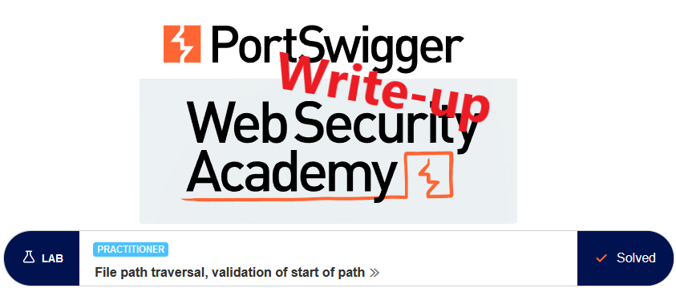
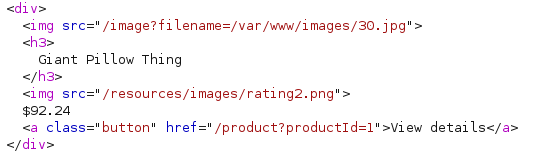
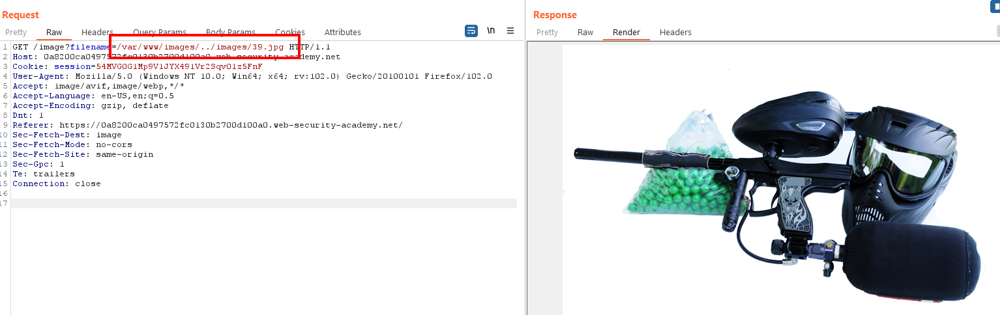

# Write-up: File path traversal, validation of start of path @ PortSwigger Academy

This write-up for the lab *File path traversal, validation of start of path* is part of my walkthrough series for [PortSwigger's Web Security Academy](https://portswigger.net/web-security).

**Learning path**: Server-side topics → Directory traversal

Lab-Link: <https://portswigger.net/web-security/file-path-traversal/lab-validate-start-of-path>  
Difficulty: PRACTITIONER  
Python script: [script.py](script.py)  

## Lab description

## Steps

### Analysis

The first step is as usual the analysis of the website. It is a shop website with a few rather interesting products. I recommend reading the product descriptions. It does not help at all with the lab, but PortSwigger put in the effort to write interesting texts so the least we can do is read them. 

Like in the previous labs of the path traversal section, we start to analyze how the filenames for the images are provided. Here, the absolute path is provided in the HTML:

The application checks that the path starts with the expected values, in this case, the absolute path `/var/www/images`, so neither different absolute paths (`/etc/passwd`) nor relative paths (`../../../etc/passwd`) are possible.

What I do not know is if this check is done with the path provided in the request or with the canonical path. The canonical path is always a direct, absolute and unique path from the root to the file

For example, the path `/var/www/images/30.jpg` is both absolute and canonical. The path `/var/www/images/../images/30.jpg` is still absolute but not canonical as it is not a unique identifier. I can simply leave some parts out (the `../images/`) and still identify the same file

So I send an image request to Repeater to find out.  If you don't see it in the HTTP history, check if images are filtered out in the filter bar (by default it is hidden):

Therefore I can reference any file on the file system when I use a non-canonical path, as long as it is absolute and starts with `/var/www/images/`.

### The malicious payload

Referencing the `/etc/passwd` file is now easy:

While performing this request, the lab updates to

