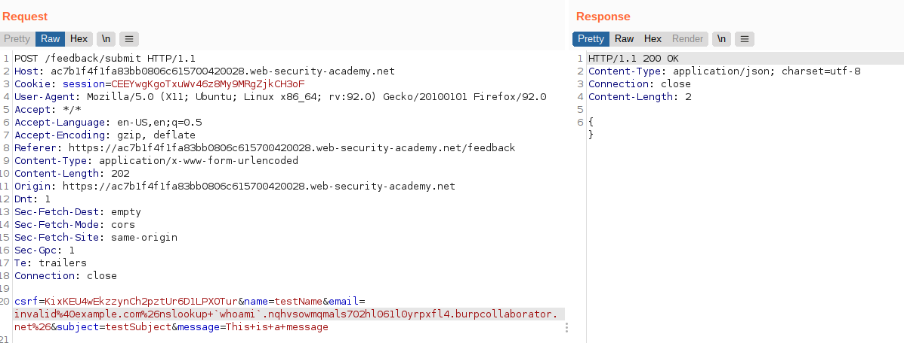
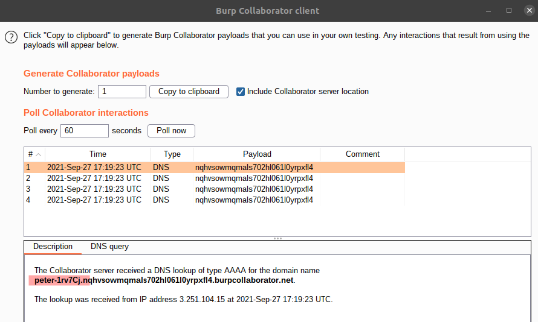

# Lab: Blind OS command injection with out-of-band data exfiltration

Lab-Link: <https://portswigger.net/web-security/os-command-injection/lab-blind-out-of-band-data-exfiltration>  
Difficulty: PRACTITIONER  
Python script: No script available  
Burp Suite Professional is required to solve this lab!

## Known information

- OS command injection vulnerability in the feedback feature
- Application call a shell command with user input. Execution is asynchronous and has no observable impact on the application
- Goals:
  - Issue a DNS lookup containing the username to Burp Collaborator

## Steps

As with the previous labs in this section, I first have a look at the website and its feedback feature. I submit a feedback and send the request to repeater. As the lab is about how to send an out-of-band request, I assume that the attack vector is the same as in the other labs: the email input field.

Like in the [previous lab](../Blind_OS_command_injection_with_out-of-band_interaction/README.md), this one requires Burp Collaborator. The only difference is that is also requires the username of the current user. So I add the output of `whoami` as subdomain to the domain name provided but Burp Collaborator and send the request. Again URLencode the payload:

In the Burp Collaborator client, the same 4 interactions as in the previous lab are shown. This time, the username is shown in the DNS request:

After entering the username in the form provided, the lab page updates to

