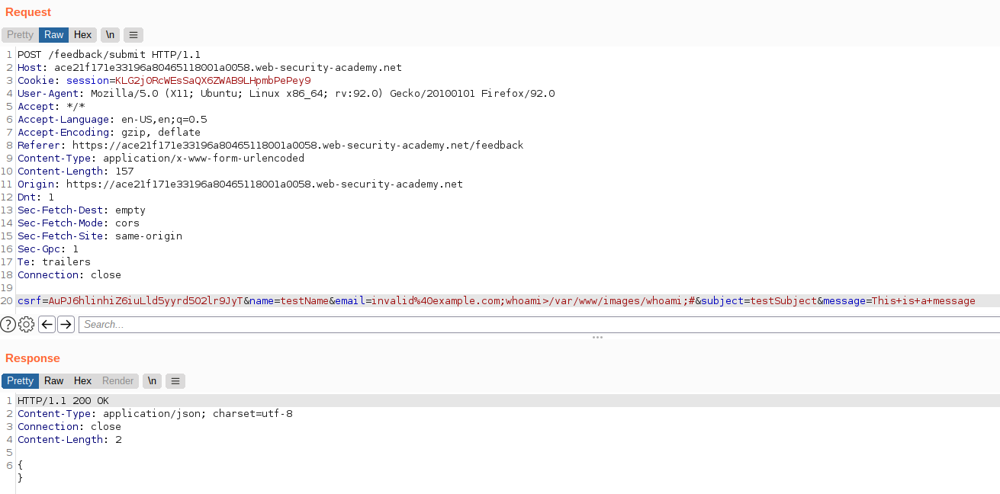
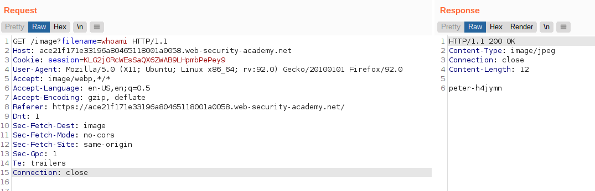

# Lab: Blind OS command injection with output redirection

Lab-Link: <https://portswigger.net/web-security/os-command-injection/lab-blind-output-redirection>  
Difficulty: PRACTITIONER  
Python script: [script.py](script.py)  

## Known information

- OS command injection vulnerability in the feedback feature
- Application call a shell command with user input
- Output is not returned, but can be redirected
- Writeable folder at `/var/www/images/`
- Goals:
  - Retrieve the output of `whoami`

## Steps

### Analysis

As usual, the first step is to browse the application to find out what it does. Like in the [previous lab](../Blind_OS_command_injection_with_time_delays/README.md), it contains a vulnerable feedback feature.

### Craft the payload

The command to execute is `whoami > /var/www/images/whoami` to write the file. I will again try straight to inject into the email argument. And as in the previous lab, commenting out the remainder results in a `200 OK`, while not doing so results in `500 Internal Server Error`. Both ways work though.

### Access the file

Now the file is in `/var/www/images`, but the path to it within the application is unknown and perhaps not even accessible directly. But I can utilize the way the application includes its images with a GET request to `/image?filename=`

At the same time, the lab page updates to

