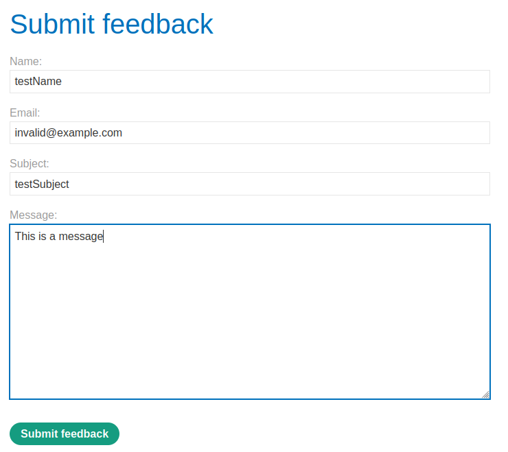
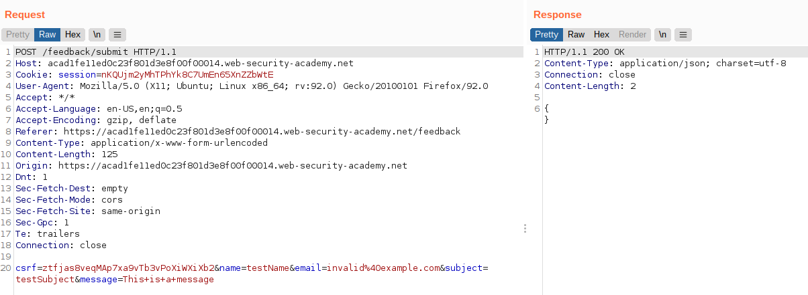
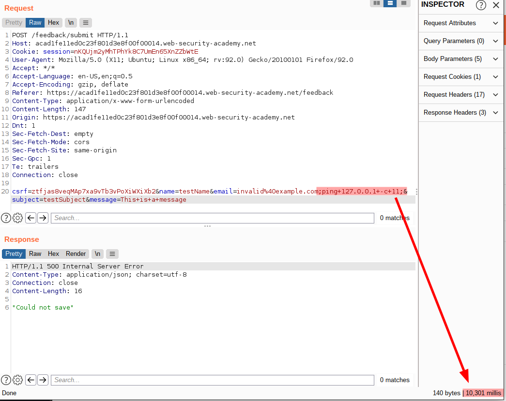

# Lab: Blind OS command injection with time delays

Lab-Link: <https://portswigger.net/web-security/os-command-injection/lab-blind-time-delays>  
Difficulty: PRACTITIONER  
Python script: [script.py](script.py)  

## Known information

- OS command injection vulnerability in the feedback feature
- Application call a shell command with user input
- Output is not returned
- Goals:
  - Cause a 10 second delay

## Steps

### Analysis

As always I start with checking the website. Any type of user input is always worth investigating. Here, I come across a feedback form:



Looking at the request in Burp, I see a possible complication, a csrf token.



Fortunately, requesting the feedback page multiple times always contains the same token, and even sending the POST request with the feedback repeatedly with Burp Repeater does result in `200 OK` responses. This means that the csrf-token is neither generated uniquely for each form nor expires on usage.

As common with blind injections, the success of the injection must be inferred by a difference in behaviour. This could be a multitude of things:

- Different behaviour of the application based on whether the command was successful or not (e.g. an error message)
- Timing differences
- Out-of-band activities that allow us to catch actions performed on the system (e.g. DNS requests)

The lab description and goal is time based, so I skip straight to that part.

There are multiple ways to introduct time delays on a command prompt, most of which are dependent on the operating system used (e.g. `sleep` in bash or `timeout` in Windows cmd). But there is one command that is available on almost any system that can be abused to cause delays: `ping`

By default, `ping` send one request immediately, followed by one additional request per second until the specified number is reached.

As target, the target system itself can be used by its localhost IP `127.0.0.1`. Sending 10 requests with ping will cause a delay of 9 seconds (first is sent immediately, than 9 times one second waiting)

```shell
ping 127.0.0.1 -c 10
```

**Please note**: the `-c` parameter is very important here. On Windows, `ping` defaults to four requests and this default could be used to infer the delay. But on Linux, `ping` defaults to *forever*, so it would never stop (until perhaps some timeout hits). Some other systems exit on the first returned packet. So while it is possible in some circumstances to use the default behaviour (namely: on Windows targets), it is better to just use the `-c` parameter that is supported on all major implementations.

### Forge a payload

To cause a 10 seconds delay, ping needs to send 11 requests. My guess for best parameter would be email, as this will likely be supplied as individual command line argument. I want to execute the ping regardless of the result status of the command before (which is likely some failure as some arguments may be missing), therefore I enclose the ping command with `;`:



I notice that I forgot to add a `#` to comment out whatever might be there on the line. While I receive a `500 Internal server error` on this request, if I add the `#` I receive a `200 OK`. So there might be also some type of error based injection possible at the box.

After the request above executed, the lab page updates to


