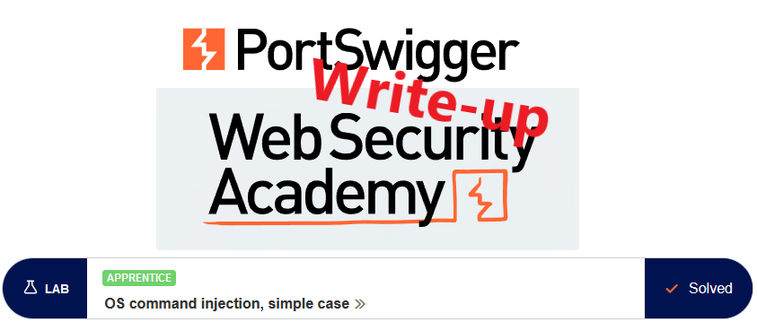

# Write-up: OS command injection, simple case @ PortSwigger Academy



This write-up for the lab *OS command injection, simple case* is part of my walkthrough series for [PortSwigger's Web Security Academy](https://portswigger.net/web-security).

**Learning path**: Server-side topics → OS command injection

Lab-Link: <https://portswigger.net/web-security/os-command-injection/lab-simple>  
Difficulty: APPRENTICE  
Python script: [script.py](script.py)  

## Lab description


## Steps

### Analysis

As usual, the first step is to browse around a bit. It is the usual showfront application known from previous labs. The new item here is the ability to check the availability of a product in different stores around the world:


Let's have a look at how the request goes in Burp:


The request contains two parameters, productID and storeID, and returns a number as plain text in the response. Lets send the request to the repeater and see how it goes. As we have two parameters, I try to inject both with different commands. This way, I can find out which parameter is injectable and in which order they are executed.

---

### The theory

The script call might look something like this (likely not the exact syntax, but the general idea is the same):

```php
echo system("someScript.sh $_REQUEST['productID'] $_REQUEST['storeId']")
```

In this case, the parameters are used as arguments for the script and the output is directly echoed back into the HTML.

There are multiple ways to execute multiple commands in one line in a shell, separating the individual commands with for example `&`, `&&`, `|`, `||`, `;`. All behave slightly differently. On Unix systems, my favorite is `;` as it completely separates the commands without side effects based on return conditions or execution order. In some conditions `&` is better as it backgrounds the command before my injection and runs my code without waiting for the other command to finish. Still, my favourite remains `;`.

SomeScript.sh might return a fail status without its arguments. We don't know the order of the arguments, and there might be more than just these two. Ideally, I want to just ignore the script completely and execute my injected command regardless.

Therefore I inject my command after a `;` in the POST parameters. (On a side note: when using `&`, it must be URLencoded).


From the response, it can be seen that both parameters are injectable, and they are executed in the order productId first, storeId second.

---

### The malicious payload

What is missing now is just executing the `whoami` command to solve the lab. I comment out the remainder of the line after the `whoami` to avoid the error message of the second parameter:


And on a personal note, I like the stockreport script:


and the lab page updates to


