# Write-up: Authentication bypass via encryption oracle @ PortSwigger Academy

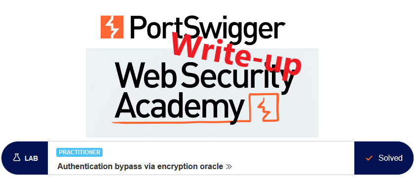

This write-up for the lab *Authentication bypass via encryption oracle* is part of my walk-through series for [PortSwigger's Web Security Academy](https://portswigger.net/web-security).

**Learning path**: Server-side topics → Business logic vulnerabilities

Lab-Link: <https://portswigger.net/web-security/logic-flaws/examples/lab-logic-flaws-authentication-bypass-via-encryption-oracle>  
Difficulty: PRACTITIONER  
Python script: [script.py](script.py)  

## Lab description

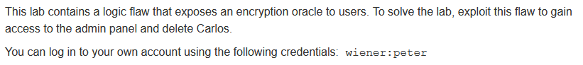

## Steps

As usual, the first step is to analyze the functionality of the lab application. In this lab, it is a blog website.

### Posting a comment

One part of this analysis is to post a comment. I play with some of the parameters and mix valid and invalid content for email and website. 

The website parameter gets checked via client-side javascript which can be circumvented but does not lead to anything interesting. 

It is a different story for the email parameter:

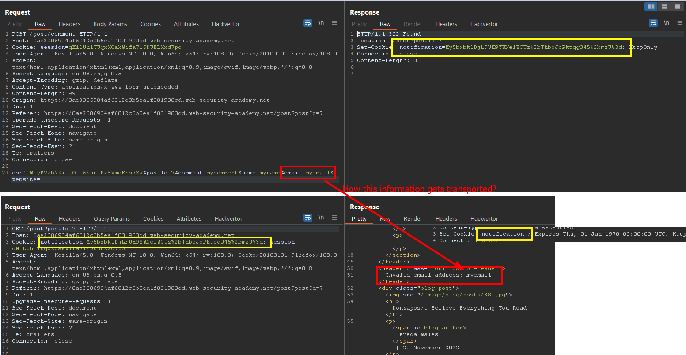

Posting the comment with an invalid address leads to a corresponding error message. What makes it interesting is that the error is not displayed in the immediate response to the `POST` request. 

The `POST` results in a redirect which in turn contains the error message including my parameter in its response. As it is an independent request this information needs to be transported. The response sets a cookie named `notification` which looks like this transport vehicle. It is also unset in the second request.

The content of the cookie does not appear to be simply encoded as no decoding variant results in anything legible.

I put it aside for now and go on with the analysis.

---

### Logging in

The public area does not show anything else that appears interesting so I log in with the credentials provided.

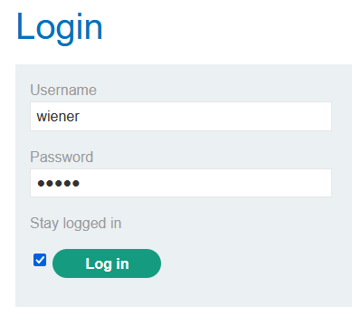

The login form provides the option to stay logged in. If the option is set a `stay-logged-in` cookie is set:

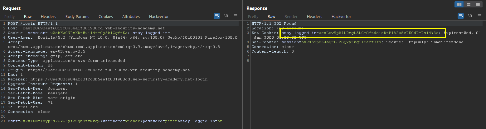

One detail that jumps to attention about this cookie is that its content is very similar to the `notification` cookie from above. Both appear to both URL- and base64 encoded but do not result in anything legible.

---

### Copying cookie contents

During the posting of my comment, I guessed that the `notification` cookie contains the error information that is converted to the error message in the second response. So what happens if I use the content of the `stay-logged-in` cookie? 

Only one way to find out. I send the second request from my comment attempt to repeater and replace the content of the `notification` cookie with the content of my `stay-logged-in` cookie:

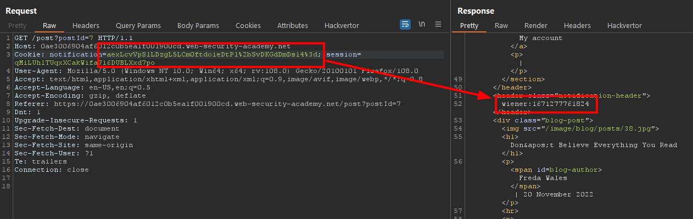

It shows two interesting things:

- Both cookies are protected in the same way
- The `stay-logged-in` cookie contains user information and a number that looks like a timestamp, in my case from a few minutes ago and corresponds to my login time

To impersonate the administrator I need to obtain the encrypted string `administrator:1671277761824` to forge a `stay-logged-in` cookie for the administrative user.

---

### Theorizing

Whatever content I put in the email field will get encrypted the same way as the `stay-logged-in` cookie. Unfortunately, the server adds a descriptive error message in front of it, in this case, `Invalid email` address: `.

If I find a way to either avoid this or strip this message from the `notification` cookie, I can forge a `stay-logged-in` cookie for any arbitrary user, including `administrator`.

I notice that the length of the encrypted `stay-logged-in` cookie is not directly related to the length of the `email` parameter. The cookie is, after urldecoding, 44 bytes long regardless of whether the email is `myEmail` or just `my`. This indicates the use of a block cipher.

A good encryption cipher will ensure that there is no observable relationship between the plaintext and the ciphertext. With minor changes in the plaintext, there should be significant changes in the ciphertext. This is called [diffusion](https://en.wikipedia.org/wiki/Confusion_and_diffusion) and is common in (decent) block ciphers by using some random initialization vectors (IV).

The cipher in use here does not appear to have this property. Both the plaintext as well as the ciphertext start with the same characters in both cases. The different characters afterward do not appear to affect the first part:

| Plaintext | Ciphertext (URLdecoded) |
|---|---|
| Invalid email address: myEmail | kz2h+4QhVc883w1bvbFEr77uKbbOnjfFfVFrFUVycP4= |
| Invalid email address: myEmai  | kz2h+4QhVc883w1bvbFErxyKJ3mv5TeyGEgDE2ADBWA= |
| Invalid email address: my      | kz2h+4QhVc883w1bvbFEryAV3dAJgEga4Zu3Rl8KjzA= |
| Invalid email address: administrator:1671277761824 | kz2h+4QhVc883w1bvbFEr87ptsajNIMxzRqfjJflK3pPyLcmimq9GT16yVJGJ7OroqW0zxlifgMmIJtTRaiYUQ== |

To better understand the structure I need to base64-decode that string and look at the hex representation:

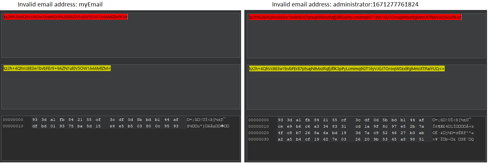

Two things are immediately obvious:

- The cipher uses a block size of 16 bytes. 
 Based on the images above 32 bytes would be possible as well. It would be highly unusual though, and using just `administrator` as email parameter shows three lines used and confirms 16 bytes as the block size.
- Within each block, some diffusion occurs. The second block differs on every byte whereas the last 7 bytes from the error message are static.

I remove the complete first block and reencode it, first base64- followed by urlencoding:

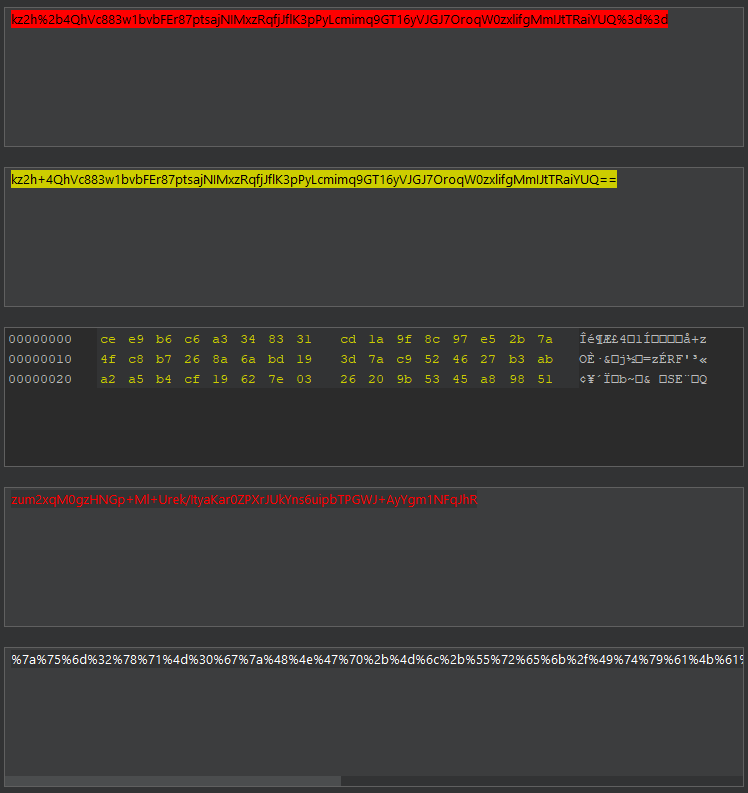

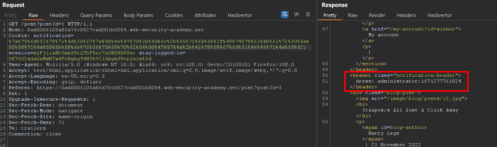

The result is promising, the first 16 bytes of the string are missing and the decryption is successful.

---

### Correct the padding

By now I know that I can remove a full block of the ciphertext without negatively affecting the following blocks. There are 7 bytes of the error message that are within the second block: `dress: `. I cannot simply remove these 7 bytes from the second block as this violates the block integrity:

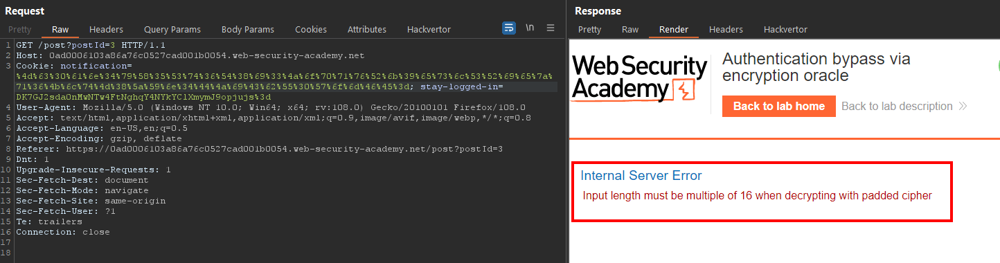

However, If I add another 9 bytes in front of my desired plaintext, then it will fill the second 16 bytes block completely and my plaintext starts at the beginning of the third block.

I send `123456789administrator:1671277761824` as the email to my encrypting method in Burp Repeater:

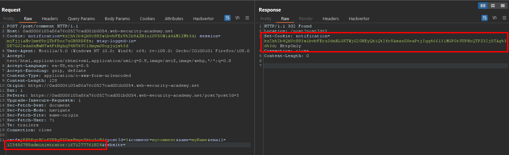

I send the cookie valid to Decoder, URL- and base64-decode it and remove the first two blocks of the hex representation (32 bytes):

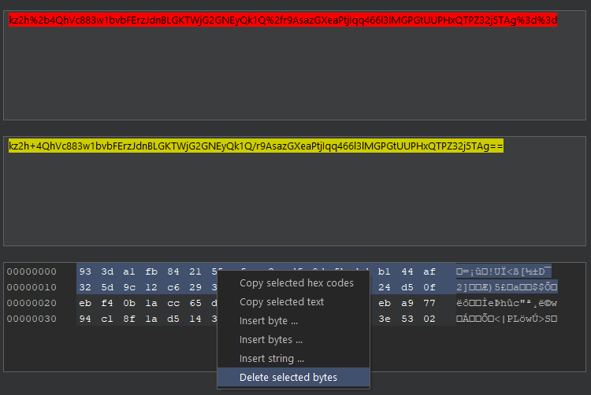

The result I re-encode again and use the content of the `notification` cookie in my decryptor:

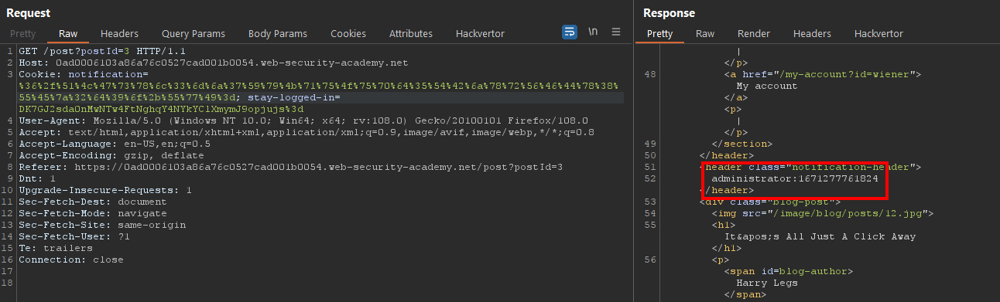

---

### Logging in

I use the cookie editor to change the `stay-logged-in` cookie in my browser:

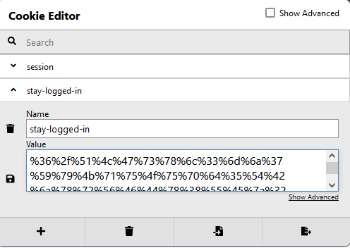

It appears that the session also contains user information and takes precedence over the `stay-logged-in` cookie. I remove the session cookie completely and refresh the page:

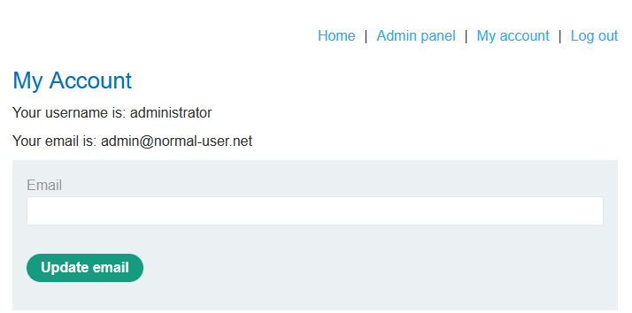

I go to the `Admin panel` to remove user `carlos` and the lab updates to

