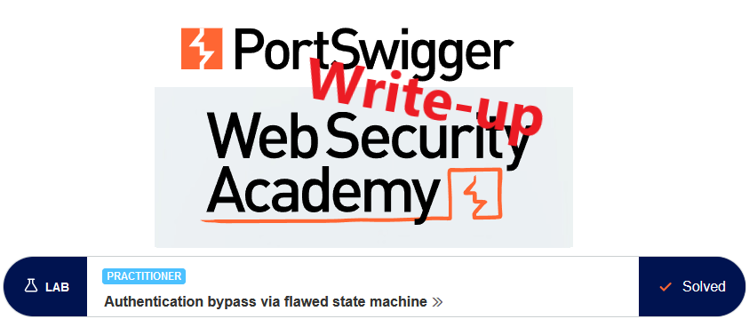
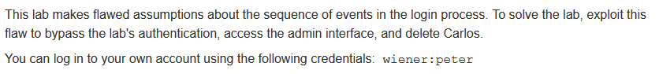
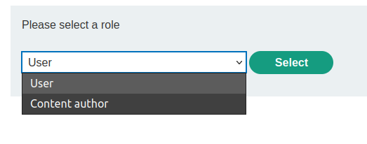
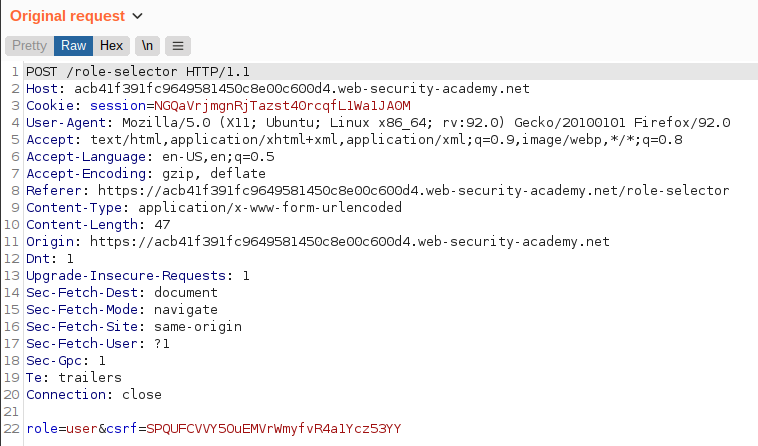
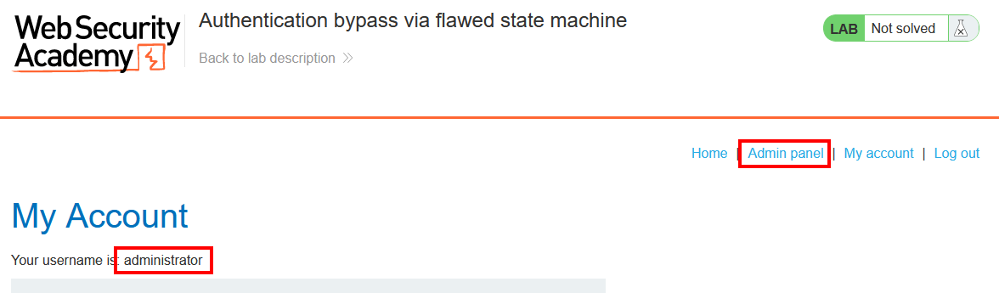

# Write-up: Authentication bypass via flawed state machine @ PortSwigger Academy

This write-up for the lab *Authentication bypass via flawed state machine* is part of my walkthrough series for [PortSwigger's Web Security Academy](https://portswigger.net/web-security).

**Learning path**: Server-side topics → Business logic vulnerabilities

Lab-Link: <https://portswigger.net/web-security/logic-flaws/examples/lab-logic-flaws-authentication-bypass-via-flawed-state-machine>  
Difficulty: PRACTITIONER  
Python script: [script.py](script.py)  

## Lab description

## Steps

### Analysis

As usual, the first step is to analyze the functionality of the lab application. In this lab, it is a shop website. After looking around, I log in with the credentials provided.

What immediately jumps to attention is that the login is a two-stage process. After providing the username and the password, I can select the role I want to login as:

Such an option does make sense. It allows users with higher privileges to restrict their permissions when they don't need them. This reduces both the attack surface during everyday activities as well as the risk of stupid and expensive mistakes. At least, if done properly. Having two dedicated accounts for this is both easier and less error-prone.

I select `user` and have a look at the `/role-selector` request in Burp Proxy:

---

### Attempt 1: Adjust role

The second login stage contains the user role. The roles available to me are listed on the page. I don't know whether another check is done during the POST of this form.

What happens if I change the role to 'admin' or 'administrator'? Of course, I don't know the role names, but it is worth a try.

Unfortunately, this does not lead to anything, neither error nor more privileges. This indicates that on processing that POST, it validates against allowed roles and defaults to something that is not admin.

---

### Attempt 2: Drop request

Speaking about defaulting, what happens if the full second request is dropped? Common sense would indicate that the session is dropped if any request is made before the second stage is finished. Easy to find out.

Using Burp proxy I log in with `wiener:peter` but drop the `GET` request to `/role-selector` completely. Afterwards, I manually browse to `/my-account` and see that the application refuses common sense and defaults to admin:

Now I simply go to the Admin panel and use the link to delete user `carlos`. Together with the confirmation message for the delete operation the lab updates to:

