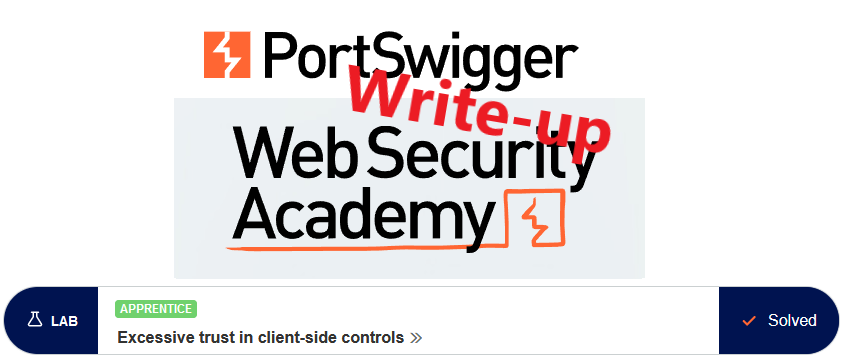
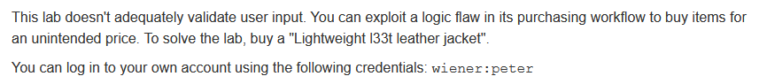
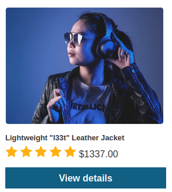
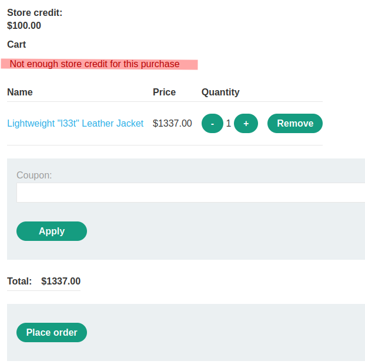
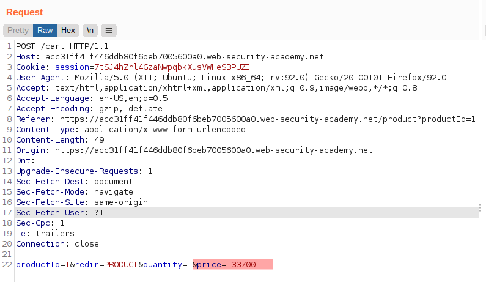
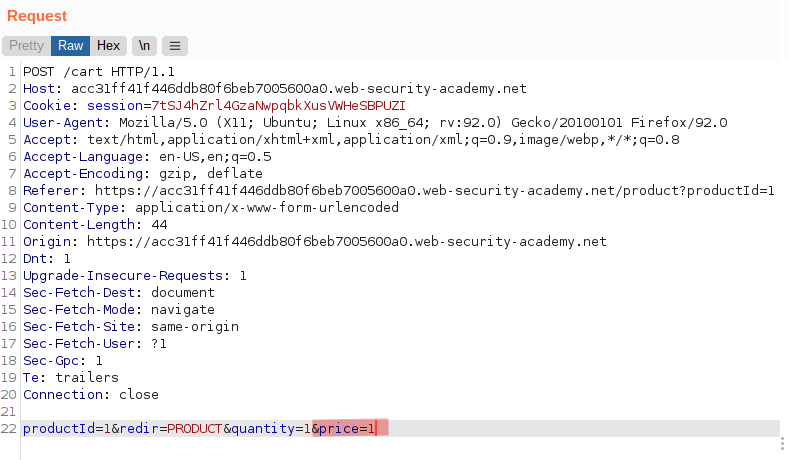
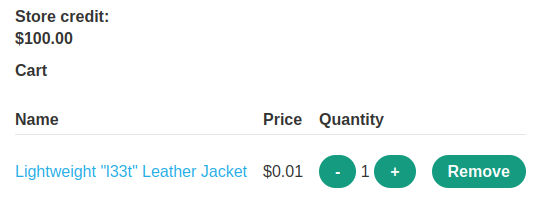
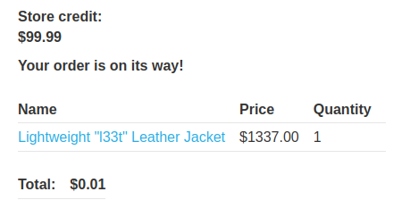
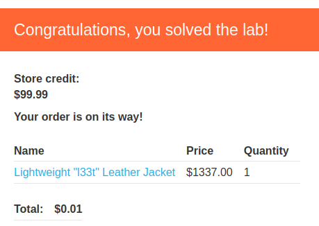

# Write-up: Excessive trust in client-side controls @ PortSwigger Academy

This write-up for the lab *Excessive trust in client-side controls* is part of my walkthrough series for [PortSwigger's Web Security Academy](https://portswigger.net/web-security).

**Learning path**: Server-side topics → Business logic vulnerabilities

Lab-Link: <https://portswigger.net/web-security/logic-flaws/examples/lab-logic-flaws-excessive-trust-in-client-side-controls>  
Difficulty: APPRENTICE  
Python script: [script.py](script.py)  

## Lab description

## Steps

### Analysis

As usual, the first step is to check out the website. It is the usual shop website used in numerous labs already. Logging in with the known credentials I see that I have 100$ in store credit, which puts the jacket slightly out of the possible range

So what happens when I put it in the cart? It lands there, but placing the order brings the reality check - it is too expensive:

So have a look at the requests done so far in Burp. The request to add it to the card looks rather promising, as it contains the price as a parameter.

---

### The malicious payload

Send that request to Repeater and change the price to something more reasonable. After all, it is just a leather jacket:

Now, the looks much better already:

After placing the order, I still have a sizeable amount of store credit left:

At the same time, the lab updates to

