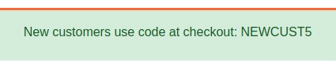
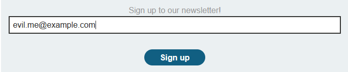
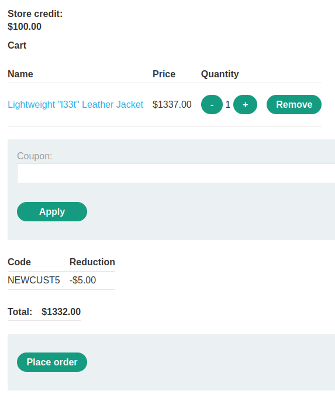
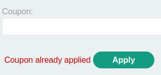
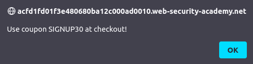
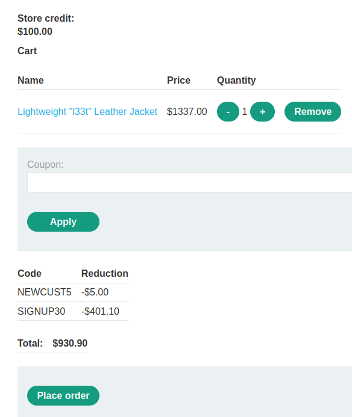
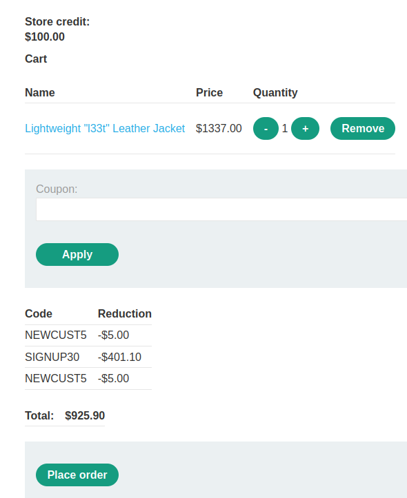
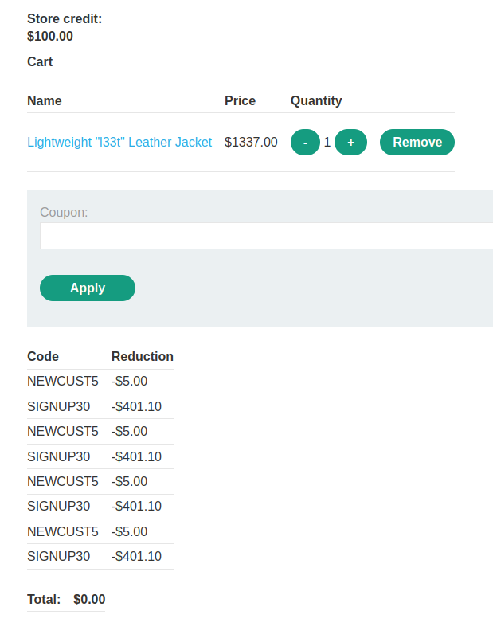
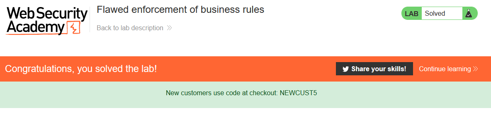

# Lab: Flawed enforcement of business rules

Lab-Link: <https://portswigger.net/web-security/logic-flaws/examples/lab-logic-flaws-flawed-enforcement-of-business-rules>  
Difficulty: APPRENTICE  
Python script: [script.py](script.py)  

## Known information

- Flawed purchase workflow
- Known credentials `wiener:peter`
- Goals:
  - Purchase a "Lightweight l33t leather jacket"

## Steps

### Analysis

And back again to my preferred web shop. Upon loading the page, two new features are very obvious: it looks like finally we can get some legit discounts:

And we can sign up for some newsletter:

### Applying the discount

Unfortunately, even with the discount the jacket is still above our price range (such a cheapskate page anyway, I expected 5% instead of just \$5 off):

Trying to apply the coupon again does not work either:

### Signing up for the newsletter

The second new feature was the newsletter. When signing up for it, a nice Javascript popup appears:

Now it looks better than before, but still not affordable with the store credit available:

As with the new customer discount, it can not be applied again. But something interesting happens when trying to apply the new customer account again now:

### Combininig the discounts

It looks like the 'is-the-discount-code-alread-used' check is only done with the latest discount code applied. So try to alternate the discounts until the price is right:

The price bottoms out at zero, so it does not appear like I have to find additional items to get a positive total again.

So I'll be a good customer and purchase a product:

