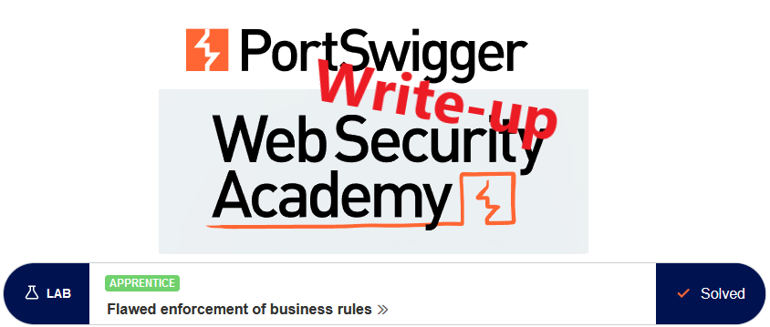
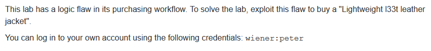
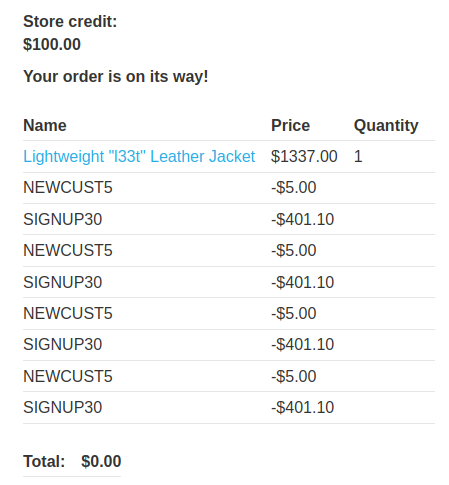

# Write-up: Flawed enforcement of business rules @ PortSwigger Academy

This write-up for the lab *Flawed enforcement of business rules* is part of my walkthrough series for [PortSwigger's Web Security Academy](https://portswigger.net/web-security).

**Learning path**: Server-side topics → Business logic vulnerabilities

Lab-Link: <https://portswigger.net/web-security/logic-flaws/examples/lab-logic-flaws-flawed-enforcement-of-business-rules>  
Difficulty: APPRENTICE  
Python script: [script.py](script.py)  

## Lab description

## Steps

### Analysis

The first step, as usual, is the analysis of the website, in this case, a webshop.

Upon loading the page, one thing is very obvious: it looks like I can get a legit discount:

### Applying the discount

Unfortunately, even with the discount, the jacket is still above my price range (such a cheapskate page anyway, I expected 5% instead of just \$5 off):

Of course, I try to apply the coupon again. Unfortunately, this does not work:

### Signing up for the newsletter

Another interesting functionality is found at the very bottom of the page: I can sign up for a newsletter. Newsletters often contain nice offers, so I do it immediately:

When signing up for it, a very welcome Javascript popup appears:

After I apply it, the total price looks better than before. But still not affordable with the store credit available:

As with the new customer discount, it can not be applied again. 

### Combininig the discounts

However, something interesting happens when I try to apply the new customer account again now:

It looks like the 'is-the-discount-code-alread-used' check is only done with the latest discount code applied. So try to alternate the discounts until the price is right:

The price bottoms out at zero, so it does not appear like I have to find additional items to get a positive total again.

So I'll be a good customer and purchase a product:

At the same time, the lap updates to

