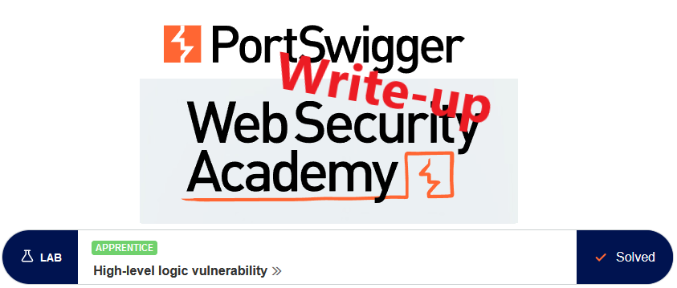
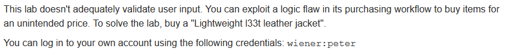
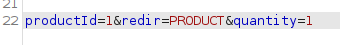
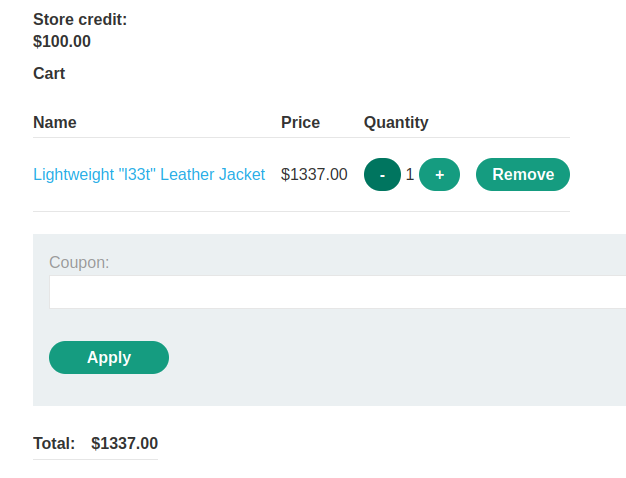
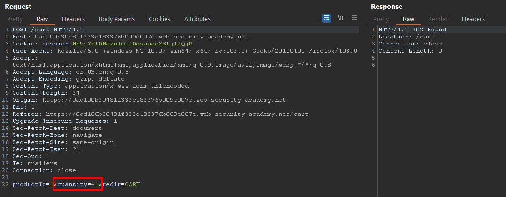
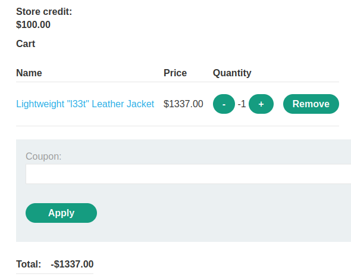
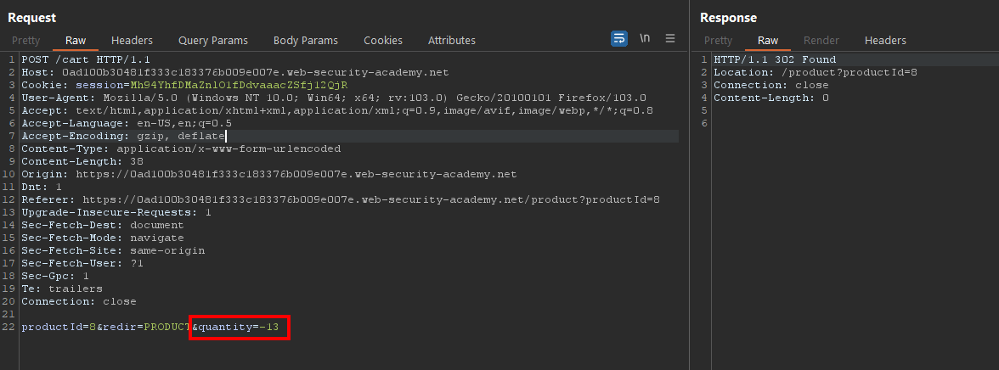
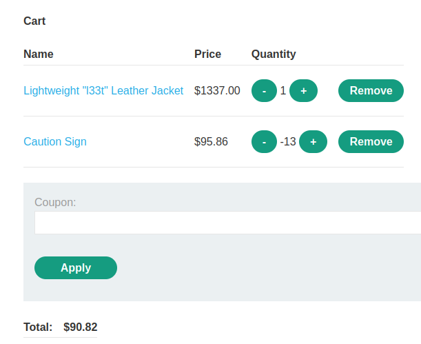
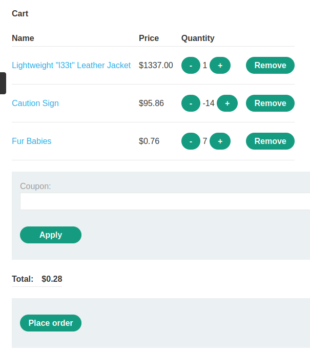
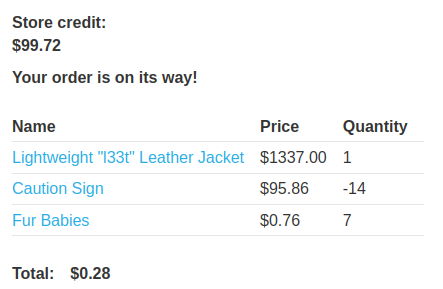

# Write-up: High-level logic vulnerability @ PortSwigger Academy

This write-up for the lab *High-level logic vulnerability* is part of my walkthrough series for [PortSwigger's Web Security Academy](https://portswigger.net/web-security).

**Learning path**: Server-side topics → Business logic vulnerabilities

Lab-Link: <https://portswigger.net/web-security/logic-flaws/examples/lab-logic-flaws-high-level>  
Difficulty: APPRENTICE  
Python script: [script.py](script.py)  

## Lab description

## Steps

### Analysis

The first step, as usual, is the analysis of the website and the existing workflow for buying items. As such, I log in with the given credentials and see that, as in real life, the available money is not enough to purchase the desired item.

This time, the request to add items to the cart does not contain the price, but just the productId and the quantity.

The cart now contains my jacket, the information that I can't afford it, and buttons to adjust the quantity:

Clicking on the `+` and `-` buttons results in requests similar to the one shown above, just with positive or negative quantities.

What happens if I send the `-` request again when the cart is empty? I send the request to Repeater and the cart updates accordingly:

Interesting. So if I purchase my leather jacket and a negative number of things so that the total is within the available store credit, it may succeed if no additional checks are in place.

### The malicious payload

So try it out. Entering a negative number in the 'add to cart'-form is not allowed (although it is a JavaScript check, so easily avoidable). But intercepting the request with Burp and changing it works just fine. 

I browse through the store to find a suitable item and do the basic math of how many of them I don't want:

Now the cart shows a much more affordable total:

But with some additional purchases, the price can be optimized even further (a negative total is unfortunately prevented by the application)

After placing the order I even get a few spare fur babies to resell:

At the same time, the lab updates to

