# Write-up: Inconsistent handling of exceptional input @ PortSwigger Academy

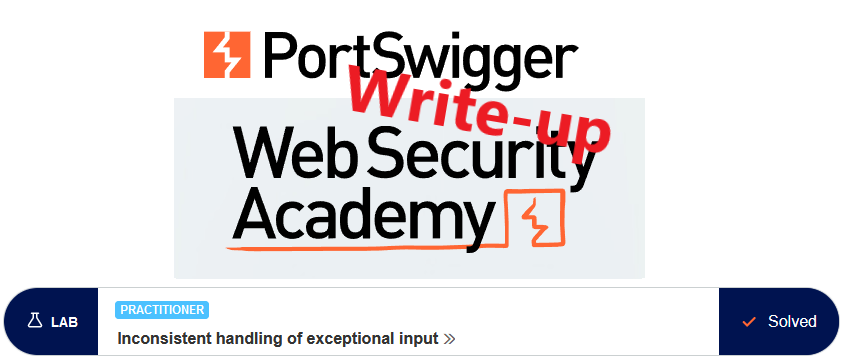

This write-up for the lab *Inconsistent handling of exceptional input* is part of my walkthrough series for [PortSwigger's Web Security Academy](https://portswigger.net/web-security).

**Learning path**: Server-side topics → Business logic vulnerabilities

Lab-Link: <https://portswigger.net/web-security/logic-flaws/examples/lab-logic-flaws-inconsistent-handling-of-exceptional-input>  
Difficulty: PRACTITIONER  
Python script: [script.py](script.py)  

## Lab description

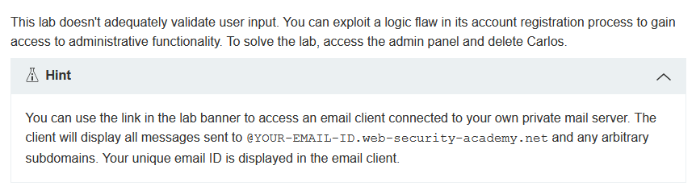

## Steps

### Analysis

As usual, the first step is to browse the application, which is a shop website. In this lab, no known good credentials are provided. There is, however, a possibility to register an own user, which I do. I use the email address from the email client of the lab:

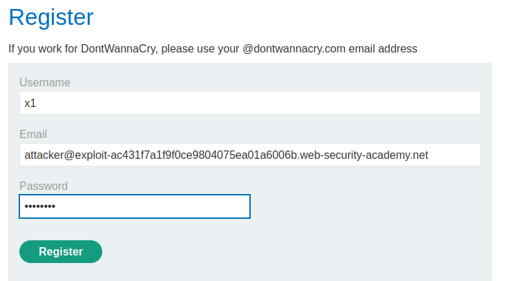

Once I register, I receive an email with a link to complete the registration:

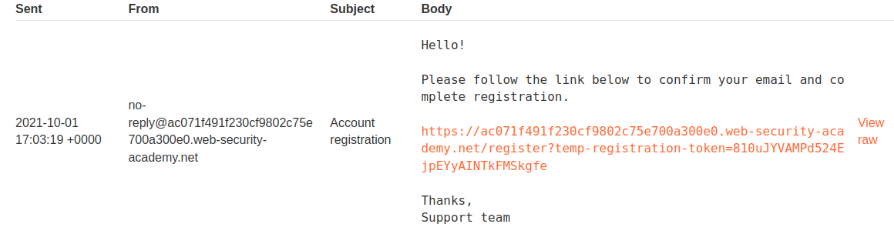

Once done, I can log in to my account:

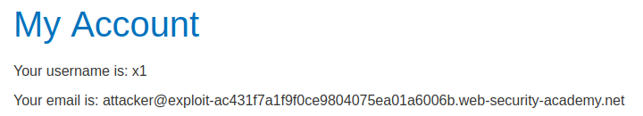

I have a look in Burp at how the communication went, but nothing interesting showed up.

So far, the only interesting item is the comment on the registration page about a @dontwannacry.com email address. Unfortunately, I don't have access to that domain, so can not use it directly. But perhaps I can inject this in a way that the registration link is sent to me, but the application thinks I'm a dontwannacry user.

---

### Attempt 1: Inject a null byte

There are numerous ways of trying to inject strings that systems may interpret differently. The easiest to check is by injecting a null byte which is used in several environments as 'end-of-string' indicator. If the registration system takes the full string, it may register me as a dontwannacry user. If the email system on the other hand terminates the string at a null byte, I'll receive the email.

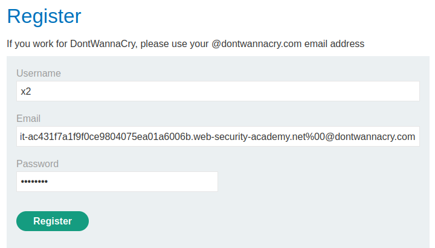

On the first attempt, I got a `Please enter a valid email` error message. However the message was generated by Javascript, so can be avoided easily by intercepting a valid request in Burp and changing it manually.

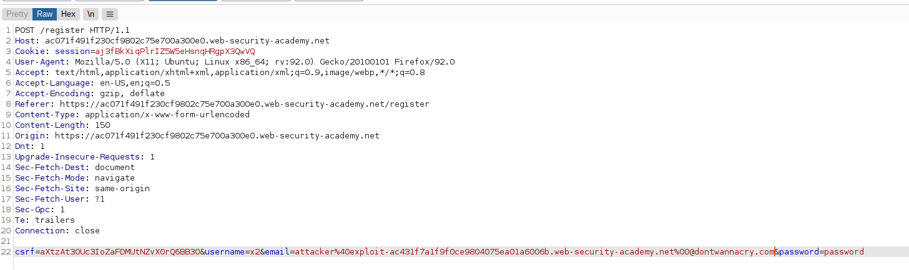

Alas, the system does not allow this:

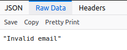

---

### Attempt 2: Use a long string

Another common issue is different systems using different lengths for the same string. If I can use a string that the web application considers as dontwannacry email while the mail server at the same time uses the full string then I'll get the confirmation email.

But first I need to find out if there might be a truncation anywhere. So I generate a long string of unique patterns (so in case there is a noticeable mismatch I'll be able to find the position). The easiest way to do so is with msf-pattern_create from the Metasploit Framework:

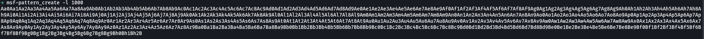

Using this string as email-address by adding @exploit-ac431f7a1f9f0ce9804075ea01a6006b.web-security-academy.net, I receive a registration confirmation notification and email. After confirming the registration and logging into the account, the account page shows my email as:

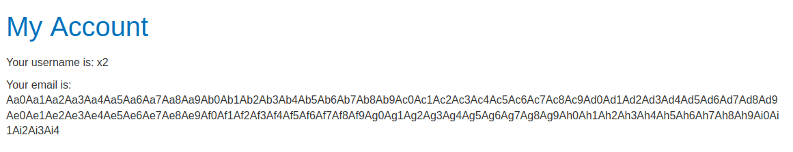

This proves that the two systems consider the email value differently.

It is easy to find at which character the truncation happened with the script msf-pattern_offset provided my the Metasploit framework: 

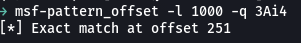

This 4-character pattern starts at position 251, therefore the first 255 characters are recognized by the application to see as account email.

---

### The exploit

The string `@dontwannacry.com` is 17 characters long. So I need a 238-character long prefix, followed by that domain, followed by my attacker server.

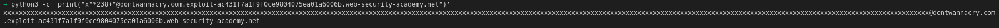

This ensures that the email shop application reads my email as a `@dontwannacry.com` user, whereas the email system sends the registration email to my real account.

Sure enough, using this string as the email address, I receive the confirmation email. After logging in and going to the account website, it shows an additional link in the page header - an admin panel.

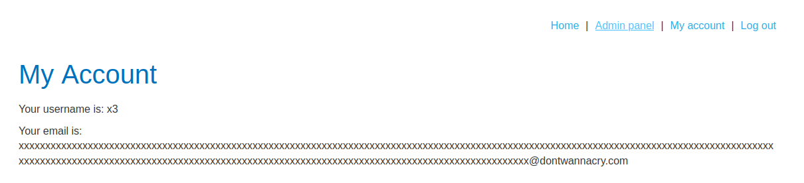

In the admin panel I see the list of all users together with the links to delete them:

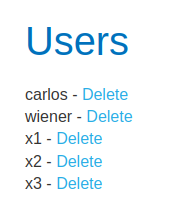

After deleting the user `carlos`, the application provides the confirmation:

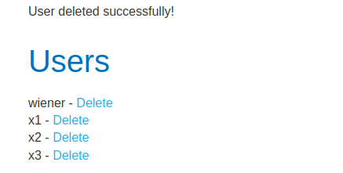

At the same time, the lab updates to

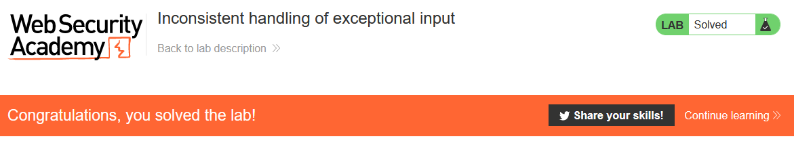
