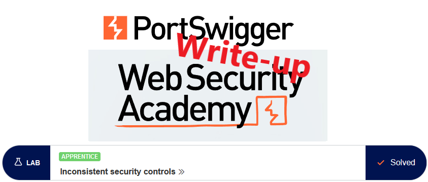
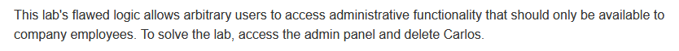
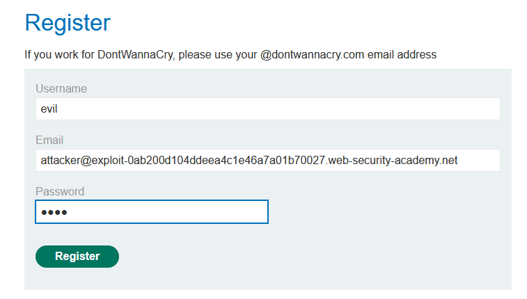
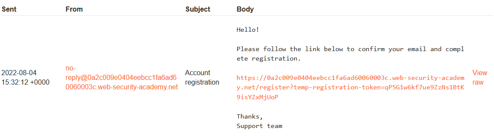
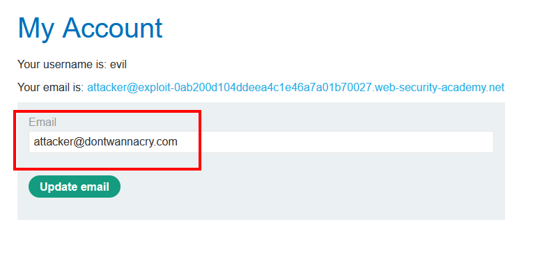

# Write-up: Inconsistent security controls @ PortSwigger Academy

This write-up for the lab *Inconsistent security controls* is part of my walkthrough series for [PortSwigger's Web Security Academy](https://portswigger.net/web-security).

**Learning path**: Server-side topics → Business logic vulnerabilities

Lab-Link: <https://portswigger.net/web-security/logic-flaws/examples/lab-logic-flaws-inconsistent-security-controls>  
Difficulty: APPRENTICE  
Python script: [script.py](script.py)  

## Lab description

## Steps

### Analysis

The first step, as usual, is the analysis of the website, in this case, a webshop.

I can register a new account and see that employees of DontWannaCry should use their company email. As I do not have one I register a new account with my email address from the email client:

In my email client, I find the registration email with the confirmation link:

After confirming the email, I can log into my account.

### Change of email address

On the `my account` page, I noticed can update my email address. What happens if I simply change it to a `@dontwannacry.com` one? In theory, it should verify my ownership like during account registration. Let's find out:

After clicking on the `Update email` button, two things become obvious:

1. My email address is changed straight away
2. An `Admin panel` link appeared

This shows two things:

1. There is no validation on changing the email
2. The existence of an `@dontwannacry.com` email entry is the sole condition for access to the admin panel

So I go there to delete `carlos` and get a confirmation:

At the same time, the lab updates to

